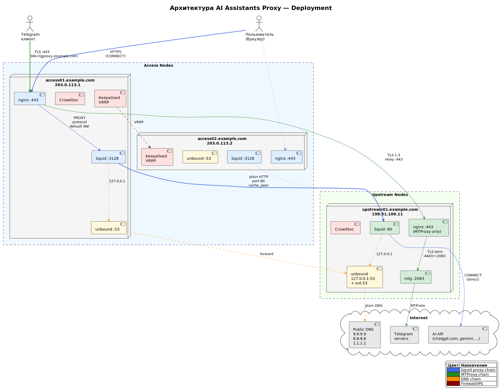

# Ansible Deployment

Автоматизированное развертывание AI Proxy на базе Squid.

## Структура

```
deploy/
├── inventory.yml                # Инвентарь хостов и переменные
├── playbook.yml                 # Основной playbook
├── passwd                       # Пример файла пользователей
├── templates/
│   ├── squid-access.conf.j2     # Шаблон Squid для access
│   ├── squid-upstream.conf.j2   # Шаблон Squid для upstream
│   ├── keepalived.conf.j2       # Шаблон Keepalived для access
│   ├── check_and_restart_squid.sh.j2  # Health-check скрипт для keepalived
│   └── nftables-upstream.conf.j2    # Шаблон nftables для upstream (Debian)
├── roles/
│   ├── dns_resolver/            # Кеширующий DNS-резолвер (unbound)
│   │   ├── templates/unbound.conf.j2
│   │   ├── tasks/main.yml
│   │   ├── handlers/main.yml
│   │   └── defaults/main.yml
│   ├── nginx/                   # nginx SNI router (access nodes)
│   │   ├── templates/
│   │   │   ├── 00-sni-router.conf.j2        # Shared SNI router (port 443)
│   │   │   ├── 10-aiproxy-upstreams.conf.j2  # MTProxy relay + upstream definitions
│   │   │   └── sni-map.d/aiproxy.conf.j2     # SNI entries: MTProxy domains
│   │   └── tasks/main.yml
│   ├── mtproxy/                 # MTProxy + upstream nginx (upstream nodes)
│   │   ├── templates/
│   │   │   ├── 00-sni-router.conf.j2         # Shared SNI router (upstream)
│   │   │   ├── nginx-mtproxy-stream.conf.j2  # MTProxy TLS 1.3 terminator
│   │   │   ├── nginx-squid-tls-term.conf.j2  # (legacy, не используется)
│   │   │   ├── sni-map.d/mtproxy.conf.j2     # SNI entries: MTProxy hostname
│   │   │   ├── sni-map.d/squid.conf.j2       # (legacy, не используется)
│   │   │   ├── mtg.toml.j2                   # mtg daemon config
│   │   │   └── nftables-mtproxy.conf.j2      # Firewall rules (Debian)
│   │   └── tasks/main.yml
│   └── crowdsec/                # CrowdSec IPS
│       ├── tasks/main.yml
│       └── templates/whitelist-infrastructure.yaml.j2
├── MTProxy.md                   # MTProxy configuration reference
└── README.md
```

## Требования

### Управляющий хост
- Ansible >= 2.9
- Коллекции: `ansible.posix`, `community.general`

### Целевые серверы

| Дистрибутив | Примечание |
|-------------|------------|
| **Ubuntu 24.04 LTS** | Рекомендуется (Squid 6.13 из коробки) |
| Ubuntu 22.04 LTS | Требуется [Diladele PPA](https://docs.diladele.com/howtos/build_squid_on_ubuntu_22/repository.html) |
| Debian 13 (Trixie) | Squid 6.x в репозитории |

**Системные требования:**
- Python >= 3.8
- systemd
- SSH доступ с правами root

### Пререквизиты: версии пакетов

| Пакет | Минимум | Максимум | Назначение |
|-------|---------|----------|------------|
| Squid | 6.0 | 6.x | Прокси-сервер |
| Unbound | 1.16 | 1.x | Кеширующий DNS-резолвер |
| Keepalived | 2.0 | 2.x | VRRP для access (опционально) |

**Фаерволы (upstream прокси):**

| ОС | Фаервол | Версия |
|----|---------|--------|
| Ubuntu | UFW | >= 0.36 |
| Debian | nftables | >= 1.0 |

Playbook автоматически определяет ОС и применяет соответствующий фаервол.

## Использование

1. Отредактируйте `inventory.yml`:
   - Укажите реальные IP/hostname серверов в группах `access_proxies` и `upstreams`
   - Настройте переменные `allowed_domains` и `allowed_domain_patterns`

2. Запустите playbook:
   ```bash
   ansible-playbook -i inventory.yml playbook.yml
   ```

3. Для отдельных групп:
   ```bash
   # Только access прокси
   ansible-playbook -i inventory.yml playbook.yml --limit access_proxies

   # Только upstream прокси
   ansible-playbook -i inventory.yml playbook.yml --limit upstreams

   # Только DNS
   ansible-playbook -i inventory.yml playbook.yml -t dns
   ```

## Управление пользователями (access)

Отредактируйте файл `passwd` перед развёртыванием:

```bash
# Добавить пользователя
htpasswd -Bbn username password >> passwd

# Или через openssl
echo "username:$(openssl passwd -apr1 password)" >> passwd
```

## Переменные

| Переменная | Описание | По умолчанию |
|------------|----------|--------------|
| `squid_port` | Порт Squid | 443 (access), 80 (upstream) |
| `enable_auth` | Включить аутентификацию | true (access) |
| `enable_logging` | Включить журналирование | true (access) |
| `enable_caching` | Включить кеширование | true (access) |
| `allowed_domains` | Разрешенные домены (явный список) | см. inventory |
| `allowed_domain_patterns` | Разрешенные домены (regex) | см. inventory |
| `dns_servers` | Публичные DNS (plain DNS, порт 53) | 9.9.9.9, 8.8.8.8, 1.1.1.1 |
| `enable_keepalived` | Включить Keepalived (access) | false |
| `keepalived_vip` | Виртуальный IP | — (обязательно задать) |
| `keepalived_interface` | Сетевой интерфейс | auto (default gw) |
| `keepalived_state` | MASTER или BACKUP | per-host |
| `keepalived_priority` | Приоритет (100/90) | per-host |
| `read_timeout` | Таймаут ожидания данных от AI API | 30 minutes |
| `behind_nginx` | Ручное переопределение: Squid за nginx | не задана (автоопределение) |
| `squid_local_port` | Локальный порт Squid при работе за nginx | 3128 |
| `crowdsec_enabled` | Включить CrowdSec IPS | true |
| `crowdsec_memory_mb` | Лимит памяти CrowdSec (MB) | 512 |
| `crowdsec_fw_bouncer_memory_mb` | Лимит памяти firewall bouncer (MB) | 128 |
| `mtproxy_enabled` | Включить MTProxy | true |
| `mtproxy_fake_tls_domain` | Fake-TLS домен для DPI | git.example.com |
| `mtproxy_hostname` | Публичный домен для MTProxy (маршрутизация SNI) | tgproxy.example.com |
| `mtproxy_local_port` | Порт mtg daemon (upstream) | 2083 |
| `mtproxy_secret` | Hex-секрет | "" (автоген) |
| `mtproxy_max_connections` | Максимум подключений per IP | 100 |
| `mtproxy_version` | Версия mtg | 2.1.8 |

## Порядок развёртывания

Playbook выполняет фазы в строгом порядке:

1. **Base setup** — apt, SSH, утилиты, sysctl, лимиты
2. **DNS resolver** — unbound на каждой ноде
3. **Install Squid** — пакет, systemd override, директории
4. **nginx/MTProxy** — **до** конфигурации Squid, чтобы освободить порты:
   - upstream: mtproxy role устанавливает nginx на :443, удаляет default site с :80
   - access: nginx role устанавливает nginx на :443, переконфигурирует Squid на :3128
5. **Squid config** — деплой конфигурации, reload/restart
6. **Firewall** — UFW/nftables/iptables (upstream)
7. **Keepalived** — VRRP failover (access)
8. **CrowdSec** — IPS с infrastructure whitelist

## DNS Resolver (unbound)

Каждая нода получает локальный кеширующий DNS-резолвер (unbound) с различной архитектурой в зависимости от роли:

```
                    ┌──────────────────┐
                    │  Публичные DNS   │
                    │  (plain DNS)     │
                    │ 9.9.9.9          │
                    │ 8.8.8.8          │
                    │ 1.1.1.1          │
                    └────────▲─────────┘
                             │
              ┌──────────────┴──────────────┐
              │    upstream nodes            │
              │    unbound (127.0.0.1:53     │
              │           + ansible_host:53) │
              └──────────────▲──────────────┘
                             │
         ┌───────────────────┼───────────────────┐
         │                   │                   │
┌────────┴────────┐ ┌────────┴────────┐         ...
│  access-01      │ │  access-02      │
│  unbound        │ │  unbound        │
│  (127.0.0.1:53) │ │  (127.0.0.1:53) │
│  → upstream DNS │ │  → upstream DNS │
└─────────────────┘ └─────────────────┘
```

**Ключевые характеристики:**
- **upstream** → plain DNS к публичным резолверам (9.9.9.9, 8.8.8.8, 1.1.1.1)
- **access** → forward **только** на unbound upstream-нод (никакого прямого доступа к публичным DNS)
- Squid на всех нодах использует `dns_nameservers 127.0.0.1` (локальный unbound)
- Автотюнинг: потоки = CPU, кеш = RAM/32 (мин 16 МБ), DNSSEC, prefetch
- `serve-expired: yes` — отдаёт устаревшие записи при недоступности upstream (30 сек)
- `cache-max-negative-ttl: 10` — быстрое восстановление после DNS-ошибок
- systemd-resolved отключается, `/etc/resolv.conf` → 127.0.0.1
- Firewall: upstream принимает DNS (53/tcp+udp) только от access-нод

**Управление:**

```bash
# Развернуть только DNS
ansible-playbook -i inventory.yml playbook.yml -t dns

# Проверить статус
ssh root@<host> 'systemctl status unbound'

# Проверить резолвинг
ssh root@<host> 'dig @127.0.0.1 google.com'

# Статистика кеша
ssh root@<host> 'unbound-control stats_noreset'
```

## Архитектура: nginx stream routing и Squid



### Access nodes

nginx выполняет SNI-based маршрутизацию на порту 443 с `ssl_preread` (без TLS-терминации). Squid слушает на localhost:3128 за nginx и использует plain HTTP cache_peer к upstream Squid на порту 80.

```
Client → nginx:443 (access, ssl_preread + PROXY protocol)
            ├─ SNI=git.example.com / tgproxy.example.com → MTProxy relay
            │     └─ TLS 1.3 relay (proxy_ssl) → upstream:443
            └─ Default → localhost:3128 (Squid, PROXY protocol)
                  └─ cache_peer (plain HTTP) → upstream:80 (Squid)
```

### Upstream nodes

nginx используется **только для MTProxy** (порт 443). Squid слушает на отдельном порту 80 напрямую, без nginx.

```
                            ┌─ nginx:443 (ssl_preread + PROXY protocol)
Access nodes ──┤            │     └─ SNI=tgproxy.example.com → MTProxy TLS terminator (:4443)
               │            │           └─ TLS 1.3 termination → mtg daemon (:2083)
               │            │
               └─ Squid:80 (прямое подключение, plain HTTP)
                     └─ Выход в интернет
```

**Ключевые характеристики:**
- **Разделение портов на upstream**: nginx :443 (только MTProxy), Squid :80 (proxy chain)
- **Plain HTTP cache_peer**: access Squid → upstream Squid на порту 80 (без TLS)
- **PROXY protocol**: nginx на access пробрасывает реальный IP клиента к локальному Squid
- **TCP keepalive**: `proxy_socket_keepalive on` для обнаружения мёртвых соединений
- **Дифференцированные таймауты**: Squid chain — 1800s (30 мин, AI API); MTProxy chain — 60s

### Upstream прокси (Squid cache_peer)

Access прокси автоматически переключается между upstream серверами. Upstream определяются как хосты группы `upstreams` в inventory:

```yaml
# inventory.yml
upstreams:
  hosts:
    upstream01.example.com:
      ansible_host: 198.51.100.11
  vars:
    squid_port: 80
```

Параметры failover:
- `userhash` — балансировка по хэшу пользователя (sticky sessions), fallback на `sourcehash`
- `connect-fail-limit=2` — после 2 неудач сервер помечается недоступным
- `connect-timeout=5` — таймаут подключения 5 секунд
- `dead_peer_timeout=15` — проверка недоступных серверов каждые 15 секунд

## Отказоустойчивость

### Виртуальный IP для access (Keepalived)

Access прокси используют VRRP для обеспечения единого виртуального IP:

```yaml
# Настройки в inventory.yml (группа access_proxies → vars)
enable_keepalived: true              # По умолчанию false
keepalived_vip: 192.168.0.2         # Виртуальный IP для клиентов (обязательно задать)
# keepalived_interface: eth0        # Автоопределение через ansible_default_ipv4.interface
keepalived_vrid: 51
keepalived_auth_pass: "<your-password>"

# Для каждого хоста
access01.example.com:
  keepalived_state: MASTER
  keepalived_priority: 100
access02.example.com:
  keepalived_state: BACKUP
  keepalived_priority: 90
```

### CrowdSec IPS

**CrowdSec** — современная система предотвращения вторжений (IPS) с автоматическим обновлением threat intelligence фидов от глобального сообщества (70k+ серверов).

**Функции:**
- Защита от SSH brute-force атак
- Защита от HTTP сканеров и CVE exploitation (для Squid access logs)
- Автоматическая блокировка через firewall bouncer (nftables)
- Whitelist легитимных актёров (Google, Microsoft, Cloudflare)
- **Whitelist инфраструктурных IP** — все access и upstream ноды автоматически добавляются в whitelist для предотвращения самоблокировки

**Управление:**

```bash
# Включение/отключение в inventory.yml
crowdsec_enabled: true  # или false

# Развернуть только CrowdSec
ansible-playbook -i inventory.yml playbook.yml -t crowdsec

# Проверить статус на хосте
ssh root@<host> 'systemctl status crowdsec crowdsec-firewall-bouncer'

# Просмотреть активные блокировки
ssh root@<host> 'cscli decisions list'

# Просмотреть логи
ssh root@<host> 'journalctl -u crowdsec -f'

# Удалить блокировку IP (если ошибочно заблокирован)
ssh root@<host> 'cscli decisions delete --ip 1.2.3.4'
```

**Потребление ресурсов:**
- CrowdSec: 512 MB RAM
- Firewall bouncer: 128 MB RAM
- Диск: ~50 MB (collections + база решений)

### MTProxy (Telegram Proxy)

**MTProxy** — прокси-сервер для обхода блокировок Telegram через fake-TLS маскировку.

**Архитектура:**
- **Upstream nodes**: mtg daemon на порту 2083, за nginx TLS 1.3 терминатором (:4443)
- **Access nodes**: nginx stream SNI-роутинг на порту 443, TLS 1.3 relay к upstream

**Функции:**
- DPI-circumvention через fake-TLS домен (`git.example.com`)
- TLS 1.3 шифрование access→upstream transit (self-signed cert, `proxy_ssl`)
- Load balancing между upstream instances (round-robin)
- Firewall защита: доступ к MTProxy только от access nodes
- PROXY protocol: реальный IP клиента пробрасывается через всю цепочку
- Интеграция с Squid: nginx на access маршрутизирует MTProxy трафик на upstream:443, остальной — на локальный Squid (127.0.0.1:3128)

**Управление:**

```bash
# Включение/отключение в inventory.yml
mtproxy_enabled: true  # или false

# Развернуть только MTProxy (upstream + access)
ansible-playbook -i inventory.yml playbook.yml -t mtproxy

# Развернуть только nginx для MTProxy (access)
ansible-playbook -i inventory.yml playbook.yml -t nginx

# Проверить статус на upstream хосте
ssh root@<upstream-host> 'systemctl status mtg'

# Проверить статус nginx на access хосте
ssh root@<access-host> 'systemctl status nginx'

# Просмотреть активные подключения к MTProxy
ssh root@<upstream-host> 'ss -tnp | grep :2083'

# Получить секрет для подключения клиентов
ssh root@<upstream-host> 'grep "^secret" /etc/mtproxy/mtg.toml'
```

**Конфигурация клиента:**

Подключиться к MTProxy:
- **Сервер**: IP одной из access nodes (или VIP, если Keepalived включён)
  - access01.example.com: `203.0.113.1`
  - access02.example.com: `203.0.113.2`
- **Порт**: `443`
- **Секрет**: получить из `/etc/mtproxy/mtg.toml` на любом upstream node

Формат ссылки для Telegram:
```
tg://proxy?server=203.0.113.1&port=443&secret=<hex-секрет>
```

**Потребление ресурсов:**
- **MTProxy (upstream)**: 64 MB RAM per instance
- **nginx stream (access)**: минимальное (включено в общий nginx budget)

**Переменные (inventory.yml):**

| Переменная | Описание | По умолчанию |
|---|---|---|
| `mtproxy_enabled` | Включить MTProxy | true |
| `mtproxy_fake_tls_domain` | Fake-TLS домен для DPI | git.example.com |
| `mtproxy_local_port` | Порт mtg daemon на upstream nodes | 2083 |
| `mtproxy_secret` | Hex-секрет | "" (автогенерируется) |
| `mtproxy_max_connections` | Максимум подключений per IP | 100 |
| `mtproxy_version` | Версия mtg | 2.1.8 |

## Совместное развёртывание с Matrix

AI Assistants Proxy поддерживает co-deployment на одном сервере с проектом [Matrix Synapse Homeserver](https://github.com/Organization/Matrix). При совместном развёртывании AI Assistants Proxy работает как **primary** (первичное развёртывание), владея shared resources (port 443, CrowdSec, firewall), а Matrix адаптируется как **secondary**.

**Архитектура co-deployment:**

```
Internet → AI Proxy nginx :443 (stream SNI routing, ssl_preread, PROXY protocol)
                ├─ SNI=git.example.com → MTProxy relay (TLS 1.3) → upstream:443
                ├─ SNI=matrix.example.com → Matrix nginx (localhost:8443)
                └─ default → Squid (localhost:3128)
                      └─ cache_peer (plain HTTP) → upstream:80

CrowdSec IPS ← AI Proxy (owner) + Matrix (collections-only)
              └─ nginx logs: both AI Proxy and Matrix
              └─ firewall bouncer: managed by AI Proxy

UFW Firewall ← AI Proxy (reset + policies) + Matrix (additive rules)
```

**Роли и ответственность:**

| Компонент | AI Assistants Proxy (primary) | Matrix (secondary) |
|---|---|---|
| **nginx port 443** | Владелец — stream SNI routing | Адаптируется — слушает только localhost:8443 |
| **CrowdSec** | Владелец — установка, systemd, firewall bouncer | Адаптируется — добавляет collections + nginx logs |
| **UFW** | Владелец — reset, default policies | Адаптируется — добавляет правила (8448, TURN, LiveKit) |
| **Squid** | Владелец — localhost:3128 (за nginx) | Не используется |
| **MTProxy** | Владелец — upstream:2083 + nginx routing | Не используется |
| **unbound** | Владелец — DNS resolver на всех нодах | Может использовать localhost:53 |

**Модульная архитектура (Composable Stream Configuration):**

Оба проекта используют модульную архитектуру nginx stream. Каждый проект управляет только своими файлами, общий SNI router создаётся первым задеплоенным проектом (`force: no`).

```
# Access nodes:
/etc/nginx/stream.d/
  00-sni-router.conf              # Shared: map + listen 443 + ssl_preread + proxy_protocol
  10-aiproxy-upstreams.conf       # ai-proxy: MTProxy relay (TLS 1.3 to upstream)
  sni-map.d/
    aiproxy.conf                  # ai-proxy: git.example.com/tgproxy.example.com → MTProxy
    matrix.conf                   # Matrix: matrix.example.com → Matrix nginx (co-deployment)

# Upstream nodes:
/etc/nginx/stream.d/
  00-sni-router.conf              # Shared: map + listen 443 + ssl_preread + proxy_protocol
  10-mtproxy-tls.conf             # MTProxy TLS 1.3 terminator (:4443 → mtg :2083)
  sni-map.d/
    mtproxy.conf                  # tgproxy.example.com → mtproxy_tls_term
```

Никаких ручных правок конфигов не требуется — при деплое Matrix на тот же хост, Matrix автоматически добавит свои upstream и SNI маппинги.

**Изоляция трафика:**

Оба проекта изолированы на уровне L4 (stream SNI routing):
- Matrix трафик (SNI = matrix.example.com) → Matrix nginx :8443
- MTProxy трафик (SNI = git.example.com/tgproxy.example.com) → MTProxy relay → upstream:443 (TLS 1.3)
- AI Proxy трафик (default) → Squid :3128 → upstream:80 (plain HTTP)

CrowdSec защищает оба проекта единым набором правил и TI-фидов.
