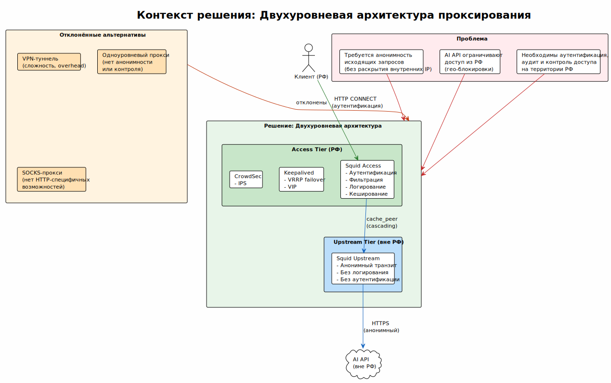

<!-- [AIGD] -->
# ADR-000001 — Двухуровневая архитектура проксирования

## Статус

Implemented

## Контекст

Инженерная команда Организации нуждается в доступе к западным AI API (Claude, ChatGPT, Gemini, GitHub Copilot и др.), которые ограничивают доступ из Российской Федерации по геолокации IP-адреса. Одновременно необходимо обеспечить:

- Аутентификацию и контроль доступа на территории РФ
- Журналирование обращений для аудита (требование 152-ФЗ — хранение логов на территории РФ)
- Анонимизацию исходящих запросов (без раскрытия внутренних IP-адресов Организации)
- Отказоустойчивость точки входа

Однозначного решения, удовлетворяющего всем требованиям в одном уровне, не существует: прокси в РФ не может напрямую обращаться к AI API из-за гео-блокировок, а прокси за рубежом не может обеспечить аутентификацию и аудит в соответствии с требованиями РФ.

## Решение

Принята **двухуровневая архитектура проксирования** с физическим разнесением уровней:

1. **Access tier (РФ)** — 2 ноды. Точка входа для пользователей. Реализует:
   - Аутентификацию через Basic Auth (ncsa_auth)
   - Фильтрацию по белому списку доменов (ACL)
   - Журналирование обращений (access.log)
   - Кеширование ответов
   - VRRP failover (виртуальный IP)
   - IPS (CrowdSec)

2. **Upstream tier (вне РФ)** — 1 нода. Анонимный транспортный уровень. Реализует:
   - CONNECT-проксирование без расшифровки TLS (Squid на порту 80, напрямую без nginx)
   - Анонимизацию заголовков (`forwarded_for off`, `via off`)
   - Минимальную конфигурацию (без аутентификации, без логирования)
   - Контроль доступа по IP-адресам access-прокси (UFW)
   - Co-deployment с MTProxy через nginx SNI Router на порту 443 ([ADR-000005](ADR-000005.md))

Access-прокси каскадирует запросы на upstream через `cache_peer` с балансировкой `userhash`.

## Альтернативы

### VPN-туннель (отклонено)

Организовать VPN между access-нодой и upstream-нодой, направляя трафик прокси через VPN.

**Причина отклонения:** дополнительная сложность (управление VPN-соединениями, PKI), overhead на шифрование/дешифрование, ухудшение латентности. Squid `cache_peer` обеспечивает каскадирование нативно без дополнительного уровня шифрования (TLS-трафик уже зашифрован end-to-end).

### Одноуровневый прокси (отклонено)

Разместить один прокси за рубежом — пользователи подключаются напрямую.

**Причина отклонения:** невозможно обеспечить аудит и хранение логов на территории РФ (152-ФЗ). Прямой доступ из РФ к зарубежному прокси создаёт single point of failure и раскрывает факт использования прокси.

### SOCKS-прокси (отклонено)

Использовать SOCKS5-прокси вместо HTTP-прокси.

**Причина отклонения:** SOCKS5 работает на уровне TCP и не обеспечивает HTTP-специфичные возможности: кеширование, фильтрацию по доменам (ACL dstdomain), Basic Auth через стандартные HTTP-заголовки. IDE и браузеры лучше поддерживают HTTP-прокси.

## Последствия

### Положительные

- Чёткое разделение ответственности: контроль доступа в РФ, анонимный транзит за рубежом
- Соответствие 152-ФЗ (логи хранятся на access tier в РФ)
- Анонимность: AI API видят только IP upstream-нод
- Отказоустойчивость на обоих уровнях (VRRP + userhash)
- Масштабируемость: добавление нод на любом уровне

### Отрицательные

- Операционная сложность: управление 3 серверами вместо 1–2
- Стоимость: аренда серверов в двух юрисдикциях
- Добавленная латентность: дополнительный hop (access → upstream)

### Риски

- Сетевая связность между РФ и зарубежными площадками может ухудшиться (геополитика)
- Upstream-ноды могут быть заблокированы AI-провайдерами (IP-бан)

## Связанные требования

- [C1-BC-001](../C1/C1-BC-001.md) — Целевая система AI Assistants Proxy
- [C1-BC-004](../C1/C1-BC-004.md) — Бизнес-цели, KPI и регуляторика
- [C2-FR-001](../C2/C2-FR-001.md) — Проксирование запросов к AI API
- [C2-NF-002](../C2/C2-NF-002.md) — Безопасность (анонимизация)
- [C2-NF-004](../C2/C2-NF-004.md) — Масштабируемость
- [C2-CN-001](../C2/C2-CN-001.md) — Ограничение: двухуровневая архитектура

## Диаграмма контекста решения

> Исходник: [diagrams/ADR-000001-context.puml](diagrams/ADR-000001-context.puml)

## Классификация

Segment × Technology
<!-- [/AIGD] -->
