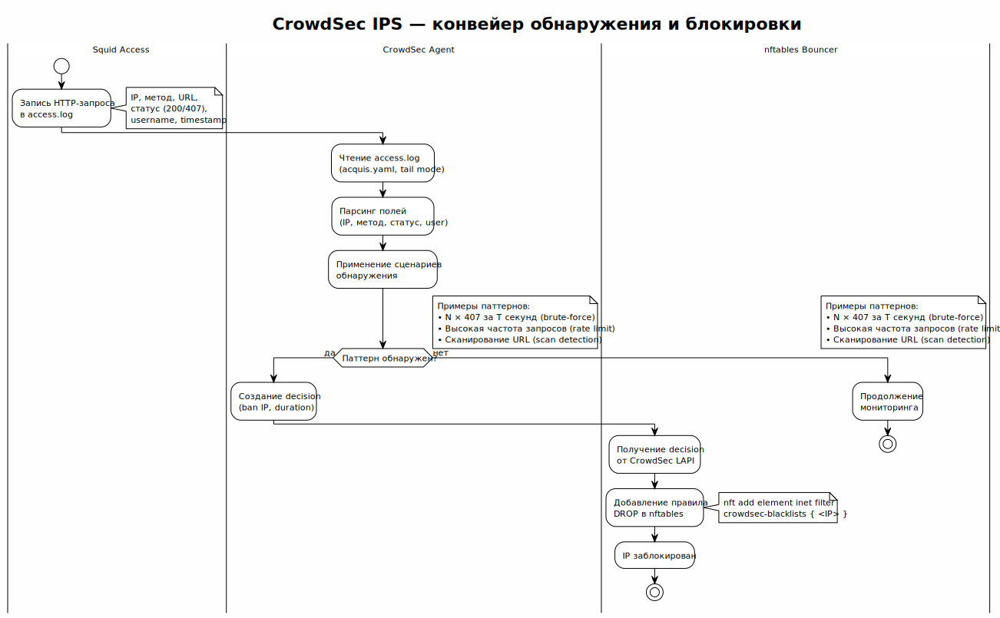

<!-- [AIGD] -->
# ADR-000004 — CrowdSec как IPS

## Статус

Implemented

## Контекст

Access-прокси доступны из интернета (порт 443 за nginx SNI Router) и являются потенциальной мишенью для атак: brute-force аутентификации, сканирование портов, DoS. Upstream-ноды доступны по портам 443 (MTProxy) и 80 (Squid). Необходима система обнаружения и предотвращения вторжений (IPS), которая:

- Анализирует логи Squid для обнаружения аномалий
- Автоматически блокирует злоумышленников
- Интегрируется с Linux firewall (nftables)
- Использует коллаборативную репутационную базу IP
- Различает инфраструктурные ноды (whitelist) и внешних клиентов
- Проста в развёртывании через Ansible

## Решение

Выбран **CrowdSec** (версия 1.x) в качестве IPS:

> Исходник: [../C2/diagrams/C2-NF-002-crowdsec-pipeline.puml](../C2/diagrams/C2-NF-002-crowdsec-pipeline.puml) (первичная диаграмма — [C2-NF-002](../C2/C2-NF-002.md))

**Архитектура CrowdSec:**
1. **Agent (Log Processor)** — парсит access.log Squid, применяет сценарии обнаружения
2. **Local API (LAPI)** — хранит решения (decisions), управляет bouncer-ами
3. **Bouncer (nftables)** — применяет решения: добавляет/удаляет IP в nftables ruleset
4. **Central API** — облачная репутационная база: push alerts, pull community blocklists

**Сценарии обнаружения:**
- `crowdsecurity/http-bad-user-agent` — подозрительные User-Agent
- `crowdsecurity/http-probing` — сканирование
- `crowdsecurity/http-bf` — brute-force аутентификации (413/407)
- Community-коллекции для HTTP-прокси

**Интеграция:**
- CrowdSec парсит `/var/log/squid/access.log`
- nftables bouncer (`crowdsec-firewall-bouncer-nftables`) блокирует IP на уровне ядра (таблица `ip crowdsec`, приоритет `filter - 10`)
- Ansible-роль `crowdsec` автоматизирует развёртывание на **всех** нодах (access + upstream)
- **Whitelist инфраструктуры** — IP-адреса access- и upstream-прокси исключаются из блокировки (шаблон `whitelist-infrastructure.yaml.j2`), чтобы предотвратить self-banning кластера

## Альтернативы

### fail2ban (отклонено)

Классическая IPS на основе регулярных выражений.

**Причина отклонения:** regex-based парсинг менее надёжен; отсутствие коллаборативной репутационной базы; устаревшая архитектура (однопоточный); нет нативного nftables bouncer (работает через iptables); менее активное развитие.

### Suricata (отклонено)

IDS/IPS на уровне сетевого трафика.

**Причина отклонения:** работает на уровне пакетов, а не логов — избыточен для задачи. Высокие требования к ресурсам. Сложная конфигурация правил. Ориентирован на сетевую безопасность, а не на application-level IPS.

### OSSEC / Wazuh (отклонено)

Host-based IDS с агентной архитектурой.

**Причина отклонения:** требует центральный сервер (manager), что избыточно для 4 нод. Более сложная архитектура. Ориентирован на enterprise-масштаб.

## Последствия

### Положительные

- Коллаборативная репутационная база: защита от известных атакующих IP до первого инцидента
- Нативная интеграция с nftables (блокировка на уровне ядра)
- Низкое потребление ресурсов (Go, эффективный парсинг)
- Активное community, регулярные обновления коллекций
- CLI-инструмент `cscli` для управления и диагностики

### Отрицательные

- Зависимость от облачного Central API для репутационных данных
- Необходимость настройки парсера для формата логов Squid
- Дополнительный компонент на всех нодах (access + upstream)

### Риски

- Ложные срабатывания (false positives) могут заблокировать легитимных пользователей
- Без whitelist инфраструктуры — CrowdSec может заблокировать access-ноды на upstream (self-banning)
- Недоступность Central API снижает эффективность (но локальные сценарии продолжают работать)

## Связанные требования

- [C1-BC-004](../C1/C1-BC-004.md) — Регуляторика, корпоративная ИБ
- [C2-FR-005](../C2/C2-FR-005.md) — Журналирование и аудит
- [C2-NF-002](../C2/C2-NF-002.md) — Безопасность (IPS)
- [C2-NF-005](../C2/C2-NF-005.md) — Наблюдаемость

## Классификация

Capability × Technology
<!-- [/AIGD] -->
