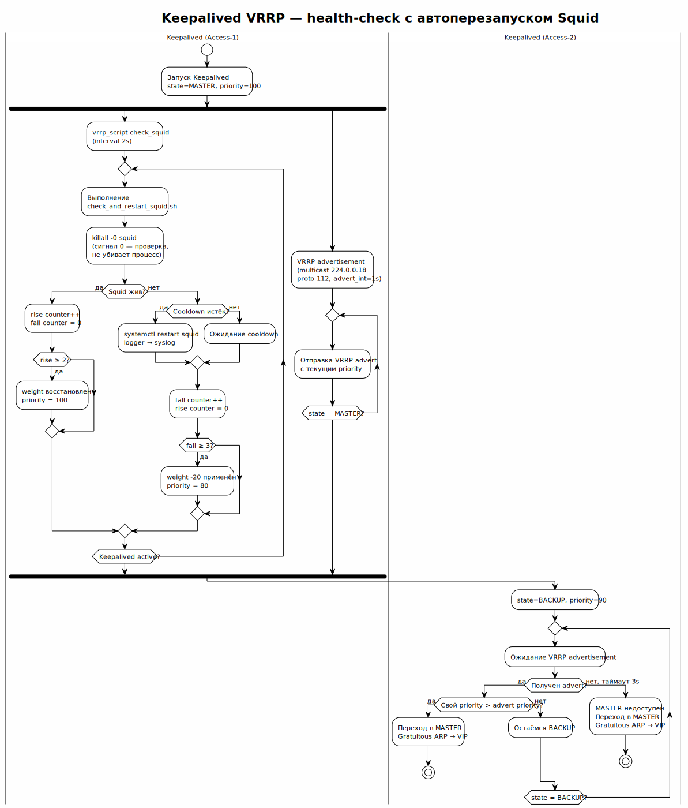

<!-- [AIGD] -->
# ADR-000006 — Keepalived VRRP для отказоустойчивости access-уровня

## Статус

Implemented

## Контекст

Access-уровень — единая точка входа для всех пользователей ([ADR-000001](ADR-000001.md)). При отказе access-ноды все пользователи теряют доступ к AI API. Необходимо обеспечить автоматический failover с минимальным RTO (Recovery Time Objective).

Требования:
- RTO ≤ 5 секунд (время переключения)
- Единый статичный IP-адрес для клиентов (не меняется при failover)
- Автоматическое переключение без вмешательства оператора
- Health-check: мониторинг доступности Squid, а не только ноды

## Решение

Принят **Keepalived** (версия 2.x) с протоколом VRRP для обеспечения высокой доступности access-уровня:



> Исходник: [diagrams/ADR-000006-vrrp-election.puml](diagrams/ADR-000006-vrrp-election.puml)

**Архитектура:**
1. Две access-ноды образуют VRRP-пару в одной виртуальной группе (VRID)
2. Одна нода — **MASTER** (удерживает виртуальный IP), другая — **BACKUP**
3. MASTER периодически отправляет VRRP advertisement (multicast, protocol 112)
4. При отсутствии advertisement в течение `advert_int × 3` BACKUP поднимает VIP
5. `vrrp_script` мониторит процесс Squid через `check_and_restart_squid.sh` — при падении Squid скрипт автоматически перезапускает его (`systemctl restart squid`) с cooldown-защитой от restart-storm, одновременно понижая приоритет (`weight -20`), что инициирует failover если перезапуск не помогает

**Автоперезапуск Squid:**
1. `killall -0 squid` — проверка существования процесса (сигнал 0, не убивает)
2. Если Squid жив → exit 0, keepalived считает скрипт успешным
3. Если Squid мёртв → `systemctl restart squid` (однократно, cooldown 30s между попытками)
4. Exit 1 → keepalived применяет `weight -20` → `priority 100 → 80`
5. При следующей проверке (через `interval 2s`), если Squid поднялся → exit 0 → `rise` восстановит priority
6. Если Squid не поднялся после `fall 3` (6 секунд) → failover на BACKUP

**Конфигурация (концептуальная):**
```
# AI-GENERATED — NOT REVIEWED: SECTION START
vrrp_script check_squid {
    script "/etc/keepalived/check_and_restart_squid.sh"
    interval 2
    weight -20
    fall 3
    rise 2
}

vrrp_instance VI_SQUID {
    state MASTER          # или BACKUP на второй ноде
    interface eth0
    virtual_router_id 51
    priority 100          # 90 на BACKUP
    advert_int 1
    authentication {
        auth_type PASS
        auth_pass <secret>
    }
    virtual_ipaddress {
        <VIP>/24
    }
    track_script {
        check_squid
    }
}
# AI-GENERATED — NOT REVIEWED: SECTION END
```

**Время переключения:** ~6 секунд в худшем случае (fall 3 × interval 2s + ARP gratuitous). При успешном автоперезапуске Squid — failover не происходит, priority восстанавливается за ~4 секунды (rise 2 × interval 2s).

## Альтернативы

### DNS failover (отклонено)

Использовать DNS с коротким TTL для переключения между access-нодами.

**Причина отклонения:** DNS TTL не гарантирует быстрое переключение — клиенты и резолверы кешируют записи. Время переключения непредсказуемо (от секунд до минут). Не подходит для RTO ≤ 5 секунд.

### Load Balancer (отклонено)

Поставить балансировщик (HAProxy, nginx) перед access-нодами.

**Причина отклонения:** дополнительный компонент, который сам становится single point of failure. Требует ещё один сервер или пару серверов с VRRP. Избыточно для 2 access-нод.

### Anycast (отклонено)

Использовать BGP anycast для маршрутизации к ближайшей access-ноде.

**Причина отклонения:** требует контроль над BGP-маршрутизацией, что недоступно на обычных VPS/dedicated. Избыточная сложность для масштаба проекта.

## Последствия

### Положительные

- Автоперезапуск Squid при падении — самовосстановление без failover в большинстве случаев
- Автоматический failover за ~6 секунд если перезапуск не помог
- Единый статичный VIP для клиентов (не нужно менять настройки прокси)
- Health-check Squid (failover при падении сервиса, а не только ноды)
- Cooldown-защита от restart-storm (по умолчанию 30 секунд)
- Простая конфигурация (keepalived.conf + скрипт проверки)
- Минимальное потребление ресурсов

### Отрицательные

- Требует поддержку VRRP multicast в сети (не все VPS-провайдеры поддерживают)
- Работает только для нод в одной L2-сети (одна подсеть)
- BACKUP-нода простаивает (active-passive, не active-active)

### Риски

- Хостинг-провайдер может блокировать VRRP multicast или floating IP
- Split-brain при сетевом разделении (обе ноды поднимают VIP)
- VIP не мигрирует между разными L2-сегментами / дата-центрами

## Связанные требования

- [C1-BC-004](../C1/C1-BC-004.md) — SLA доступности ≥ 99.5%
- [C2-NF-001](../C2/C2-NF-001.md) — Высокая доступность (VRRP, failover)
- [C2-NF-005](../C2/C2-NF-005.md) — Наблюдаемость (VRRP transitions)

## Классификация

Capability × Technology
<!-- [/AIGD] -->
