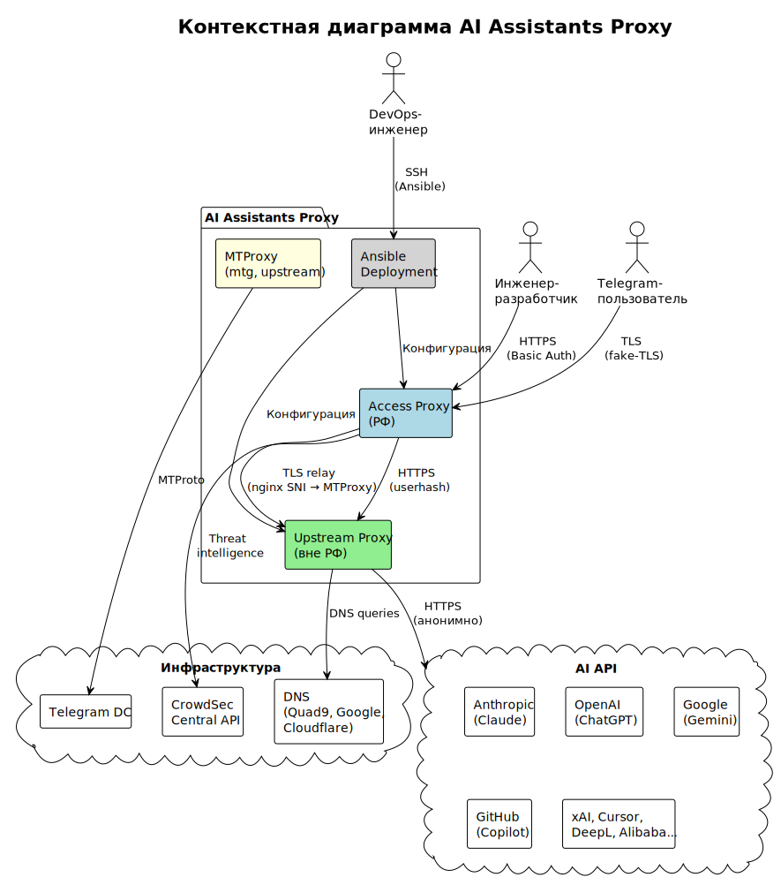

<!-- [AIGD] -->
# C1-BC-001 — Целевая система AI Assistants Proxy

## Ссылки на дочерние требования (C2)

- [C2-FR-001](../C2/C2-FR-001.md) — Проксирование запросов к AI API
- [C2-FR-002](../C2/C2-FR-002.md) — Аутентификация и авторизация
- [C2-FR-003](../C2/C2-FR-003.md) — Фильтрация доменов
- [C2-FR-004](../C2/C2-FR-004.md) — Кеширование ответов
- [C2-FR-005](../C2/C2-FR-005.md) — Журналирование и аудит
- [C2-FR-006](../C2/C2-FR-006.md) — MTProxy для Telegram
- [C2-FR-007](../C2/C2-FR-007.md) — Конфигурации клиентов
- [C2-FR-008](../C2/C2-FR-008.md) — Автоматизированное развёртывание
- [C2-NF-001](../C2/C2-NF-001.md) — Высокая доступность
- [C2-NF-002](../C2/C2-NF-002.md) — Безопасность
- [C2-NF-003](../C2/C2-NF-003.md) — Производительность
- [C2-NF-004](../C2/C2-NF-004.md) — Масштабируемость
- [C2-NF-005](../C2/C2-NF-005.md) — Наблюдаемость
- [C2-CN-001](../C2/C2-CN-001.md) — Ограничение: двухуровневая архитектура
- [C2-CN-002](../C2/C2-CN-002.md) — Ограничение: совместимость с co-deployment

## Описание

**AI Assistants Proxy** — корпоративный сервис проксирования доступа к западным AI API для инженерной команды Организации. Система обеспечивает безопасный, анонимный и отказоустойчивый доступ к AI-сервисам (Claude, ChatGPT, Gemini, GitHub Copilot, Cursor и др.) через единый статичный эндпоинт на территории Российской Федерации.

### Архитектурная концепция

Система реализует **двухуровневую архитектуру проксирования**:

1. **Access tier (РФ)** — точка входа для пользователей. Обеспечивает аутентификацию, авторизацию, журналирование обращений, кеширование ответов и отказоустойчивость через VRRP failover (виртуальный IP).

2. **Upstream tier (вне РФ)** — анонимный транспортный уровень. Минимальная конфигурация, отсутствие журналирования и аутентификации. Управление доступом по IP-адресам access-прокси.

Оба уровня построены на базе прокси-сервера **Squid**. Инфраструктура управляется через **Ansible** (IaC — Infrastructure as Code).

### Дополнительные возможности

Система поддерживает **co-deployment** — совместное размещение на одних серверах с другими проектами. Маршрутизация трафика на порту 443 реализована через **nginx SNI Router**, обеспечивающий бесконфликтное разделение TLS-потоков по SNI (Server Name Indication).

На upstream-нодах дополнительно развёрнут **MTProxy (mtg)** — прокси для Telegram с обходом DPI через fake-TLS маскировку.

### Контекстная диаграмма

> Исходник: [diagrams/C1-BC-001-context.puml](diagrams/C1-BC-001-context.puml)

**Компоненты контекстной диаграммы:**

| Элемент | Тип | Описание |
|---|---|---|
| AI Assistants Proxy | Целевая система | Двухуровневая прокси-инфраструктура |
| Инженер | Актор | Пользователь AI-инструментов через IDE или браузер |
| DevOps-инженер | Актор | Оператор инфраструктуры, развёртывание и обслуживание |
| AI API (Claude, ChatGPT, Gemini, …) | Внешняя система | Целевые AI-сервисы |
| DNS (Quad9, Google, Cloudflare) | Внешняя система | Разрешение доменных имён |
| CrowdSec Intelligence | Внешняя система | Репутационные данные для IPS |
| Telegram | Внешняя система | Telegram-клиенты через MTProxy |

### Границы системы

**Входит в scope:**
- Серверная прокси-инфраструктура (Ansible roles, playbooks, templates)
- Конфигурации клиентов (IDE, браузер, PowerShell)
- Документация развёртывания и эксплуатации

**Не входит в scope:**
- Сами AI-сервисы (Claude API, OpenAI API и др.)
- Серверы, на которых развёрнута инфраструктура (предоставляются Организацией)
- Сетевая связность между РФ и зарубежными площадками
- Биллинг и подписки на AI-сервисы

## Покрытие объектов управления
| Тип объекта | Статус | Артефакт / Обоснование N/A |
|---|---|---|
| Целевая система (System-of-Interest) | Covered | Описание выше — AI Assistants Proxy |
| Стейкхолдеры (Stakeholders) | Covered | [C1-BC-002](C1-BC-002.md) |
| Внешние системы (External Systems) | Covered | [C1-BC-003](C1-BC-003.md) |
| Акторы (Actors / Personas) | Covered | [C1-BC-002](C1-BC-002.md) |
| Бизнес-цели и метрики (Goals & KPIs) | Covered | [C1-BC-004](C1-BC-004.md) |
| Регуляторная среда (Regulatory) | Covered | [C1-BC-004](C1-BC-004.md) |
| Контракты и SLA | Covered | [C1-BC-004](C1-BC-004.md) |
| Границы системы (System Boundary) | Covered | Секция «Границы системы» выше |
| Бизнес-сущности данных (Business Data Entities) | Covered | [C1-BC-003](C1-BC-003.md) — описание потоков данных |
| Потоки ценности (Value Streams) | Covered | [C1-BC-004](C1-BC-004.md) |
<!-- [/AIGD] -->
