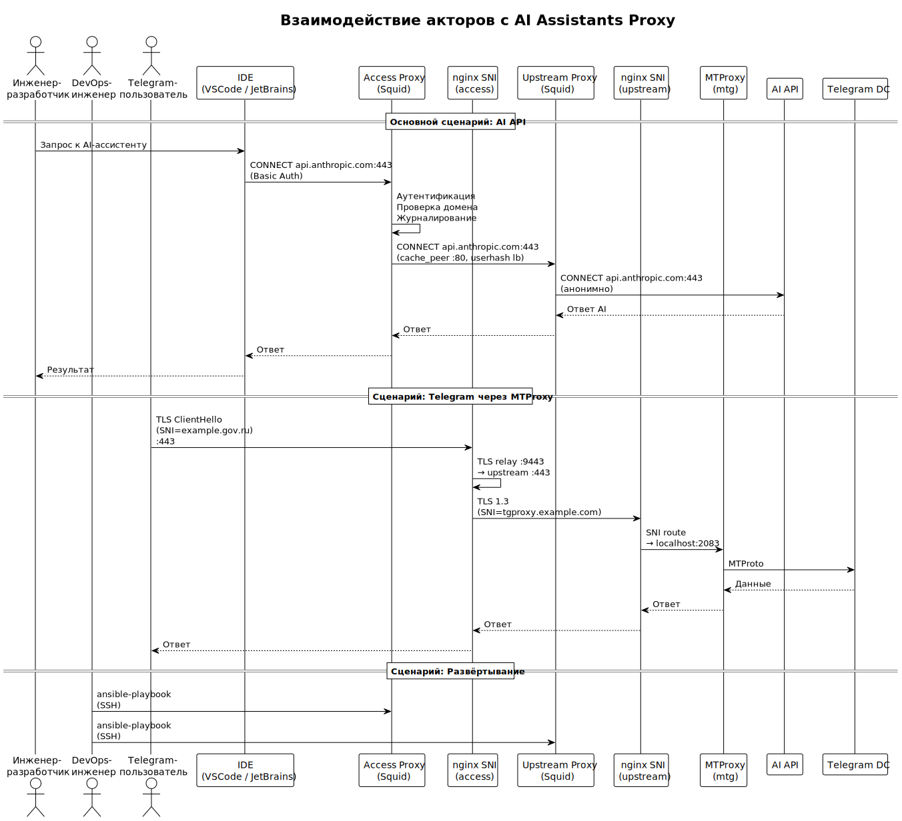

<!-- [AIGD] -->
# C1-BC-002 — Стейкхолдеры и акторы

## Ссылки

- Родительское требование: [C1-BC-001](C1-BC-001.md) — Целевая система
- Дочерние требования:
  - [C2-FR-002](../C2/C2-FR-002.md) — Аутентификация и авторизация
  - [C2-FR-007](../C2/C2-FR-007.md) — Конфигурации клиентов
  - [C2-FR-008](../C2/C2-FR-008.md) — Автоматизированное развёртывание

## Описание

### Стейкхолдеры

| ID | Роль | Описание | Интересы | Viewpoint |
|---|---|---|---|---|
| SH-01 | Владелец продукта | Руководитель / технический директор Организации | Обеспечение доступа инженеров к AI-инструментам; контроль затрат; безопасность | Стратегический |
| SH-02 | DevOps-инженер | Оператор инфраструктуры | Простота развёртывания и обслуживания; мониторинг; автоматизация | Операционный |
| SH-03 | Инженер-разработчик | Конечный пользователь AI-инструментов | Стабильный доступ к AI API; минимальная задержка; прозрачность настройки | Потребительский |
| SH-04 | Служба информационной безопасности | Контроль соответствия политикам ИБ | Аудит доступа; анонимизация; контроль утечек; IPS | Безопасность |

### Акторы (Personas)

#### Инженер-разработчик

Использует IDE (VSCode, JetBrains) с AI-ассистентами (Claude Code, GitHub Copilot, Gemini Code Assist). Подключается к прокси через HTTP_PROXY / HTTPS_PROXY переменные окружения. Ожидает прозрачную работу — прокси не должен требовать ручных действий после однократной настройки.

**Инструменты:** VSCode, JetBrains IDE, браузер (FoxyProxy), PowerShell.

**Сценарий:** инженер запускает Claude Code в VSCode → запрос уходит через access-прокси → access-прокси аутентифицирует, логирует, проверяет домен → пересылает на upstream-прокси → upstream анонимно передаёт запрос в Claude API → ответ возвращается по цепочке.

#### DevOps-инженер

Управляет инфраструктурой через Ansible. Редактирует inventory, запускает playbook, управляет пользователями (htpasswd), мониторит состояние компонентов.

**Инструменты:** Ansible CLI, SSH, htpasswd, systemctl, journalctl, cscli (CrowdSec).

**Сценарий:** DevOps-инженер добавляет нового пользователя → редактирует inventory.yml → запускает `ansible-playbook` → Ansible обновляет passwd-файл на access-прокси → новый пользователь получает доступ.

#### Telegram-пользователь

Подключается к Telegram через MTProxy, развёрнутый на upstream-нодах. Использует ссылку вида `tg://proxy?server=...&port=443&secret=...`.

**Сценарий:** пользователь добавляет прокси в Telegram-клиент → nginx SNI Router определяет fake-TLS домен → маршрутизирует трафик на MTProxy → MTProxy расшифровывает и транслирует в Telegram DC.

### Диаграмма взаимодействия акторов с системой

> Исходник: [diagrams/C1-BC-002-actors.puml](diagrams/C1-BC-002-actors.puml)

## Покрытие объектов управления
| Тип объекта | Статус | Артефакт / Обоснование N/A |
|---|---|---|
| Целевая система (System-of-Interest) | Covered | Контекст в [C1-BC-001](C1-BC-001.md) |
| Стейкхолдеры (Stakeholders) | Covered | Таблица стейкхолдеров выше |
| Внешние системы (External Systems) | N/A | Описаны в [C1-BC-003](C1-BC-003.md) |
| Акторы (Actors / Personas) | Covered | Три персоны описаны выше |
| Бизнес-цели и метрики (Goals & KPIs) | N/A | Описаны в [C1-BC-004](C1-BC-004.md) |
| Регуляторная среда (Regulatory) | N/A | Описана в [C1-BC-004](C1-BC-004.md) |
| Контракты и SLA | N/A | Описаны в [C1-BC-004](C1-BC-004.md) |
| Границы системы (System Boundary) | N/A | Описаны в [C1-BC-001](C1-BC-001.md) |
| Бизнес-сущности данных (Business Data Entities) | N/A | Описаны в [C1-BC-003](C1-BC-003.md) |
| Потоки ценности (Value Streams) | N/A | Описаны в [C1-BC-004](C1-BC-004.md) |
<!-- [/AIGD] -->
