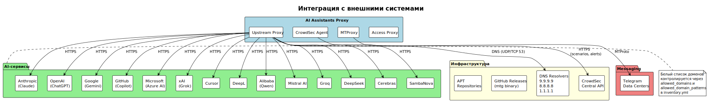

<!-- [AIGD] -->
# C1-BC-003 — Внешние системы и интеграции

## Ссылки

- Родительское требование: [C1-BC-001](C1-BC-001.md) — Целевая система
- Дочерние требования:
  - [C2-FR-001](../C2/C2-FR-001.md) — Проксирование запросов к AI API
  - [C2-FR-003](../C2/C2-FR-003.md) — Фильтрация доменов
  - [C2-FR-006](../C2/C2-FR-006.md) — MTProxy для Telegram
  - [C2-NF-002](../C2/C2-NF-002.md) — Безопасность

## Описание

### Внешние AI-системы

Система обеспечивает проксирование к следующим AI API через белый список доменов:

| Провайдер | Домены | Протокол | Описание |
|---|---|---|---|
| **Anthropic (Claude)** | `*.anthropic.com`, `claude.ai`, `*.claude.ai` | HTTPS | Claude API, Claude Code |
| **OpenAI (ChatGPT)** | `*.openai.com`, `chatgpt.com`, `*.chatgpt.com` | HTTPS | ChatGPT, GPT API |
| **Google (Gemini)** | `*.googleapis.com`, `*.google.com`, `generativelanguage.googleapis.com` | HTTPS | Gemini API, Gemini Code Assist |
| **GitHub Copilot** | `copilot-proxy.githubusercontent.com`, `*.github.com` | HTTPS | GitHub Copilot |
| **Microsoft AI** | `*.azure.com`, `*.microsoft.com`, `*.bing.com` | HTTPS | Azure OpenAI, Copilot |
| **xAI (Grok)** | `*.x.ai`, `*.grok.com` | HTTPS | Grok API |
| **Cursor** | `*.cursor.sh`, `*.cursorapi.com` | HTTPS | Cursor IDE AI |
| **DeepL** | `*.deepl.com` | HTTPS | DeepL Translator |
| **Alibaba Cloud** | `dashscope.aliyuncs.com`, `*.alibabacloud.com` | HTTPS | Qwen API |
| **Общий паттерн** | `*.ai` | HTTPS | Любые AI-сервисы на домене .ai |

Полный список определяется переменными `allowed_domains` и `allowed_domain_patterns` в inventory.yml.

### Инфраструктурные внешние системы

| Система | Назначение | Взаимодействие |
|---|---|---|
| **DNS (Quad9, Google, Cloudflare)** | Разрешение доменных имён AI-сервисов | Squid upstream → DNS resolvers (9.9.9.9, 8.8.8.8, 1.1.1.1) |
| **CrowdSec Central API** | Репутационная база IP-адресов и сценарии обнаружения | CrowdSec agent → Central API (pull scenarios/collections, push alerts) |
| **GitHub Releases (mtg)** | Загрузка бинарного файла MTProxy | Ansible → GitHub API при развёртывании |
| **Ubuntu/Debian APT** | Пакетный менеджер ОС | Ansible → APT для установки Squid, nginx, CrowdSec |
| **Telegram DC** | Серверы Telegram для MTProxy | MTProxy ↔ Telegram Data Centers |

### Бизнес-сущности данных (потоки)

| Сущность | Источник | Приёмник | Описание |
|---|---|---|---|
| HTTP/HTTPS запрос к AI API | Клиент (IDE/браузер) | Access Proxy → Upstream Proxy → AI API | Основной поток данных |
| Учётные данные (credentials) | DevOps-инженер | Access Proxy (passwd file) | Логин/пароль для Basic Auth |
| Белый список доменов | Ansible inventory | Access Proxy (squid.conf) | Разрешённые домены для проксирования |
| Записи журнала доступа | Access Proxy (Squid) | CrowdSec, файловая система | Лог обращений |
| MTProxy secret | mtg generate-secret / inventory | MTProxy daemon / Telegram-клиент | Секрет для fake-TLS |
| Конфигурации клиентов | Git-репозиторий | IDE / браузер пользователя | Настройки прокси |

### Диаграмма интеграции с внешними системами

> Исходник: [diagrams/C1-BC-003-external.puml](diagrams/C1-BC-003-external.puml)

## Покрытие объектов управления
| Тип объекта | Статус | Артефакт / Обоснование N/A |
|---|---|---|
| Целевая система (System-of-Interest) | N/A | Описана в [C1-BC-001](C1-BC-001.md) |
| Стейкхолдеры (Stakeholders) | N/A | Описаны в [C1-BC-002](C1-BC-002.md) |
| Внешние системы (External Systems) | Covered | Таблицы внешних систем выше |
| Акторы (Actors / Personas) | N/A | Описаны в [C1-BC-002](C1-BC-002.md) |
| Бизнес-цели и метрики (Goals & KPIs) | N/A | Описаны в [C1-BC-004](C1-BC-004.md) |
| Регуляторная среда (Regulatory) | N/A | Описана в [C1-BC-004](C1-BC-004.md) |
| Контракты и SLA | N/A | Описаны в [C1-BC-004](C1-BC-004.md) |
| Границы системы (System Boundary) | N/A | Описаны в [C1-BC-001](C1-BC-001.md) |
| Бизнес-сущности данных (Business Data Entities) | Covered | Таблица «Бизнес-сущности данных» выше |
| Потоки ценности (Value Streams) | N/A | Описаны в [C1-BC-004](C1-BC-004.md) |
<!-- [/AIGD] -->
