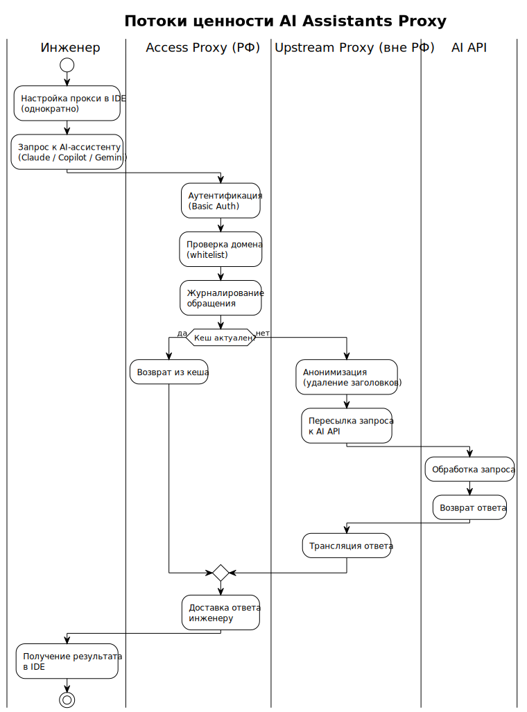

<!-- [AIGD] -->
# C1-BC-004 — Бизнес-цели, KPI и регуляторика

## Ссылки

- Родительское требование: [C1-BC-001](C1-BC-001.md) — Целевая система
- Дочерние требования:
  - [C2-NF-001](../C2/C2-NF-001.md) — Высокая доступность
  - [C2-NF-002](../C2/C2-NF-002.md) — Безопасность
  - [C2-NF-003](../C2/C2-NF-003.md) — Производительность
  - [C2-NF-004](../C2/C2-NF-004.md) — Масштабируемость
  - [C2-NF-005](../C2/C2-NF-005.md) — Наблюдаемость

## Описание

### Бизнес-цели

| ID | Цель | Приоритет | KPI | Целевое значение |
|---|---|---|---|---|
| BG-01 | Обеспечить инженерной команде стабильный доступ к AI-инструментам | Must | Доступность сервиса (uptime) | ≥ 99.5% |
| BG-02 | Минимизировать задержку при работе с AI API | Must | Добавленная латентность прокси | ≤ 50 мс (без учёта RTT до API) |
| BG-03 | Обеспечить анонимность обращений к AI API | Must | Утечка внутренних IP-адресов | 0 (ноль утечек) |
| BG-04 | Обеспечить контроль доступа и аудит | Should | Процент аутентифицированных запросов на access tier | 100% |
| BG-05 | Минимизировать операционные затраты на обслуживание | Should | Время развёртывания / обновления | ≤ 10 мин (ansible-playbook) |
| BG-06 | Поддерживать бесконфликтное сосуществование с другими проектами | Should | Инциденты co-deployment | 0 |

### Потоки ценности

#### Основной поток: Доступ инженера к AI API

```
Инженер → Настройка прокси (однократно) → Работа в IDE с AI-ассистентом →
→ Запрос через Access Proxy (аутентификация, фильтрация, логирование) →
→ Upstream Proxy (анонимизация) → AI API → Ответ → Инженер
```

**Ценность:** инженер получает доступ к AI-инструментам без необходимости использования VPN и без раскрытия корпоративных IP-адресов.

#### Вспомогательный поток: Развёртывание и обслуживание

```
DevOps-инженер → Редактирование inventory → Запуск Ansible playbook →
→ Автоматическое конфигурирование серверов → Проверка состояния (health check)
```

**Ценность:** инфраструктура управляется декларативно, воспроизводимо и идемпотентно.

#### Вспомогательный поток: Telegram через MTProxy

```
Telegram-пользователь → Добавление прокси-ссылки → Подключение через nginx SNI →
→ MTProxy (fake-TLS) → Telegram DC
```

**Ценность:** обход блокировок Telegram с маскировкой трафика.

### Диаграмма потока ценности



> Исходник: [diagrams/C1-BC-004-value-stream.puml](diagrams/C1-BC-004-value-stream.puml)

### Регуляторная среда

| Аспект | Описание | Влияние на систему |
|---|---|---|
| Санкционные ограничения | Ряд AI-сервисов ограничивает доступ из РФ | Upstream-прокси размещаются за пределами РФ для обхода гео-ограничений |
| 152-ФЗ «О персональных данных» | Логи доступа могут содержать ПДн (IP, логины) | Access-прокси хранят логи на территории РФ; на upstream-прокси логирование отключено |
| Корпоративная политика ИБ | Контроль исходящего трафика, аудит | Аутентификация, фильтрация доменов, журналирование на access tier |
| Блокировки Telegram (исторические) | DPI-блокировки Telegram-протокола | MTProxy с fake-TLS маскировкой под легитимный HTTPS |

### Контракты и SLA

| Контракт | Стороны | Условия |
|---|---|---|
| SLA доступности AI Proxy | DevOps-команда → Инженеры | Доступность ≥ 99.5%; RTO ≤ 5 мин (при наличии VRRP); инцидент = недоступность >1 мин |
| Аренда серверов | Организация → Хостинг-провайдеры | 2 access (РФ) + 2 upstream (вне РФ); SLA провайдера |
| AI API subscriptions | Организация → AI-провайдеры | Биллинг на стороне пользователей/Организации; вне scope системы |

## Покрытие объектов управления
| Тип объекта | Статус | Артефакт / Обоснование N/A |
|---|---|---|
| Целевая система (System-of-Interest) | N/A | Описана в [C1-BC-001](C1-BC-001.md) |
| Стейкхолдеры (Stakeholders) | N/A | Описаны в [C1-BC-002](C1-BC-002.md) |
| Внешние системы (External Systems) | N/A | Описаны в [C1-BC-003](C1-BC-003.md) |
| Акторы (Actors / Personas) | N/A | Описаны в [C1-BC-002](C1-BC-002.md) |
| Бизнес-цели и метрики (Goals & KPIs) | Covered | Таблица «Бизнес-цели» выше |
| Регуляторная среда (Regulatory) | Covered | Секция «Регуляторная среда» выше |
| Контракты и SLA | Covered | Секция «Контракты и SLA» выше |
| Границы системы (System Boundary) | N/A | Описаны в [C1-BC-001](C1-BC-001.md) |
| Бизнес-сущности данных (Business Data Entities) | N/A | Описаны в [C1-BC-003](C1-BC-003.md) |
| Потоки ценности (Value Streams) | Covered | Секция «Потоки ценности» выше |
<!-- [/AIGD] -->
