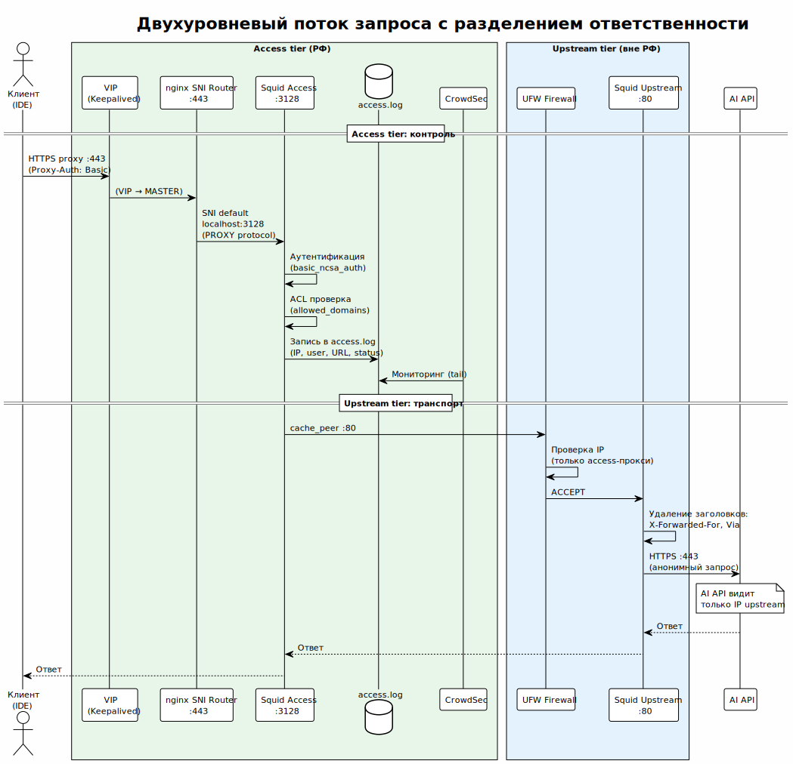

<!-- [AIGD] -->
# C2-CN-001 — Ограничение: двухуровневая архитектура

## Ссылки

- Родительские требования C1: [C1-BC-001](../C1/C1-BC-001.md)
- Дочерние требования C3: [C3-SA-001](../C3/C3-SA-001.md), [C3-SU-001](../C3/C3-SU-001.md), [C3-KA-001](../C3/C3-KA-001.md), [C3-CS-001](../C3/C3-CS-001.md), [C3-NX-001](../C3/C3-NX-001.md), [C3-MT-001](../C3/C3-MT-001.md), [C3-AD-001](../C3/C3-AD-001.md)

## Описание

Система **обязана** реализовывать двухуровневую архитектуру проксирования с чётким разделением ответственности между уровнями. Это архитектурный инвариант, не подлежащий изменению без пересмотра всей концепции системы.

### Определение ограничения

> Исходник: [diagrams/C2-CN-001-two-tier-flow.puml](diagrams/C2-CN-001-two-tier-flow.puml)

| Свойство | Access tier (РФ) | Upstream tier (вне РФ) |
|---|---|---|
| **Расположение** | Территория РФ | За пределами РФ |
| **Точка входа** | Клиенты подключаются сюда | Нет прямого доступа клиентов |
| **Аутентификация** | Да (Basic Auth) | Нет (по IP) |
| **Журналирование** | Да (access.log) | Нет |
| **Кеширование** | Да (опционально) | Нет |
| **IPS** | Да (CrowdSec) | Нет |
| **Анонимизация** | Нет | Да (удаление заголовков) |
| **Firewall** | Стандартный | Strict (только access-IP) |
| **MTProxy** | Нет | Да |
| **nginx SNI** | Нет | Да |

### Обоснование ограничения

1. **Географическое разделение:** access-прокси в РФ обеспечивает минимальную латентность для клиентов. Upstream за пределами РФ обеспечивает доступ к заблокированным ресурсам.

2. **Разделение ответственности (SoC):**
   - Access: контроль (auth, logging, IPS) — *кто* и *что*.
   - Upstream: транспорт (anonymization, routing) — *как*.

3. **Анонимизация:** upstream не знает о пользователях и не хранит логи. Целевые AI API видят только IP upstream-прокси.

4. **Безопасность:** компрометация upstream не даёт доступа к credentials и логам (они на access). Компрометация access не раскрывает IP upstream (firewall + отсутствие публичных эндпоинтов).

### Правило: нет прямого доступа клиентов к upstream

Клиенты **не могут** подключаться к upstream-нодам напрямую:
- nftables на upstream разрешает подключения только с IP access-прокси ([C2-NF-002](C2-NF-002.md)).
- Upstream-нода не публикует свой адрес клиентам.
- Все клиентские конфигурации ([C2-FR-007](C2-FR-007.md)) указывают на VIP access-прокси.

## Критерии приёмки

| # | Критерий | Метрика / Способ проверки | Целевое значение |
|---|----------|---------------------------|------------------|
| 1 | Access-ноды расположены в РФ | GeoIP по IP-адресу | Россия |
| 2 | Upstream-ноды расположены за пределами РФ | GeoIP по IP-адресу | Не Россия |
| 3 | Клиент не может подключиться к upstream напрямую | curl к upstream с произвольного IP | Connection refused |
| 4 | Access выполняет аутентификацию, upstream — нет | Анализ squid.conf на обоих уровнях | auth_param на access, нет на upstream |
| 5 | Upstream не ведёт журнал | grep access_log на upstream | access_log none |

## Доказательство реализации

### Конструктивное

Ограничение реализовано через:
- **Ansible inventory:** группы `access_proxies` и `upstreams` с разными host_vars.
- **squid.conf.j2:** условные блоки `` и ``.
- **nftables rules:** upstream разрешает только IP из `access_proxies`.
- **Клиентские конфигурации:** указывают на VIP access, не на upstream.

### Трассировочное

| C1 | C2 | C3 (дочерние) |
|---|---|---|
| [C1-BC-001](../C1/C1-BC-001.md) — Целевая система | C2-CN-001 — Двухуровневая архитектура | Все C3-компоненты |

### Аналитическое

**Почему не одноуровневая:** единый прокси в РФ не обеспечивает доступ к заблокированным ресурсам. Единый прокси за рубежом не обеспечивает минимальную латентность и контроль доступа в корпоративной сети.

**Почему не трёхуровневая:** текущий масштаб (инженерная команда) не требует дополнительного уровня (например, CDN или edge-прокси). Два уровня — минимально достаточная архитектура.

### Негативное

| Риск | Митигация |
|---|---|
| Увеличенная латентность (два hop вместо одного) | Access в РФ минимизирует первый hop; второй hop — высокоскоростной канал |
| Единая точка отказа на каждом уровне | VRRP на access ([C2-NF-001](C2-NF-001.md)); 2 upstream-ноды с failover |
| Усложнение диагностики (два прокси) | Журналирование на access с peer_host; squidclient mgr:info |

## Покрытие объектов управления
| Тип объекта | Статус | Артефакт / Обоснование N/A |
|---|---|---|
| Технологические ограничения | Covered | Архитектурный инвариант |
| Организационные ограничения | Covered | Географическое разделение (РФ / за рубежом) |
| Допущения | Covered | Сетевая связность между РФ и зарубежными площадками |
| Риски требований | Covered | См. секцию «Негативное» |

## Статус соответствия

| Дата | Уровень | Обоснование | Корректирующее действие |
|------|---------|-------------|-------------------------|
| 2026-02-23 | 4 — Conformant | Архитектура полностью реализована | — |

## Статус доказательства: verified

| Дата | Из статуса | В статус | Причина |
|------|------------|----------|---------|
| 2026-02-23 | absent | verified | Актуализация из кода Ansible |
<!-- [/AIGD] -->
