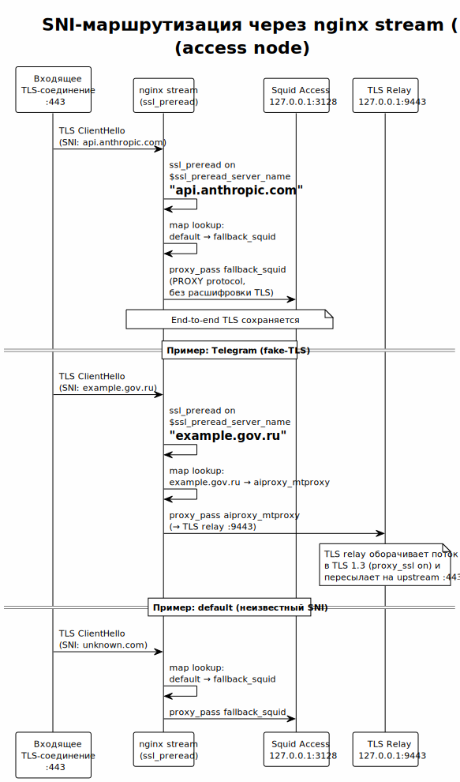

<!-- [AIGD] -->
# C2-CN-002 — Ограничение: совместимость с co-deployment

## Ссылки

- Родительские требования C1: [C1-BC-001](../C1/C1-BC-001.md)
- Дочерние требования C3: [C3-NX-001](../C3/C3-NX-001.md), [C3-CS-001](../C3/C3-CS-001.md)

## Описание

Upstream-ноды **совместно используются** с другими проектами Организации. Система обязана обеспечивать бесконфликтное сосуществование на одних серверах, разделяя порт 443 и инфраструктурные компоненты.

### Механизм co-deployment



> Исходник: [../ADR/diagrams/ADR-000003-sni-routing.puml](../ADR/diagrams/ADR-000003-sni-routing.puml) (первичная диаграмма — [ADR-000003](../ADR/ADR-000003.md))

#### 1. nginx SNI Router — разделение порта 443

Все сервисы, требующие порт 443, маршрутизируются через единый nginx stream-модуль с `ssl_preread`:

```nginx
# AI-GENERATED — NOT REVIEWED: SECTION START
stream {
    map $ssl_preread_server_name $backend {
        # MTProxy (AI Assistants Proxy)
        example.gov.ru          mtproxy_backend;

        # Default: Squid HTTPS (upstream proxy)
        default                 squid_https_backend;
    }

    server {
        listen 443;
        ssl_preread on;
        proxy_pass $backend;
    }
}
# AI-GENERATED — NOT REVIEWED: SECTION END
```

nginx анализирует SNI (Server Name Indication) в TLS ClientHello **без терминации TLS** и маршрутизирует подключение на соответствующий backend.

#### 2. Модульная конфигурация nginx

Каждый проект владеет своими конфигурационными файлами:

| Проект | Файл конфигурации | Backend |
|---|---|---|
| AI Assistants Proxy | `conf.d/ai-proxy-stream.conf` | MTProxy (2083), Squid HTTPS |

Конфигурации включаются через `include conf.d/*.conf` в основном `nginx.conf`.

#### 3. CrowdSec — совместное использование

CrowdSec IPS разделяется между проектами:
- Единый CrowdSec agent на ноде.
- Каждый проект добавляет свои datasources в `acquis.yaml`.
- Решения о блокировке применяются единым nftables bouncer.
- Коллекции и парсеры устанавливаются для каждого проекта.

### Правила co-deployment

1. **Изоляция конфигураций:** каждый проект управляет только своими файлами. Ansible-роль `nginx` AI Assistants Proxy не модифицирует конфигурации других проектов и наоборот.

2. **Нет конфликтов портов:** все сервисы слушают на уникальных локальных портах. MTProxy: 2083, Squid HTTPS: конфигурируемый. Порт 443 управляется nginx.

3. **Graceful reload:** изменение конфигурации одного проекта не прерывает соединения другого (`nginx -s reload`).

4. **CrowdSec scope:** решения о блокировке IP применяются глобально. Блокировка атакующего IP применяется ко всем проектам на ноде. Это **ожидаемое поведение** — атакующий IP блокируется полностью.

## Критерии приёмки

| # | Критерий | Метрика / Способ проверки | Целевое значение |
|---|----------|---------------------------|------------------|
| 1 | nginx маршрутизирует MTProxy-трафик по SNI | TLS-подключение с SNI=example.gov.ru | Ответ от mtg |
| 2 | nginx маршрутизирует Squid-трафик по default | TLS-подключение с произвольным SNI | Ответ от Squid HTTPS |
| 3 | Конфигурации изолированы | ls conf.d/ | Файлы каждого проекта отдельно |
| 4 | CrowdSec активен на ноде | cscli metrics | Datasources активны |

## Доказательство реализации

### Конструктивное

Реализовано через:
- **nginx role:** шаблон `nginx.conf.j2` с stream-блоком и `ssl_preread`; map по `$ssl_preread_server_name`.
- **Модульные конфигурации:** отдельные файлы в `conf.d/` для каждого проекта.
- **CrowdSec role:** `acquis.yaml` поддерживает множественные datasources.
- **Ansible:** каждый проект имеет свою роль; роли не конфликтуют.

### Трассировочное

| C1 | C2 | C3 (дочерние) |
|---|---|---|
| [C1-BC-001](../C1/C1-BC-001.md) — Целевая система | C2-CN-002 — Co-deployment | [C3-NX-001](../C3/C3-NX-001.md) — nginx SNI Router |
| [C1-BC-001](../C1/C1-BC-001.md) — Целевая система | C2-CN-002 — Co-deployment | [C3-CS-001](../C3/C3-CS-001.md) — CrowdSec |

### Аналитическое

**nginx SNI routing:** единственный способ разделить порт 443 между несколькими TLS-сервисами без терминации TLS. `ssl_preread` модуль nginx анализирует SNI из ClientHello — стандартный подход для multi-tenant TLS.

**Модульная конфигурация:** паттерн `conf.d/*.conf` предотвращает конфликты при параллельной разработке.

### Негативное

| Риск | Митигация |
|---|---|
| Ошибка в конфигурации одного проекта ломает nginx | `nginx -t` перед reload; Ansible handler |
| CrowdSec блокирует IP для всех проектов | Ожидаемое поведение; whitelist для критичных IP |
| Ресурсная конкуренция между проектами | Мониторинг CPU/RAM; разделение по cgroups (опционально) |
| SNI-based routing не работает при ESNI/ECH | ECH пока не распространён; мониторинг TLS-стандартов |

## Покрытие объектов управления
| Тип объекта | Статус | Артефакт / Обоснование N/A |
|---|---|---|
| Технологические ограничения | Covered | nginx SNI, совместное использование порта 443 |
| Организационные ограничения | Covered | Серверы разделяются между проектами |
| Совместимость | Covered | Co-deployment с другими проектами |
| Допущения | Covered | Другие проекты также используют Ansible; координация через conf.d/ |
| Риски требований | Covered | См. секцию «Негативное» |

## Статус соответствия

| Дата | Уровень | Обоснование | Корректирующее действие |
|------|---------|-------------|-------------------------|
| 2026-02-23 | 4 — Conformant | Реализовано в nginx role и CrowdSec role | — |

## Статус доказательства: verified

| Дата | Из статуса | В статус | Причина |
|------|------------|----------|---------|
| 2026-02-23 | absent | verified | Актуализация из кода Ansible/nginx/CrowdSec |
<!-- [/AIGD] -->
