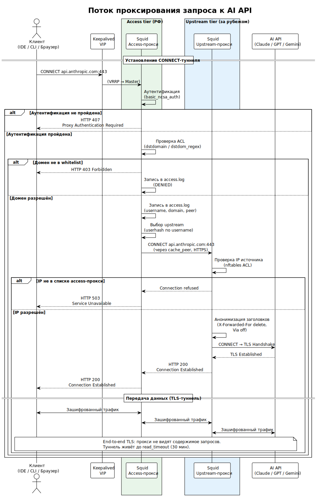

<!-- [AIGD] -->
# C2-FR-001 — Проксирование запросов к AI API

## Ссылки

- Родительские требования C1: [C1-BC-001](../C1/C1-BC-001.md), [C1-BC-003](../C1/C1-BC-003.md)
- Дочерние требования C3: [C3-SA-001](../C3/C3-SA-001.md), [C3-SU-001](../C3/C3-SU-001.md)

## Описание

Система обеспечивает прозрачное проксирование HTTPS-запросов от клиентских приложений (IDE, CLI-утилиты, браузеры) к целевым AI API (Claude, ChatGPT, Gemini, GitHub Copilot, Cursor и др.) через двухуровневую цепочку CONNECT-проксирования.

### Механизм проксирования

Запрос от клиента проходит следующую цепочку:

1. **Клиент** отправляет CONNECT-запрос к access-прокси (Squid) на виртуальный IP (VRRP).
2. **Access-прокси** (Squid, уровень РФ) выполняет аутентификацию ([C2-FR-002](C2-FR-002.md)), фильтрацию домена ([C2-FR-003](C2-FR-003.md)) и журналирование ([C2-FR-005](C2-FR-005.md)).
3. Access-прокси передаёт запрос на **upstream-прокси** (Squid, уровень за рубежом) через директиву `cache_peer` с протоколом CONNECT.
4. **Upstream-прокси** устанавливает TLS-туннель к целевому AI API.
5. Ответ возвращается по обратному маршруту.

> Исходник: [diagrams/C2-FR-001-proxy-flow.puml](diagrams/C2-FR-001-proxy-flow.puml)

### Балансировка нагрузки на upstream

Access-прокси распределяет запросы между upstream-нодами с использованием алгоритма **userhash** — хеширование по имени пользователя обеспечивает привязку пользователя к конкретному upstream-серверу, что улучшает кэширование и упрощает отладку. Параметры `cache_peer`:

| Параметр | Значение | Назначение |
|---|---|---|
| `type` | parent | Upstream является родительским пиром |
| `http_port` | 0 | HTTP-проксирование отключено |
| `https_port` | порт upstream | CONNECT-проксирование через HTTPS |
| `connect-fail-limit` | 2 | Порог отказов перед пометкой пира мёртвым |
| `dead_peer_timeout` | 15 seconds | Период восстановления мёртвого пира |
| `weight` | конфигурируемый | Вес пира для балансировки |

При отказе userhash-балансировки (все пиры для хеша недоступны) происходит fallback на **sourcehash** (хеширование по IP-адресу клиента).

### Маршрутизация доменов

Squid на access-уровне использует ACL-правила для определения допустимых целевых доменов:

- `acl allowed_domains dstdomain` — точное совпадение доменов из переменной `allowed_domains`
- `acl allowed_domain_patterns url_regex` — регулярные выражения из переменной `allowed_domain_patterns`

Разрешённый трафик перенаправляется на upstream через `cache_peer_access`. Запросы к неразрешённым доменам отклоняются с HTTP 403 ([C2-FR-003](C2-FR-003.md)).

### Протокол взаимодействия

Трафик между access-прокси и upstream-прокси передаётся по протоколу HTTPS (CONNECT через TLS). Squid на upstream-уровне слушает только на HTTPS-порту (`https_port` с `cert=` и `key=`). Это обеспечивает шифрование трафика между уровнями проксирования.

## Критерии приёмки

| # | Критерий | Метрика / Способ проверки | Целевое значение |
|---|----------|---------------------------|------------------|
| 1 | Клиент успешно проксирует HTTPS-запрос к AI API через access → upstream | curl --proxy через access-прокси к api.anthropic.com | HTTP 200 / TLS handshake success |
| 2 | Балансировка userhash распределяет пользователей по upstream-нодам | Анализ access.log: разные пользователи → разные upstream | Распределение по upstream-нодам |
| 3 | Failover при отказе upstream-ноды | Остановка одного upstream, повторный запрос | Запрос обслужен оставшимся upstream |
| 4 | Неразрешённый домен отклоняется | curl --proxy к запрещённому домену | HTTP 403 |
| 5 | CONNECT-туннель устанавливается корректно | tcpdump/wireshark: CONNECT → 200 → TLS handshake | Двухэтапное установление |

## Доказательство реализации

### Конструктивное

Механизм реализован через конфигурацию Squid (`squid.conf.j2` template):

- **Access-прокси:** `http_port` для входящих подключений, `cache_peer` для каждого upstream с параметрами `parent`, `no-query`, `userhash`, `connect-fail-limit=2`, `dead_peer_timeout=15 seconds`.
- **Upstream-прокси:** `https_port` с TLS-сертификатом, `http_access allow access_proxies_acl` (только IP-адреса access-прокси).
- **Ansible:** переменные `upstreams` (список upstream-нод), `allowed_domains`, `allowed_domain_patterns` определяют поведение проксирования.

### Трассировочное

| C1 | C2 | C3 (дочерние) |
|---|---|---|
| [C1-BC-001](../C1/C1-BC-001.md) — Целевая система | C2-FR-001 — Проксирование | [C3-SA-001](../C3/C3-SA-001.md) — Squid Access |
| [C1-BC-003](../C1/C1-BC-003.md) — Внешние системы | C2-FR-001 — Проксирование | [C3-SU-001](../C3/C3-SU-001.md) — Squid Upstream |

### Аналитическое

**Выбор Squid как прокси-движка:** Squid выбран благодаря нативной поддержке CONNECT-туннелирования, иерархии пиров (`cache_peer`), развитой системе ACL, поддержке SMP и зрелой кодовой базе. Альтернативы (HAProxy, nginx proxy_pass, Envoy) не обеспечивают аналогичного уровня управления CONNECT-пирами.

**Выбор userhash:** обеспечивает детерминированную привязку пользователя к upstream, что упрощает отладку и аудит. При недоступности целевого пира userhash корректно выполняет failover.

### Негативное

| Риск | Митигация |
|---|---|
| Недоступность всех upstream-нод | Keepalived health check + dead_peer_timeout 15s + connect-fail-limit 2 |
| Перехват трафика между уровнями | HTTPS между access и upstream (TLS-сертификат на upstream) |
| DPI-блокировка CONNECT-трафика | Upstream расположен за пределами РФ; трафик между access и upstream — стандартный HTTPS |

## Покрытие объектов управления
| Тип объекта | Статус | Артефакт / Обоснование N/A |
|---|---|---|
| Бизнес-требования | Covered | Проксирование — основная бизнес-функция системы |
| Пользовательские требования / User Stories | Covered | Инженер отправляет запрос к AI API через прокси |
| Функциональные спецификации | Covered | Описание механизма проксирования выше |
| Сценарии использования (Use Cases) | Covered | Диаграмма proxy-flow |
| Бизнес-правила | Covered | Правила маршрутизации: whitelist доменов, userhash-балансировка |
| Модель данных (Domain Data Model) | N/A | Проксирование не создаёт персистентных данных |
| Интеграционные требования | Covered | Протокол CONNECT, TLS, cache_peer |
| Интерфейс командной строки (CLI) | N/A | Управление через Ansible, не CLI |
| Производительность | Covered | [C2-NF-003](C2-NF-003.md) — SMP, fd limits |
| Надёжность / Доступность | Covered | [C2-NF-001](C2-NF-001.md) — VRRP, failover |
| Масштабируемость | Covered | [C2-NF-004](C2-NF-004.md) — горизонтальное масштабирование |
| Безопасность | Covered | [C2-NF-002](C2-NF-002.md) — анонимизация, firewall |
| Удобство (UX) | N/A | Инфраструктурный компонент, не UI |
| Сопровождаемость | Covered | IaC через Ansible ([C2-FR-008](C2-FR-008.md)) |
| Переносимость | N/A | Привязка к Squid на Linux |
| Совместимость | Covered | Стандартный HTTP CONNECT proxy, совместим с любым HTTPS-клиентом |
| Наблюдаемость | Covered | [C2-NF-005](C2-NF-005.md) |
| Аудит и журналирование | Covered | [C2-FR-005](C2-FR-005.md) |
| Внутренние метрики и счётчики | N/A | Squid не экспортирует метрики в Prometheus-формате |
| Технологические ограничения | Covered | Squid, Ansible, Linux |
| Организационные ограничения | N/A | Нет специфичных ограничений |
| Допущения | Covered | Наличие сетевой связности между РФ и зарубежными площадками |
| Риски требований | Covered | См. секцию «Негативное» |

## Статус соответствия

| Дата | Уровень | Обоснование | Корректирующее действие |
|------|---------|-------------|-------------------------|
| 2026-02-23 | 4 — Conformant | Механизм полностью реализован в squid.conf.j2 и Ansible playbook | — |

## Статус доказательства: verified

| Дата | Из статуса | В статус | Причина |
|------|------------|----------|---------|
| 2026-02-23 | absent | verified | Актуализация из кода Ansible/Squid |
<!-- [/AIGD] -->
