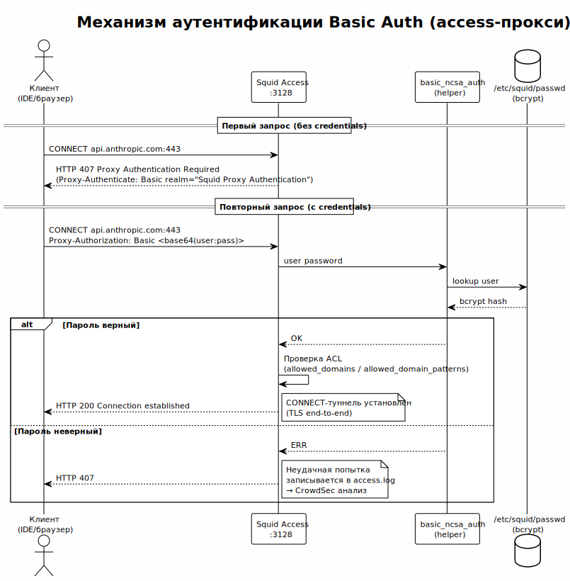

<!-- [AIGD] -->
# C2-FR-002 — Аутентификация и авторизация

## Ссылки

- Родительские требования C1: [C1-BC-002](../C1/C1-BC-002.md)
- Дочерние требования C3: [C3-SA-001](../C3/C3-SA-001.md)

## Описание

Система обеспечивает контроль доступа к прокси-сервису через механизм HTTP Basic Authentication, реализованный средствами Squid. Аутентификация применяется **только на уровне access-прокси**; upstream-прокси авторизует подключения по IP-адресу источника (access-прокси).

### Механизм аутентификации



> Исходник: [diagrams/C2-FR-002-auth-flow.puml](diagrams/C2-FR-002-auth-flow.puml)

1. Клиент отправляет CONNECT-запрос к access-прокси.
2. Squid запрашивает аутентификацию (HTTP 407 Proxy Authentication Required).
3. Клиент повторяет запрос с заголовком `Proxy-Authorization: Basic <base64(user:password)>`.
4. Squid передаёт учётные данные вспомогательной программе `basic_ncsa_auth`.
5. `basic_ncsa_auth` проверяет учётные данные по файлу `passwd` (формат htpasswd, bcrypt).
6. При успешной аутентификации запрос допускается к обработке ACL.

### Управление учётными записями

- Файл паролей: `/etc/squid/passwd` (управляется Ansible).
- Формат: Apache htpasswd с bcrypt-хешированием.
- Ansible-переменная `proxy_users` определяет список пользователей и паролей.
- Утилита `htpasswd` используется для генерации файла при развёртывании.

### Конфигурация Squid

```ini
# AI-GENERATED — NOT REVIEWED: SECTION START
auth_param basic program /usr/lib64/squid/basic_ncsa_auth /etc/squid/passwd
auth_param basic children 5 startup=2 idle=1
auth_param basic realm AI Proxy
auth_param basic credentialsttl 2 hours
auth_param basic casesensitive on

acl authenticated proxy_auth REQUIRED
http_access allow authenticated allowed_domains
http_access allow authenticated allowed_domain_patterns
http_access deny all
# AI-GENERATED — NOT REVIEWED: SECTION END
```

### Условное включение

Аутентификация включается переменной `enable_auth` (по умолчанию `true` на access-уровне, `false` на upstream-уровне). При `enable_auth: false` блоки `auth_param` и ACL `authenticated` исключаются из конфигурации.

## Критерии приёмки

| # | Критерий | Метрика / Способ проверки | Целевое значение |
|---|----------|---------------------------|------------------|
| 1 | Запрос без аутентификации отклоняется | curl --proxy без credentials | HTTP 407 |
| 2 | Запрос с корректными credentials обслуживается | curl --proxy -U user:pass | HTTP 200 (CONNECT success) |
| 3 | Запрос с некорректным паролем отклоняется | curl --proxy -U user:wrong | HTTP 407 |
| 4 | Файл паролей генерируется при развёртывании | Проверка /etc/squid/passwd после ansible-playbook | Файл существует, содержит bcrypt-хеши |
| 5 | Аутентификация отключена на upstream | curl --proxy к upstream без credentials | HTTP 200 (при разрешённом IP) |

## Доказательство реализации

### Конструктивное

Реализовано через Jinja2-шаблон `squid.conf.j2`:
- Блок `auth_param` условно включается при `enable_auth: true`.
- Задача Ansible `htpasswd` создаёт файл `/etc/squid/passwd` из словаря `proxy_users`.
- ACL `authenticated` требует proxy_auth REQUIRED перед проверкой доменного whitelist.

### Трассировочное

| C1 | C2 | C3 (дочерние) |
|---|---|---|
| [C1-BC-002](../C1/C1-BC-002.md) — Стейкхолдеры и акторы | C2-FR-002 — Аутентификация | [C3-SA-001](../C3/C3-SA-001.md) — Squid Access |

### Аналитическое

**Выбор Basic Auth:** Простота реализации и совместимость со всеми HTTP-клиентами (IDE, CLI, браузеры). Для корпоративной сети с TLS-шифрованием между клиентом и access-прокси (CONNECT через TLS) базовая аутентификация обеспечивает достаточный уровень защиты. Альтернативы (Kerberos, клиентские сертификаты) избыточны для текущего масштаба.

**Выбор bcrypt:** устойчив к brute-force по сравнению с MD5/SHA — стандарт htpasswd.

### Негативное

| Риск | Митигация |
|---|---|
| Перехват credentials в сети | TLS между клиентом и access-прокси (CONNECT) |
| Brute-force подбор пароля | CrowdSec IPS ([C2-NF-002](C2-NF-002.md)) анализирует access.log |
| Утечка файла passwd | Файл с bcrypt-хешами; доступ ограничен правами FS (squid:squid) |
| Отсутствие ротации паролей | Пароли обновляются через Ansible при переразвёртывании |

## Покрытие объектов управления
| Тип объекта | Статус | Артефакт / Обоснование N/A |
|---|---|---|
| Бизнес-требования | Covered | Контроль доступа — бизнес-требование корпоративной среды |
| Пользовательские требования / User Stories | Covered | Инженер вводит credentials при настройке прокси |
| Функциональные спецификации | Covered | Описание механизма Basic Auth выше |
| Сценарии использования (Use Cases) | Covered | Сценарий успешной/неуспешной аутентификации |
| Бизнес-правила | Covered | Только аутентифицированные пользователи получают доступ |
| Модель данных (Domain Data Model) | Covered | Файл passwd (user:bcrypt_hash) |
| Интеграционные требования | Covered | Squid basic_ncsa_auth, htpasswd |
| Интерфейс командной строки (CLI) | N/A | Управление через Ansible |
| Безопасность | Covered | TSF-функция: контроль доступа |
| Аудит и журналирование | Covered | Имя пользователя записывается в access.log ([C2-FR-005](C2-FR-005.md)) |
| Технологические ограничения | Covered | Squid basic_ncsa_auth, htpasswd |
| Допущения | Covered | TLS обеспечивает защиту credentials при передаче |
| Риски требований | Covered | См. секцию «Негативное» |

## Статус соответствия

| Дата | Уровень | Обоснование | Корректирующее действие |
|------|---------|-------------|-------------------------|
| 2026-02-23 | 4 — Conformant | Полностью реализовано в squid.conf.j2 и Ansible tasks | — |

## Статус доказательства: verified

| Дата | Из статуса | В статус | Причина |
|------|------------|----------|---------|
| 2026-02-23 | absent | verified | Актуализация из кода Ansible/Squid |
<!-- [/AIGD] -->
