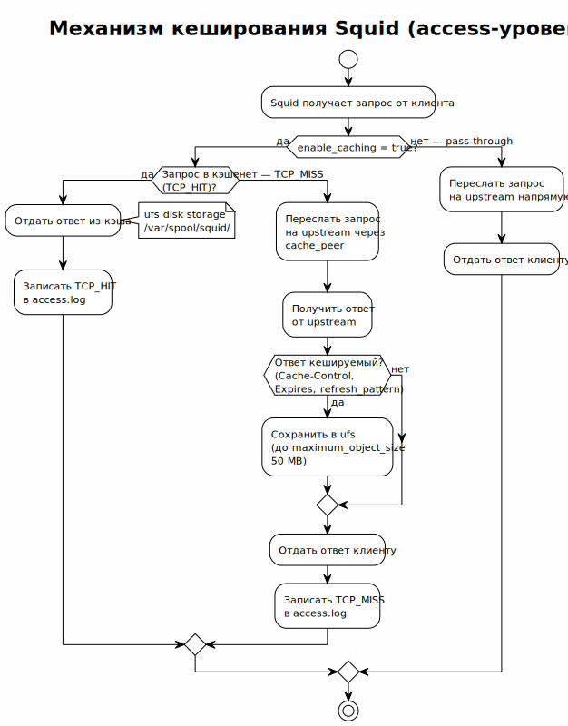

<!-- [AIGD] -->
# C2-FR-004 — Кеширование ответов

## Ссылки

- Родительские требования C1: [C1-BC-001](../C1/C1-BC-001.md)
- Дочерние требования C3: [C3-SA-001](../C3/C3-SA-001.md)

## Описание

Система реализует дисковое кеширование HTTP-ответов на уровне **access-прокси** для снижения латентности повторных запросов и нагрузки на upstream-каналы. Кеширование включается условно и не применяется на upstream-уровне.

### Механизм кеширования

> Исходник: [diagrams/C2-FR-004-caching-flow.puml](diagrams/C2-FR-004-caching-flow.puml)

1. Access-прокси Squid получает ответ от upstream (или из кэша).
2. Squid оценивает кешируемость ответа по HTTP-заголовкам (Cache-Control, Expires, Last-Modified).
3. При положительной оценке ответ сохраняется в дисковом хранилище (ufs).
4. Последующие идентичные запросы обслуживаются из кэша без обращения к upstream.

### Конфигурация кэша

| Параметр | Значение | Описание |
|---|---|---|
| `cache_dir` | `ufs /var/spool/squid 100 16 256` | Тип ufs, 100 MB, 16 директорий L1, 256 L2 |
| `maximum_object_size` | 50 MB | Максимальный размер кешируемого объекта |
| `enable_caching` | `true` (access) / `false` (upstream) | Условное включение |

### Условное включение

Кеширование включается переменной `enable_caching` (по умолчанию `true` на access-уровне). При `enable_caching: false` директива `cache_dir` исключается из конфигурации, добавляется `cache deny all`, и Squid работает в pass-through режиме.

## Критерии приёмки

| # | Критерий | Метрика / Способ проверки | Целевое значение |
|---|----------|---------------------------|------------------|
| 1 | Директория кэша создаётся при развёртывании | ls -la /var/spool/squid | Директория существует с корректными правами |
| 2 | Размер кэша соответствует конфигурации | grep cache_dir /etc/squid/squid.conf | `ufs /var/spool/squid 100 16 256` |
| 3 | Повторный запрос обслуживается из кэша | Два идентичных запроса; проверка TCP_HIT в access.log | TCP_HIT для второго запроса |
| 4 | Кеширование отключено на upstream | grep cache_dir на upstream-ноде | Строка отсутствует |

## Доказательство реализации

### Конструктивное

Реализовано в `Servers/deploy/templates/squid-access.conf.j2`:
- Условный блок `` включает `cache_dir ufs` с фиксированным размером 100 MB.
- При `enable_caching: false` — `cache deny all`.
- Инициализация кэша: `squid -z` выполняется Ansible-задачей при первом развёртывании.

### Трассировочное

| C1 | C2 | C3 (дочерние) |
|---|---|---|
| [C1-BC-001](../C1/C1-BC-001.md) — Целевая система | C2-FR-004 — Кеширование | [C3-SA-001](../C3/C3-SA-001.md) — Squid Access |

### Аналитическое

**Выбор ufs:** стандартный тип хранилища Squid, использующий синхронный I/O. При текущих объёмах кэша (100 MB) переход на `aufs` (асинхронный) или `rock` (SSD-оптимизированный) не оправдан.

**Фиксированный размер:** 100 MB — достаточен для кеширования статических ресурсов AI-сервисов (JS, CSS, шрифты). Основной трафик — CONNECT-туннели (HTTPS), которые не кешируются.

### Негативное

| Риск | Митигация |
|---|---|
| Кэш выдаёт устаревшие ответы AI API | refresh_pattern с коротким min для JSON; AI API обычно отвечают с Cache-Control: no-cache |
| Переполнение диска | Размер кэша ограничен формулой; Squid автоматически вытесняет старые объекты (LRU) |
| Кеширование чувствительных данных | CONNECT-туннели (HTTPS) не кешируются Squid; кешируются только HTTP-ответы |

## Покрытие объектов управления
| Тип объекта | Статус | Артефакт / Обоснование N/A |
|---|---|---|
| Бизнес-требования | Covered | Снижение латентности и нагрузки |
| Функциональные спецификации | Covered | Описание механизма кеширования выше |
| Сценарии использования (Use Cases) | Covered | Сценарий повторного запроса из кэша |
| Бизнес-правила | Covered | Правила refresh_pattern |
| Производительность | Covered | Снижение латентности повторных запросов |
| Технологические ограничения | Covered | ufs, дисковое пространство |
| Допущения | Covered | HTTPS CONNECT-туннели не кешируются (ожидаемое поведение) |
| Риски требований | Covered | См. секцию «Негативное» |

## Статус соответствия

| Дата | Уровень | Обоснование | Корректирующее действие |
|------|---------|-------------|-------------------------|
| 2026-02-23 | 4 — Conformant | Реализовано в squid-access.conf.j2 с условным включением | — |
| 2026-03-24 | 4 — Conformant | Актуализация: ufs вместо aufs, 50 MB вместо 512 MB, фиксированный размер 100 MB, refresh_pattern отсутствует в шаблоне | — |

## Статус доказательства: verified

| Дата | Из статуса | В статус | Причина |
|------|------------|----------|---------|
| 2026-02-23 | absent | verified | Актуализация из кода Ansible/Squid |
<!-- [/AIGD] -->
