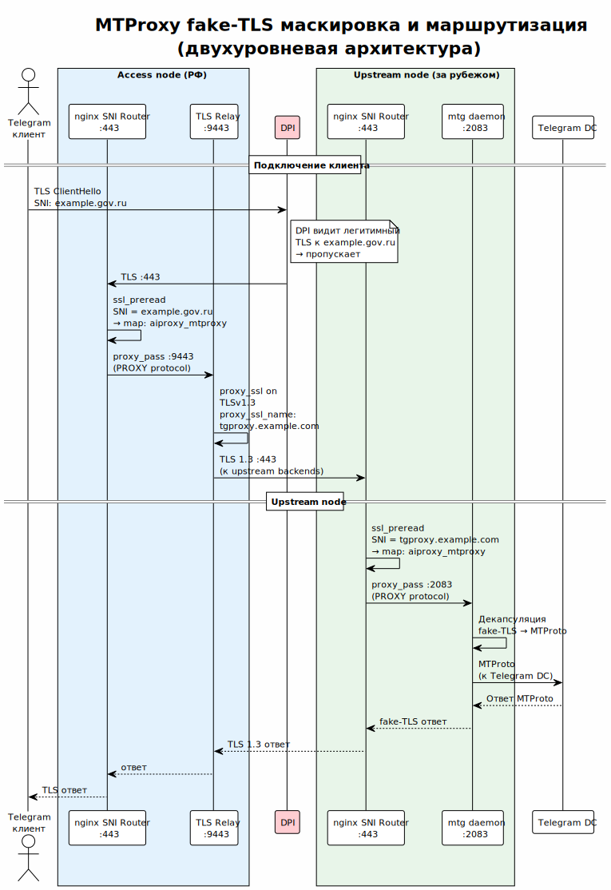

<!-- [AIGD] -->
# C2-FR-006 — MTProxy для Telegram

## Ссылки

- Родительские требования C1: [C1-BC-001](../C1/C1-BC-001.md), [C1-BC-003](../C1/C1-BC-003.md)
- Дочерние требования C3: [C3-MT-001](../C3/C3-MT-001.md), [C3-NX-001](../C3/C3-NX-001.md)

## Описание

Система предоставляет MTProxy-сервис для доступа к Telegram через upstream-ноды. MTProxy обеспечивает обход DPI-блокировок благодаря маскировке трафика под стандартный TLS (fake-TLS). Маршрутизация MTProxy-трафика осуществляется через nginx SNI Router, разделяющий порт 443 с другими сервисами ([C2-CN-002](C2-CN-002.md)).

### Компоненты

1. **mtg v2** — реализация MTProxy протокола (Go-бинарник).
2. **nginx SNI Router** — маршрутизирует TLS-трафик по SNI на MTProxy или другие backend.

### Механизм работы

> Исходник: [../ADR/diagrams/ADR-000005-mtproxy-flow.puml](../ADR/diagrams/ADR-000005-mtproxy-flow.puml) (первичная диаграмма — [ADR-000005](../ADR/ADR-000005.md))

1. Telegram-клиент инициирует TLS-подключение к upstream-ноде на порт 443 с SNI, соответствующим домену маскировки (по умолчанию `example.gov.ru`).
2. nginx SNI Router анализирует SNI и маршрутизирует подключение на локальный порт mtg (2083).
3. mtg выполняет fake-TLS handshake, декапсулирует MTProxy-трафик и проксирует его к серверам Telegram.

### Конфигурация mtg

| Параметр | Значение | Описание |
|---|---|---|
| `secret` | Генерируемый при развёртывании | MTProxy secret для аутентификации |
| `bind` | `0.0.0.0:2083` | Локальный порт прослушивания |
| `cloak_host` | `example.gov.ru` (конфигурируемо) | Домен для fake-TLS маскировки |
| `cloak_port` | `443` | Порт маскировки |
| Формат конфигурации | TOML | `mtg.toml` |
| Управление процессом | systemd | `mtg.service` |

### Маршрутизация nginx

nginx stream-модуль маршрутизирует подключения на порт 443 по SNI:
- SNI = домен маскировки MTProxy → `127.0.0.1:2083` (mtg)
- SNI = прочие → upstream Squid HTTPS port или default backend

## Критерии приёмки

| # | Критерий | Метрика / Способ проверки | Целевое значение |
|---|----------|---------------------------|------------------|
| 1 | mtg-сервис запущен и работает | systemctl status mtg | active (running) |
| 2 | Telegram-клиент подключается через MTProxy | Настройка MTProxy в Telegram, отправка сообщения | Сообщение доставлено |
| 3 | Fake-TLS маскировка активна | Анализ TLS handshake (SNI = cloak_host) | SNI = example.gov.ru |
| 4 | nginx маршрутизирует MTProxy-трафик | Подключение к порту 443 с SNI = cloak_host | Ответ от mtg |
| 5 | Secret генерируется при развёртывании | cat /etc/mtg/mtg.toml | Поле secret заполнено |

## Доказательство реализации

### Конструктивное

Реализовано через Ansible-роль `mtproxy`:
- Шаблон `mtg.toml.j2` генерирует TOML-конфигурацию с параметрами secret, bind, cloak_host, cloak_port.
- Systemd unit `mtg.service` управляет жизненным циклом процесса.
- Ansible-роль `nginx` конфигурирует stream-блок с `ssl_preread` и `map $ssl_preread_server_name` для SNI-маршрутизации.

### Трассировочное

| C1 | C2 | C3 (дочерние) |
|---|---|---|
| [C1-BC-001](../C1/C1-BC-001.md) — Целевая система | C2-FR-006 — MTProxy | [C3-MT-001](../C3/C3-MT-001.md) — MTProxy (mtg) |
| [C1-BC-003](../C1/C1-BC-003.md) — Внешние системы | C2-FR-006 — MTProxy | [C3-NX-001](../C3/C3-NX-001.md) — nginx SNI Router |

### Аналитическое

**Выбор mtg v2:** единственная зрелая реализация MTProxy на Go с поддержкой fake-TLS. Оригинальный C-клиент от Telegram устарел и не поддерживает fake-TLS.

**Выбор порта 2083:** нестандартный порт для MTProxy, снижающий вероятность конфликтов. Внешний трафик приходит на 443 и маршрутизируется nginx.

**Fake-TLS с example.gov.ru:** трафик маскируется под HTTPS-обращение к государственному сайту example.gov.ru, затрудняющее DPI-фильтрацию.

### Негативное

| Риск | Митигация |
|---|---|
| Обнаружение MTProxy через timing analysis | fake-TLS с padding; example.gov.ru как cloak_host |
| Утечка MTProxy secret | Secret хранится в Ansible vault; файл mtg.toml с ограниченными правами |
| Блокировка IP upstream-ноды | Upstream-ноды — не публичные; IP распространяются только через внутренние каналы |

## Покрытие объектов управления
| Тип объекта | Статус | Артефакт / Обоснование N/A |
|---|---|---|
| Бизнес-требования | Covered | Доступ к Telegram для инженерной команды |
| Пользовательские требования / User Stories | Covered | Инженер подключается к Telegram через MTProxy |
| Функциональные спецификации | Covered | Описание механизма выше |
| Сценарии использования (Use Cases) | Covered | Подключение Telegram-клиента через MTProxy |
| Бизнес-правила | N/A | Нет специфичных бизнес-правил |
| Модель данных (Domain Data Model) | N/A | Транзитный трафик, без хранения |
| Интеграционные требования | Covered | mtg ↔ Telegram, nginx SNI ↔ mtg |
| Безопасность | Covered | Fake-TLS, secret-аутентификация |
| Технологические ограничения | Covered | mtg v2 (Go), nginx stream, TOML |
| Допущения | Covered | Telegram не меняет MTProxy-протокол критически |
| Риски требований | Covered | См. секцию «Негативное» |

## Статус соответствия

| Дата | Уровень | Обоснование | Корректирующее действие |
|------|---------|-------------|-------------------------|
| 2026-02-23 | 4 — Conformant | Реализовано в ролях mtproxy и nginx | — |

## Статус доказательства: verified

| Дата | Из статуса | В статус | Причина |
|------|------------|----------|---------|
| 2026-02-23 | absent | verified | Актуализация из кода Ansible/mtg/nginx |
<!-- [/AIGD] -->
