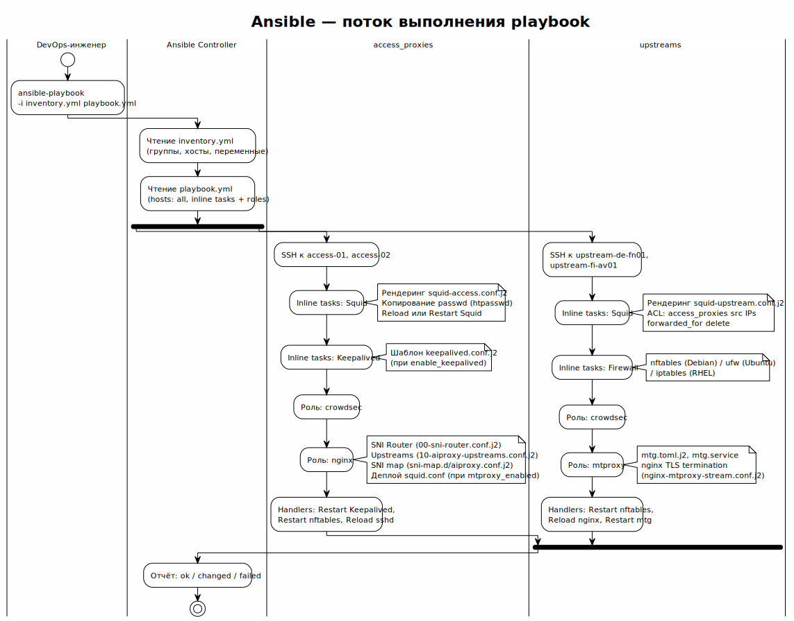

<!-- [AIGD] -->
# C2-FR-008 — Автоматизированное развёртывание (Ansible)

## Ссылки

- Родительские требования C1: [C1-BC-004](../C1/C1-BC-004.md)
- Дочерние требования C3: [C3-AD-001](../C3/C3-AD-001.md)

## Описание

Вся инфраструктура AI Assistants Proxy управляется через **Ansible** (Infrastructure as Code). Развёртывание, обновление и конфигурация всех компонентов выполняются единым playbook с идемпотентным выполнением.

### Структура автоматизации

#### Playbook

Единый `playbook.yml` оркестрирует развёртывание всех компонентов в определённом порядке:



> Исходник: [../ADR/diagrams/ADR-000007-ansible-flow.puml](../ADR/diagrams/ADR-000007-ansible-flow.puml) (первичная диаграмма — [ADR-000007](../ADR/ADR-000007.md))

1. **Общая подготовка** — установка пакетов, настройка sysctl, firewall (UFW).
2. **DNS** — роль `dns_resolver` (unbound на всех нодах).
3. **MTProxy/nginx** — роль `mtproxy` (upstream: nginx SNI + mtg) и роль `nginx` (access: SNI Router). Выполняется **до** Squid, чтобы освободить порты.
4. **Squid** — установка и конфигурация прокси (access и upstream).
5. **Keepalived** — настройка VRRP на access-нодах.
6. **CrowdSec** — установка IPS и bouncer (на **всех** нодах, с whitelist инфраструктуры).
7. **Клиентские конфигурации** — генерация config-файлов.

#### Inventory

```ini
[access_proxies]
access-1 ansible_host=...
access-2 ansible_host=...

[upstreams]
upstream-1 ansible_host=...
```

Группы inventory определяют, какие роли и задачи применяются к каким нодам:
- `access_proxies` — Squid (access mode), Keepalived, CrowdSec, nginx, unbound
- `upstreams` — Squid (upstream mode, порт 80), nginx, mtg, CrowdSec, unbound

#### Роли

| Роль | Компонент | Применяется к |
|---|---|---|
| `dns_resolver` | unbound caching DNS | all |
| `crowdsec` | CrowdSec IPS + nftables bouncer + whitelist | all |
| `nginx` | nginx SNI Router (access: Squid + MTProxy) | access_proxies |
| `mtproxy` | nginx SNI Router + mtg v2 (upstream: MTProxy only) | upstreams |

Squid и Keepalived конфигурируются задачами в playbook (не вынесены в роли).

### Идемпотентность

Все задачи Ansible идемпотентны:
- `template:` — перезаписывает файл только при изменении.
- `service:` — перезапускает сервис только при changed.
- `package:` — устанавливает только отсутствующие пакеты.
- Handlers: `restart squid`, `restart keepalived`, `restart nginx`, `restart mtg` — срабатывают только при изменении конфигурации.

### Валидация перед развёртыванием

```bash
# AI-GENERATED — NOT REVIEWED: SECTION START
ansible-playbook playbook.yml --syntax-check
ansible-playbook playbook.yml --check --diff
# AI-GENERATED — NOT REVIEWED: SECTION END
```

- `--syntax-check` — проверка синтаксиса YAML/Jinja2.
- `--check --diff` — dry-run с показом изменений.

## Критерии приёмки

| # | Критерий | Метрика / Способ проверки | Целевое значение |
|---|----------|---------------------------|------------------|
| 1 | Playbook проходит syntax-check | ansible-playbook --syntax-check | Exit code 0 |
| 2 | Повторный запуск не меняет состояние | ansible-playbook (второй раз) | changed=0 |
| 3 | Все компоненты запущены после развёртывания | systemctl status squid/keepalived/nginx/mtg | active (running) |
| 4 | Конфигурации Squid валидны | squid -k parse | Exit code 0 |
| 5 | Inventory содержит обе группы | ansible-inventory --list | access_proxies, upstreams |

## Доказательство реализации

### Конструктивное

Реализовано в:
- `playbook.yml` — основной playbook с 7 секциями.
- `inventory/` — группы access_proxies и upstreams.
- `roles/crowdsec/`, `roles/nginx/`, `roles/mtproxy/` — роли компонентов.
- `templates/squid.conf.j2`, `templates/keepalived.conf.j2` — шаблоны конфигурации.
- `group_vars/`, `host_vars/` — переменные для каждой группы/ноды.

### Трассировочное

| C1 | C2 | C3 (дочерние) |
|---|---|---|
| [C1-BC-004](../C1/C1-BC-004.md) — Бизнес-цели | C2-FR-008 — Ansible развёртывание | [C3-AD-001](../C3/C3-AD-001.md) — Ansible Deployment |

### Аналитическое

**Выбор Ansible:** agentless (SSH), декларативный, широко распространён. Не требует установки агента на управляемых нодах. Альтернативы (Terraform, Puppet, Chef) либо не подходят для конфигурации ОС (Terraform), либо требуют агента (Puppet, Chef).

**Единый playbook:** вся инфраструктура описана в одном месте, что упрощает понимание и отладку. Роли выделены только для компонентов с нетривиальной логикой (CrowdSec, nginx, mtg).

### Негативное

| Риск | Митигация |
|---|---|
| Ошибка в playbook ломает production | --check --diff перед apply; syntax-check в CI |
| Secrets в открытом виде в inventory | ansible-vault для шифрования sensitive vars |
| Зависимость от Ansible-контроллера | Playbook можно запустить с любой машины с SSH-доступом |

## Покрытие объектов управления
| Тип объекта | Статус | Артефакт / Обоснование N/A |
|---|---|---|
| Бизнес-требования | Covered | Управляемость и воспроизводимость инфраструктуры |
| Функциональные спецификации | Covered | Описание playbook, inventory, ролей выше |
| Сценарии использования (Use Cases) | Covered | DevOps запускает playbook для развёртывания |
| Интерфейс командной строки (CLI) | Covered | ansible-playbook CLI |
| Сопровождаемость | Covered | IaC — конфигурация как код, версионируемая в Git |
| Технологические ограничения | Covered | Ansible 2.x, SSH, Python на managed nodes |
| Допущения | Covered | SSH-доступ к нодам; Python установлен |
| Риски требований | Covered | См. секцию «Негативное» |

## Статус соответствия

| Дата | Уровень | Обоснование | Корректирующее действие |
|------|---------|-------------|-------------------------|
| 2026-02-23 | 4 — Conformant | Полностью реализовано в Ansible playbook и ролях | — |

## Статус доказательства: verified

| Дата | Из статуса | В статус | Причина |
|------|------------|----------|---------|
| 2026-02-23 | absent | verified | Актуализация из кода Ansible |
<!-- [/AIGD] -->
