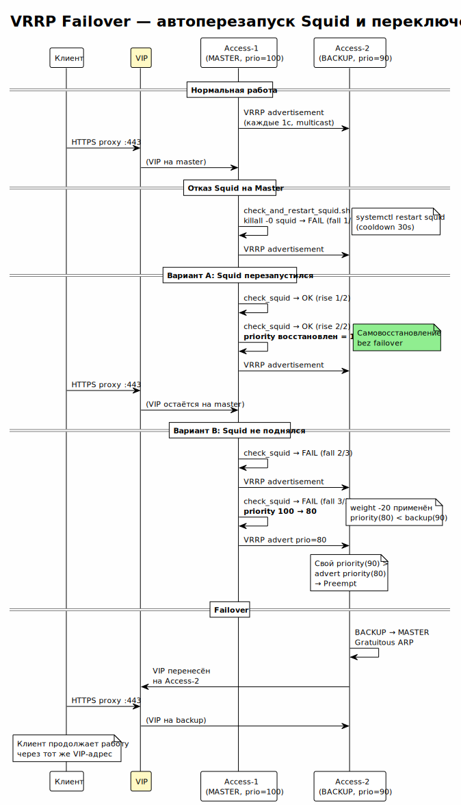
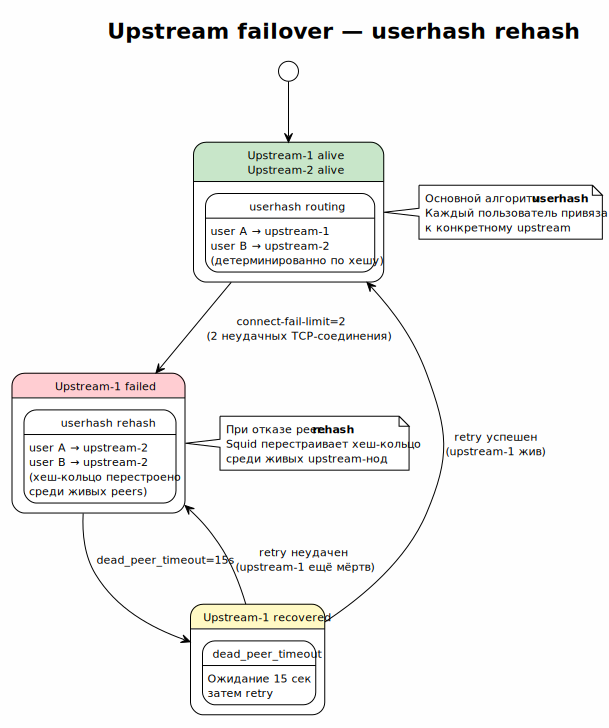

<!-- [AIGD] -->
# C2-NF-001 — Высокая доступность (VRRP, failover)

## Ссылки

- Родительские требования C1: [C1-BC-004](../C1/C1-BC-004.md)
- Дочерние требования C3: [C3-KA-001](../C3/C3-KA-001.md), [C3-SA-001](../C3/C3-SA-001.md), [C3-SU-001](../C3/C3-SU-001.md)

## Описание

Система обеспечивает высокую доступность на обоих уровнях проксирования через комбинацию VRRP failover (access-уровень) и userhash/sourcehash failover (upstream-уровень). Целевая доступность — непрерывность работы при отказе одной ноды на каждом уровне.

### Механизмы обеспечения HA

#### 1. VRRP на access-уровне (Keepalived)



> Исходник: [diagrams/C2-NF-001-vrrp-failover.puml](diagrams/C2-NF-001-vrrp-failover.puml)

Две access-ноды объединены в VRRP-группу с виртуальным IP (VIP):

| Параметр | Значение |
|---|---|
| Протокол | VRRPv2 |
| virtual_router_id | Конфигурируемый |
| priority | Master: 100, Backup: 50 |
| VIP | Единый адрес для клиентов |
| advert_int | 1 секунда |
| authentication | PASS (shared secret) |

Клиенты подключаются к VIP. При отказе Master-ноды Backup принимает VIP за ~3 секунды (3 пропущенных advertisement).

#### 2. Health Check Squid (check_squid)

Keepalived выполняет проверку работоспособности Squid:

```bash
# AI-GENERATED — NOT REVIEWED: SECTION START
vrrp_script check_squid {
    script "/usr/bin/squid -k check"
    interval 5
    weight -20
    fall 3
    rise 2
}
# AI-GENERATED — NOT REVIEWED: SECTION END
```

- `interval 5` — проверка каждые 5 секунд.
- `weight -20` — при неуспехе priority снижается на 20.
- `fall 3` — 3 неудачных проверки для пометки failure.
- `rise 2` — 2 успешных проверки для восстановления.

При отказе Squid на Master-ноде priority падает ниже Backup, VRRP выполняет failover.

#### 3. Upstream failover (Squid cache_peer)



> Исходник: [diagrams/C2-NF-001-upstream-failover.puml](diagrams/C2-NF-001-upstream-failover.puml)

Access-прокси поддерживает failover к upstream-нодам через параметры `cache_peer`:

| Параметр | Значение | Описание |
|---|---|---|
| `connect-fail-limit` | 2 | 2 неудачных попытки → пир мёртв |
| `dead_peer_timeout` | 15 seconds | Через 15 секунд пир проверяется снова |
| Основной алгоритм | userhash | Хеширование по имени пользователя |
| Fallback алгоритм | sourcehash | Хеширование по IP при отказе userhash |

#### 4. Топология

| Уровень | Количество нод | Механизм HA |
|---|---|---|
| Access | 2 | VRRP (active/standby) + health check |
| Upstream | 1 (масштабируется через inventory) | userhash → sourcehash failover |

### Количественные целевые значения

| Метрика | Целевое значение | Метод измерения |
|---|---|---|
| Время failover (access) | ≤ 5 секунд | Время между потерей Master и принятием VIP Backup |
| Время failover (upstream) | ≤ 30 секунд | dead_peer_timeout (15s) × 2 попытки |
| Доступность (access tier) | 99.5% | (1 - downtime/period) × 100% |
| RPO | 0 (stateless) | Нет данных для потери |
| RTO | ≤ 5 секунд (access) | Время восстановления VIP |

## Критерии приёмки

| # | Критерий | Метрика / Способ проверки | Целевое значение |
|---|----------|---------------------------|------------------|
| 1 | VIP назначен на Master-ноду | ip addr show на Master | VIP присутствует |
| 2 | Failover при остановке Squid на Master | systemctl stop squid на Master; проверка VIP | VIP переходит на Backup за ≤ 5s |
| 3 | Клиент продолжает работу после failover | curl --proxy через VIP после failover | HTTP 200 |
| 4 | Upstream failover при остановке upstream-ноды | Остановка одного upstream; проверка запроса | Запрос обслужен другим upstream |
| 5 | Recovery: Master возвращает VIP | Запуск Squid на Master; проверка VIP | VIP возвращается (если preempt) |

## Доказательство реализации

### Конструктивное

Реализовано через:
- `keepalived.conf.j2` — VRRP-конфигурация с vrrp_script check_squid, virtual_router_id, priority, authentication.
- `squid.conf.j2` — cache_peer с connect-fail-limit=2, dead_peer_timeout=15 seconds.
- Ansible inventory — группы access_proxies (2 ноды) и upstreams (1 нода).

### Трассировочное

| C1 | C2 | C3 (дочерние) |
|---|---|---|
| [C1-BC-004](../C1/C1-BC-004.md) — Бизнес-цели | C2-NF-001 — Высокая доступность | [C3-KA-001](../C3/C3-KA-001.md) — Keepalived |
| [C1-BC-004](../C1/C1-BC-004.md) — Бизнес-цели | C2-NF-001 — Высокая доступность | [C3-SA-001](../C3/C3-SA-001.md) — Squid Access |
| [C1-BC-004](../C1/C1-BC-004.md) — Бизнес-цели | C2-NF-001 — Высокая доступность | [C3-SU-001](../C3/C3-SU-001.md) — Squid Upstream |

### Аналитическое

**Выбор VRRP (Keepalived):** стандартный протокол для IP failover на Linux. Минимальная сложность, не требует внешних зависимостей. Альтернативы (Pacemaker/Corosync) избыточны для 2-нодного кластера.

**userhash + sourcehash fallback:** userhash обеспечивает стабильное распределение; sourcehash — fallback при отказе целевого пира. Не требует состояния или координации между access-нодами.

### Негативное

| Риск | Митигация |
|---|---|
| Split-brain при сетевом разделении | VRRP authentication + единственный VIP |
| Одновременный отказ обоих access-нод | Мониторинг; ручное вмешательство |
| Flapping (частые failover) | fall=3, rise=2 предотвращают ложные срабатывания |

## Покрытие объектов управления
| Тип объекта | Статус | Артефакт / Обоснование N/A |
|---|---|---|
| Надёжность / Доступность | Covered | VRRP, health check, failover — описано выше |
| Производительность | N/A | Рассмотрена в [C2-NF-003](C2-NF-003.md) |
| Масштабируемость | Covered | 2+2 ноды, горизонтальное расширение ([C2-NF-004](C2-NF-004.md)) |
| Безопасность | Covered | VRRP authentication (shared secret) |
| Наблюдаемость | Covered | VRRP state transitions ([C2-NF-005](C2-NF-005.md)) |
| Технологические ограничения | Covered | Keepalived, VRRPv2, Linux |
| Допущения | Covered | Сетевая связность между access-нодами для VRRP multicast |
| Риски требований | Covered | См. секцию «Негативное» |

## Статус соответствия

| Дата | Уровень | Обоснование | Корректирующее действие |
|------|---------|-------------|-------------------------|
| 2026-02-23 | 4 — Conformant | Реализовано в keepalived.conf.j2 и squid.conf.j2 | — |

## Статус доказательства: verified

| Дата | Из статуса | В статус | Причина |
|------|------------|----------|---------|
| 2026-02-23 | absent | verified | Актуализация из кода Ansible/Keepalived/Squid |
<!-- [/AIGD] -->
