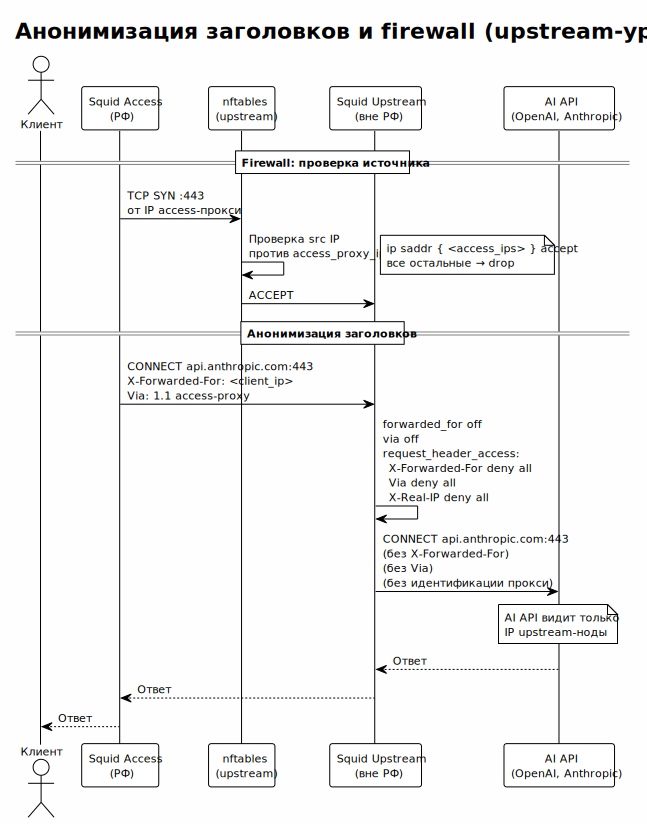

<!-- [AIGD] -->
# C2-NF-002 — Безопасность (IPS, анонимизация, firewall)

## Ссылки

- Родительские требования C1: [C1-BC-004](../C1/C1-BC-004.md)
- Дочерние требования C3: [C3-CS-001](../C3/C3-CS-001.md), [C3-SU-001](../C3/C3-SU-001.md)

## Описание

Система реализует многоуровневую защиту: обнаружение и предотвращение вторжений (IPS), анонимизацию заголовков прокси, ограничение доступа через firewall и защиту MTProxy-секретов. Безопасность обеспечивается на обоих уровнях проксирования с разными акцентами.

### 1. CrowdSec IPS (все ноды)

CrowdSec — collaborative IPS, анализирующий access.log Squid для обнаружения угроз:

| Компонент | Описание |
|---|---|
| **CrowdSec agent** | Парсит access.log, применяет сценарии обнаружения |
| **nftables bouncer** | Применяет решения CrowdSec как nftables-правила (блокировка IP) |
| **Scenarios** | Правила обнаружения: brute-force auth, scan detection, rate limiting |
| **Collections** | Наборы парсеров и сценариев для Squid |

Механизм:


> Исходник: [diagrams/C2-NF-002-crowdsec-pipeline.puml](diagrams/C2-NF-002-crowdsec-pipeline.puml)

1. CrowdSec agent читает access.log через acquis.yaml.
2. Парсеры извлекают поля (IP, метод, статус, username).
3. Сценарии анализируют паттерны (множественные 407, высокая частота, сканирование).
4. При срабатывании — создаётся решение (decision) о блокировке.
5. nftables bouncer применяет решение как правило DROP в nftables.

### 2. Анонимизация заголовков и firewall (upstream-уровень)



> Исходник: [diagrams/C2-NF-002-anonymization.puml](diagrams/C2-NF-002-anonymization.puml)

Squid на upstream-уровне удаляет все заголовки, идентифицирующие клиента и прокси-инфраструктуру:

| Директива Squid | Эффект |
|---|---|
| `forwarded_for off` | Удаление X-Forwarded-For |
| `via off` | Удаление Via header |
| `request_header_access X-Forwarded-For deny all` | Блокировка пересылки X-Forwarded-For |
| `request_header_access Via deny all` | Блокировка пересылки Via |
| `visible_hostname localhost` | Скрытие имени прокси-сервера |

### 3. UFW Firewall (upstream-уровень)

Upstream-ноды защищены UFW (Uncomplicated Firewall), разрешающим входящие подключения **только с IP-адресов access-прокси**:

```
# AI-GENERATED — NOT REVIEWED: SECTION START
ufw default deny incoming
ufw default allow outgoing
ufw allow 22/tcp                                    # SSH
ufw allow from <access_proxy_ip> to any port 80     # Squid
ufw allow from <access_proxy_ip> to any port 443    # MTProxy (nginx SNI)
# AI-GENERATED — NOT REVIEWED: SECTION END
```

CrowdSec nftables bouncer работает параллельно с UFW через отдельную таблицу `table ip crowdsec` (priority filter - 10).

### 4. MTProxy Secret

MTProxy (mtg) использует secret для аутентификации клиентов:
- Secret генерируется при развёртывании (Ansible).
- Хранится в `/etc/mtg/mtg.toml` с ограниченными правами (600).
- Передаётся клиентам через защищённые каналы.

### Количественные целевые значения

| Метрика | Целевое значение | Метод измерения |
|---|---|---|
| Время реакции CrowdSec на brute-force | ≤ 60 секунд | Время от первого 407 до блокировки |
| Утечка заголовков X-Forwarded-For на upstream | 0 | Проверка заголовков через httpbin.org |
| Неавторизованные подключения к upstream | 0 | UFW logs / nftables counters |

## Критерии приёмки

| # | Критерий | Метрика / Способ проверки | Целевое значение |
|---|----------|---------------------------|------------------|
| 1 | CrowdSec agent запущен на access-ноде | systemctl status crowdsec | active (running) |
| 2 | nftables bouncer запущен | systemctl status crowdsec-firewall-bouncer-nftables | active (running) |
| 3 | X-Forwarded-For отсутствует в запросах от upstream | curl через прокси к httpbin.org/headers | Нет X-Forwarded-For |
| 4 | Upstream отклоняет подключение не с access-IP | curl с произвольного IP к upstream | Connection refused / timeout |
| 5 | Brute-force блокируется CrowdSec | 10+ запросов с неверным паролем | IP заблокирован в nftables |

## Доказательство реализации

### Конструктивное

- **CrowdSec:** Ansible-роль `crowdsec` устанавливает agent и bouncer, конфигурирует acquis.yaml для чтения access.log.
- **Анонимизация:** `squid.conf.j2` содержит директивы `forwarded_for off`, `via off`, `request_header_access deny all`.
- **Firewall:** Ansible-задача конфигурирует UFW с whitelist по `access_proxy_ips` из inventory.
- **MTProxy secret:** генерируется Ansible-задачей, хранится в mtg.toml.

### Трассировочное

| C1 | C2 | C3 (дочерние) |
|---|---|---|
| [C1-BC-004](../C1/C1-BC-004.md) — Бизнес-цели | C2-NF-002 — Безопасность | [C3-CS-001](../C3/C3-CS-001.md) — CrowdSec |
| [C1-BC-004](../C1/C1-BC-004.md) — Бизнес-цели | C2-NF-002 — Безопасность | [C3-SU-001](../C3/C3-SU-001.md) — Squid Upstream |

### Аналитическое

**CrowdSec vs Fail2Ban:** CrowdSec обеспечивает коллаборативную защиту (shared threat intelligence), поддерживает nftables (в отличие от iptables-only Fail2Ban), имеет модульную архитектуру с коллекциями для Squid.

**Анонимизация на upstream:** целевые AI API не должны видеть IP клиентов и инфраструктуру прокси. Upstream действует как анонимный транспортный уровень.

### Негативное

| Риск | Митигация |
|---|---|
| CrowdSec ложно блокирует легитимного пользователя | Whitelist IP в CrowdSec; мониторинг decisions |
| Обход firewall через скомпрометированный access-прокси | Аутентификация на access-уровне; мониторинг |
| Утечка MTProxy secret | ansible-vault; ограничение прав на файл |
| 0-day в Squid/CrowdSec/mtg | Мониторинг CVE; обновление через Ansible |

## Покрытие объектов управления
| Тип объекта | Статус | Артефакт / Обоснование N/A |
|---|---|---|
| Безопасность | Covered | IPS, анонимизация, firewall, secret management |
| Аудит и журналирование | Covered | CrowdSec анализирует access.log |
| Надёжность / Доступность | Covered | IPS защищает от DoS/brute-force |
| Технологические ограничения | Covered | CrowdSec, nftables, Squid ACL |
| Допущения | Covered | CrowdSec intelligence доступен из access-нод |
| Риски требований | Covered | См. секцию «Негативное» |

## Статус соответствия

| Дата | Уровень | Обоснование | Корректирующее действие |
|------|---------|-------------|-------------------------|
| 2026-02-23 | 4 — Conformant | Реализовано в ролях crowdsec, squid.conf.j2, nftables rules | — |

## Статус доказательства: verified

| Дата | Из статуса | В статус | Причина |
|------|------------|----------|---------|
| 2026-02-23 | absent | verified | Актуализация из кода Ansible/CrowdSec/Squid/nftables |
<!-- [/AIGD] -->
