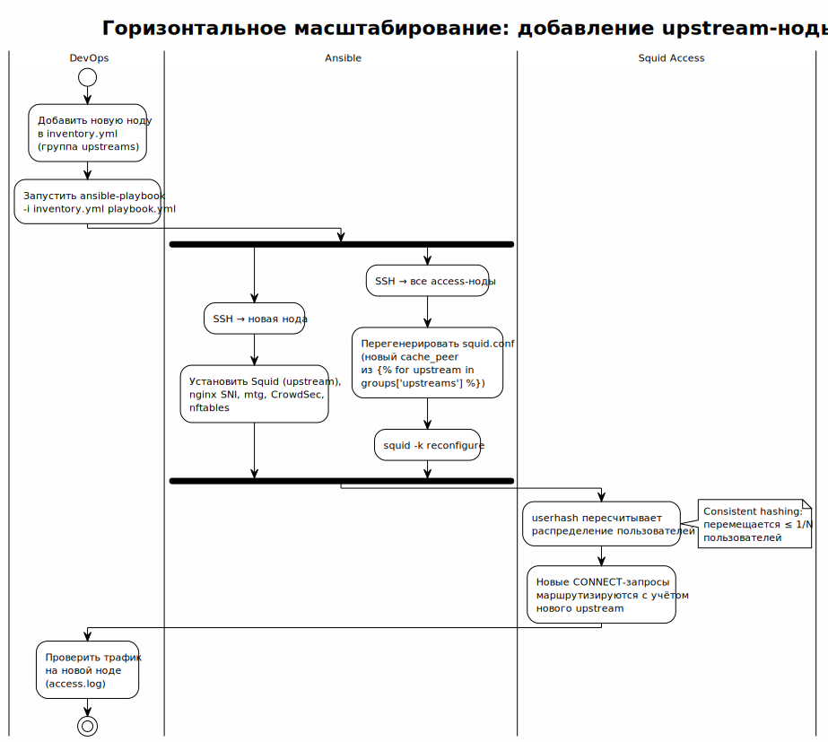

<!-- [AIGD] -->
# C2-NF-004 — Масштабируемость

## Ссылки

- Родительские требования C1: [C1-BC-004](../C1/C1-BC-004.md)
- Дочерние требования C3: [C3-SA-001](../C3/C3-SA-001.md), [C3-SU-001](../C3/C3-SU-001.md), [C3-AD-001](../C3/C3-AD-001.md)

## Описание

Система поддерживает горизонтальное масштабирование на обоих уровнях проксирования. Архитектура не требует разделяемого состояния между нодами, что позволяет добавлять ноды без координации или миграции.

### Механизм масштабирования



> Исходник: [diagrams/C2-NF-004-scaling-flow.puml](diagrams/C2-NF-004-scaling-flow.puml)

#### Горизонтальное масштабирование

Добавление новых нод выполняется через обновление Ansible inventory:

1. **Добавить ноду в inventory:**
   ```ini
   [upstreams]
   upstream-1 ansible_host=...
   upstream-2 ansible_host=...  # новая нода
   ```

2. **Запустить playbook:**
   ```bash
   ansible-playbook playbook.yml
   ```

3. Ansible автоматически:
   - Развернёт все компоненты на новой ноде.
   - Обновит `cache_peer` на access-нодах для включения нового upstream.
   - Перезагрузит Squid на access-нодах (`squid -k reconfigure`).

#### Stateless-архитектура

Ноды не хранят разделяемого состояния:

| Компонент | Состояние | Последствия |
|---|---|---|
| Squid (access) | Локальный кэш (опциональный) | Кэш не синхронизируется; потеря кэша не критична |
| Squid (upstream) | Без состояния (pass-through) | Полностью stateless |
| Keepalived | VIP + VRRP state | Автоматически выбирает Master |
| CrowdSec | Локальная база решений | Синхронизация через CrowdSec API (опциональная) |

#### Балансировка при масштабировании

При добавлении upstream-ноды userhash перераспределяет пользователей:
- Часть пользователей мигрирует на новый upstream.
- Миграция прозрачна: CONNECT-туннели переустанавливаются.
- Минимальное перераспределение (consistent hashing).

### Количественные целевые значения

| Метрика | Целевое значение | Метод измерения |
|---|---|---|
| Время добавления ноды | < 10 минут | Время выполнения ansible-playbook |
| Перераспределение при добавлении ноды | ≤ 1/N пользователей | Анализ access.log (смена upstream) |
| Максимум нод (access) | ≥ 4 | Ограничение VRRP (256 приоритетов) |
| Максимум нод (upstream) | ≥ 8 | Ограничение cache_peer |

## Критерии приёмки

| # | Критерий | Метрика / Способ проверки | Целевое значение |
|---|----------|---------------------------|------------------|
| 1 | Добавление upstream-ноды не требует изменения кода | Только изменение inventory | Inventory-only |
| 2 | После добавления ноды трафик распределяется | Анализ access.log: запросы на новый upstream | Трафик есть |
| 3 | Удаление ноды не прерывает работу | Удаление из inventory, rerun | Сервис работает |
| 4 | Stateless: нет общего хранилища | Проверка конфигурации | Нет shared storage |

## Доказательство реализации

### Конструктивное

Реализовано через архитектурные решения:
- **Ansible inventory:** группы `access_proxies` и `upstreams` — единственный параметр масштабирования.
- **Jinja2 шаблон `squid.conf.j2`:** цикл `` генерирует `cache_peer` для каждого upstream.
- **userhash:** consistent hashing минимизирует перераспределение при добавлении нод.

### Трассировочное

| C1 | C2 | C3 (дочерние) |
|---|---|---|
| [C1-BC-004](../C1/C1-BC-004.md) — Бизнес-цели | C2-NF-004 — Масштабируемость | [C3-SA-001](../C3/C3-SA-001.md) — Squid Access |
| [C1-BC-004](../C1/C1-BC-004.md) — Бизнес-цели | C2-NF-004 — Масштабируемость | [C3-SU-001](../C3/C3-SU-001.md) — Squid Upstream |
| [C1-BC-004](../C1/C1-BC-004.md) — Бизнес-цели | C2-NF-004 — Масштабируемость | [C3-AD-001](../C3/C3-AD-001.md) — Ansible Deployment |

### Аналитическое

**Stateless архитектура:** отсутствие разделяемого состояния — ключевое условие горизонтального масштабирования. Альтернатива (shared session store, replicated cache) добавляет сложность без существенной пользы при текущем масштабе.

**Inventory-driven:** масштабирование через inventory (не через код) — DevOps-паттерн, минимизирующий риск ошибок.

### Негативное

| Риск | Митигация |
|---|---|
| Перераспределение userhash при добавлении ноды | Consistent hashing минимизирует; CONNECT переустанавливаются автоматически |
| Несогласованность CrowdSec decisions между access-нодами | CrowdSec Central API (опционально) для синхронизации |
| Ограничение VRRP (256 priorities) | Достаточно для масштаба до 4 access-нод |

## Покрытие объектов управления
| Тип объекта | Статус | Артефакт / Обоснование N/A |
|---|---|---|
| Масштабируемость | Covered | Горизонтальное масштабирование через inventory |
| Производительность | Covered | Линейный рост пропускной способности |
| Сопровождаемость | Covered | Масштабирование через inventory, не код |
| Технологические ограничения | Covered | VRRP (256 priorities), cache_peer лимиты |
| Допущения | Covered | Серверы предоставляются Организацией |
| Риски требований | Covered | См. секцию «Негативное» |

## Статус соответствия

| Дата | Уровень | Обоснование | Корректирующее действие |
|------|---------|-------------|-------------------------|
| 2026-02-23 | 4 — Conformant | Архитектура stateless; inventory-driven масштабирование | — |

## Статус доказательства: verified

| Дата | Из статуса | В статус | Причина |
|------|------------|----------|---------|
| 2026-02-23 | absent | verified | Актуализация из кода Ansible |
<!-- [/AIGD] -->
