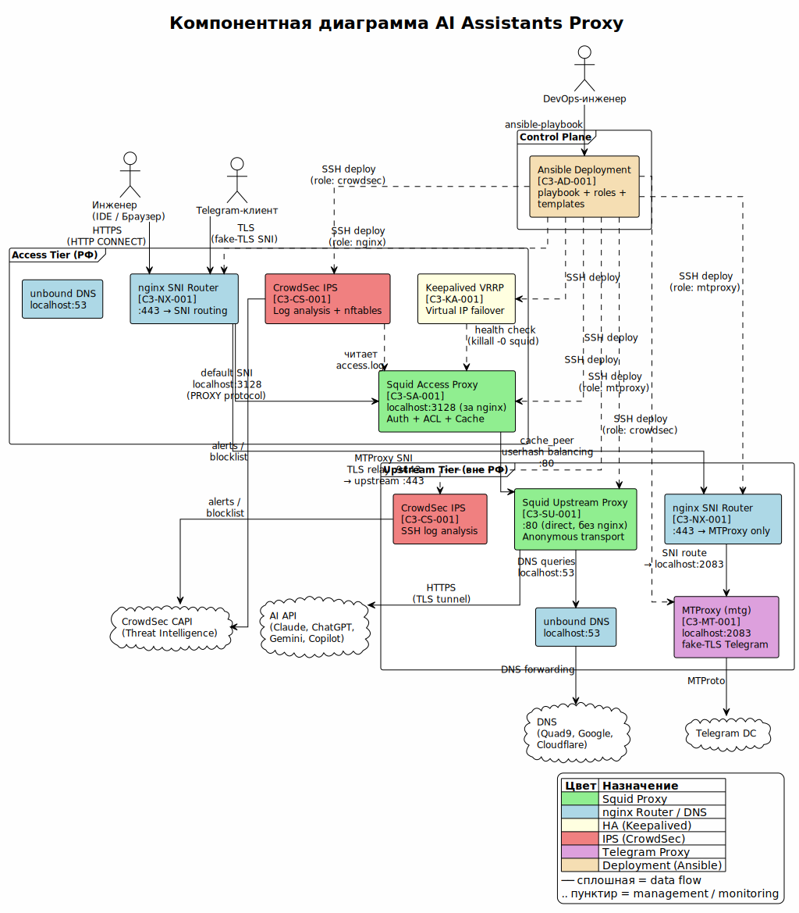

<!-- [AIGD] -->
# C3-CR -- Реестр компонентного контекста

## Группы

| Код группы | Название |
|---|---|
| SA | Squid Access (access-прокси) |
| SU | Squid Upstream (upstream-прокси) |
| NX | nginx SNI Router |
| KA | Keepalived VRRP |
| CS | CrowdSec IPS |
| MT | MTProxy (Telegram) |
| DN | DNS Resolver (Unbound) |
| AD | Ansible Deployment |

### SA: Squid Access (access-прокси)

| ID | Название | Технология | Описание | Закрывает C2 | Уровень | Детальный файл |
|---|---|---|---|---|---|---|
| C3-SA-001 | Squid Access Proxy | Squid 6.10 | Access-прокси в РФ: аутентификация, фильтрация доменов, кеширование, журналирование, цепочка к upstream | [C2-FR-001](C2/C2-FR-001.md), [C2-FR-002](C2/C2-FR-002.md), [C2-FR-003](C2/C2-FR-003.md), [C2-FR-004](C2/C2-FR-004.md), [C2-FR-005](C2/C2-FR-005.md), [C2-NF-001](C2/C2-NF-001.md), [C2-NF-003](C2/C2-NF-003.md), [C2-NF-004](C2/C2-NF-004.md), [C2-NF-005](C2/C2-NF-005.md) | 4 -- Conformant | [C3-SA-001](C3/C3-SA-001.md) |

### SU: Squid Upstream (upstream-прокси)

| ID | Название | Технология | Описание | Закрывает C2 | Уровень | Детальный файл |
|---|---|---|---|---|---|---|
| C3-SU-001 | Squid Upstream Proxy | Squid 6.10 | Upstream-прокси вне РФ: анонимный транспорт, IP ACL, SMP-параллелизм | [C2-FR-001](C2/C2-FR-001.md), [C2-NF-001](C2/C2-NF-001.md), [C2-NF-002](C2/C2-NF-002.md), [C2-NF-003](C2/C2-NF-003.md), [C2-NF-004](C2/C2-NF-004.md) | 4 -- Conformant | [C3-SU-001](C3/C3-SU-001.md) |

### NX: nginx SNI Router

| ID | Название | Технология | Описание | Закрывает C2 | Уровень | Детальный файл |
|---|---|---|---|---|---|---|
| C3-NX-001 | nginx SNI Router | nginx (stream) | SNI-маршрутизация на порту 443: Squid (default) + MTProxy | [C2-FR-006](C2/C2-FR-006.md), [C2-CN-002](C2/C2-CN-002.md) | 4 -- Conformant | [C3-NX-001](C3/C3-NX-001.md) |

### KA: Keepalived VRRP

| ID | Название | Технология | Описание | Закрывает C2 | Уровень | Детальный файл |
|---|---|---|---|---|---|---|
| C3-KA-001 | Keepalived VRRP | Keepalived | Виртуальный IP failover между access-нодами | [C2-NF-001](C2/C2-NF-001.md) | 4 -- Conformant | [C3-KA-001](C3/C3-KA-001.md) |

### CS: CrowdSec IPS

| ID | Название | Технология | Описание | Закрывает C2 | Уровень | Детальный файл |
|---|---|---|---|---|---|---|
| C3-CS-001 | CrowdSec IPS | CrowdSec + nftables | Обнаружение и блокировка атак по логам Squid и SSH | [C2-FR-005](C2/C2-FR-005.md), [C2-NF-002](C2/C2-NF-002.md), [C2-CN-002](C2/C2-CN-002.md) | 4 -- Conformant | [C3-CS-001](C3/C3-CS-001.md) |

### MT: MTProxy (Telegram)

| ID | Название | Технология | Описание | Закрывает C2 | Уровень | Детальный файл |
|---|---|---|---|---|---|---|
| C3-MT-001 | MTProxy (mtg) | mtg v2 | Telegram-прокси с fake-TLS маскировкой для обхода DPI | [C2-FR-006](C2/C2-FR-006.md) | 4 -- Conformant | [C3-MT-001](C3/C3-MT-001.md) |

### DN: DNS Resolver (Unbound)

| ID | Название | Технология | Описание | Закрывает C2 | Уровень | Детальный файл |
|---|---|---|---|---|---|---|
| C3-DN-001 | DNS Resolver (Unbound) | Unbound | Кеширующий DNS-резолвер на каждой ноде. Каскадная архитектура: access → upstream unbound → публичные DNS. Squid использует dns_nameservers 127.0.0.1 | [C2-NF-003](C2/C2-NF-003.md), [C2-NF-001](C2/C2-NF-001.md) | 4 -- Conformant | [C3-DN-001](C3/C3-DN-001.md) |

### AD: Ansible Deployment

| ID | Название | Технология | Описание | Закрывает C2 | Уровень | Детальный файл |
|---|---|---|---|---|---|---|
| C3-AD-001 | Ansible Deployment System | Ansible | IaC-система развёртывания: playbook, роли, шаблоны, инвентарь | [C2-FR-007](C2/C2-FR-007.md), [C2-FR-008](C2/C2-FR-008.md), [C2-NF-004](C2/C2-NF-004.md) | 4 -- Conformant | [C3-AD-001](C3/C3-AD-001.md) |

## Компонентная диаграмма

> Исходник: [C3/diagrams/C3-component.puml](C3/diagrams/C3-component.puml)

Диаграмма отображает все 8 компонентов системы, их взаимосвязи и распределение по двум уровням (access tier в РФ, upstream tier вне РФ). Пунктирные линии обозначают опциональные зависимости (Keepalived, CrowdSec).
<!-- [/AIGD] -->
