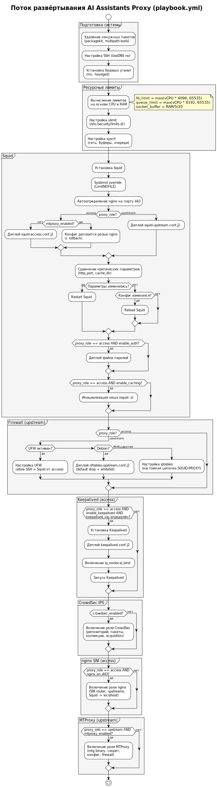

<!-- [AIGD] -->
# C4-PB-001 -- Главный плейбук (playbook.yml)

## Ссылки

- Родительские требования C3: [C3-AD-001](../C3/C3-AD-001.md)
- Связанные C4: [C4-PB-002](C4-PB-002.md) (инвентори), [C4-TM-001](C4-TM-001.md), [C4-TM-002](C4-TM-002.md), [C4-TM-003](C4-TM-003.md), [C4-TM-004](C4-TM-004.md), [C4-RL-001](C4-RL-001.md), [C4-RL-002](C4-RL-002.md), [C4-RL-003](C4-RL-003.md)

## Описание

Файл `Servers/deploy/playbook.yml` (~575 строк) -- главный Ansible playbook, оркестрирующий полное развёртывание инфраструктуры AI Assistants Proxy. Применяется ко всем хостам (`hosts: all`) с повышением привилегий (`become: true`). Логика ветвления определяется переменной `proxy_role` (access/upstream) и набором feature-флагов из инвентори.

Запуск: `ansible-playbook -i inventory.yml playbook.yml`

## Структура файла

Плейбук организован в последовательные фазы развёртывания:

| Фаза | Строки (прибл.) | Описание |
|---|---|---|
| **System cleanup** | 15--57 | Удаление ненужных пакетов (packagekit, multipath-tools), настройка SSH (UseDNS no), установка базовых утилит (mc, haveged) |
| **Resource limits** | 65--141 | Вычисление ресурсных лимитов на основе CPU/RAM: fd_limit, queue_limit, socket_buffer_bytes, tw_buckets. Настройка ulimit и sysctl для низколатентной сети |
| **Squid install** | 143--187 | Установка Squid, создание systemd override для LimitNOFILE, обеспечение директорий |
| **nginx detection** | 189--209 | Автоопределение nginx на порту 443 с возможностью ручного переопределения через `behind_nginx` |
| **Squid config deploy** | 211--338 | Развёртывание конфигурации с умным reload/restart: сохранение критических параметров до и после, restart только при изменении http_port или cache_dir. Развёртывание файла паролей, инициализация кеша |
| **Firewall (upstream)** | 340--463 | Настройка межсетевого экрана: UFW (Ubuntu), nftables (Debian), iptables с кастомной цепочкой (RHEL/CentOS) |
| **Keepalived** | 477--513 | Установка и настройка VRRP для access-прокси (условно, при наличии keepalived_vip) |
| **CrowdSec** | 515--523 | Включение роли CrowdSec IPS (условно, crowdsec_enabled) |
| **nginx SNI** | 525--538 | Включение роли nginx для SNI-маршрутизации (условно, access + nginx_on_443) |
| **MTProxy** | 540--551 | Включение роли MTProxy (условно, upstream + mtproxy_enabled) |
| **Handlers** | 553--575 | Handlers: Reload systemd, Reload sshd, Restart Keepalived, Restart nftables |

## Ключевые механизмы

### Динамическое вычисление ресурсных лимитов

Лимиты адаптируются к аппаратным характеристикам каждого хоста:

- **CPU-зависимые**: `fd_limit` = max(vcpus * 4096, 65535), `queue_limit` = max(vcpus * 8192, 65535), `tw_buckets` = vcpus * 32768
- **RAM-зависимые**: `ram_for_proxy_mb` = RAM / 5, `socket_buffer_bytes` = (RAM / 5 / 20) * 1024 * 1024

### Умный reload vs restart Squid

Критические параметры (http_port, cache_dir) сохраняются до и после деплоя конфигурации. Если они изменились -- выполняется restart; если нет -- достаточно reload. Это минимизирует downtime при рутинных обновлениях ACL, таймаутов и заголовков.

### Условная логика по proxy_role

Плейбук использует единый play для обоих типов узлов. Условия `when: proxy_role == 'access'` / `when: proxy_role == 'upstream'` разделяют логику:

- **access**: Squid с аутентификацией, upstream peers, Keepalived, nginx SNI, без firewall
- **upstream**: Squid без аутентификации, firewall, MTProxy, без Keepalived

### Multi-OS firewall

Три стратегии настройки межсетевого экрана для upstream-узлов:

1. **UFW** -- если ufw активен (Ubuntu)
2. **nftables** -- Debian без UFW (дефолт с Debian 10)
3. **iptables с кастомной цепочкой** -- RHEL/CentOS, Ubuntu без UFW

### Автоопределение nginx

Скрипт проверяет наличие активного nginx с виртуалхостом на порту 443. Результат определяет, слушает ли Squid на порту напрямую или на localhost:3128 за nginx. Ручное переопределение: `behind_nginx=true/false` в инвентори.

## Переменные

| Переменная | Тип | Значение по умолчанию | Описание |
|---|---|---|---|
| `proxy_role` | string | -- (обязательная) | Роль узла: `access` или `upstream` |
| `squid_port` | int | -- (обязательная) | Порт Squid (access: 443, upstream: 80) |
| `enable_auth` | bool | -- | Включение аутентификации (access) |
| `enable_logging` | bool | `true` | Включение журналирования |
| `enable_caching` | bool | -- | Включение кеширования (access) |
| `behind_nginx` | bool | auto-detect | Squid за nginx |
| `squid_local_port` | int | `3128` | Локальный порт Squid за nginx |
| `read_timeout` | string | `30 minutes` | Таймаут чтения от сервера (AI API, долгие ответы) |
| `dns_servers` | list | -- | DNS-серверы |
| `allowed_domains` | list | `[]` | Явный whitelist доменов |
| `allowed_domain_patterns` | list | `[]` | Regex-паттерны доменов |
| `enable_keepalived` | bool | `true` | Включение VRRP |
| `keepalived_vip` | string | -- (условная) | Виртуальный IP-адрес |
| `crowdsec_enabled` | bool | `true` | Включение CrowdSec IPS |
| `mtproxy_enabled` | bool | `true` | Включение MTProxy |

## Критерии приёмки

| # | Критерий | Метрика / Способ проверки | Целевое значение |
|---|----------|---------------------------|------------------|
| 1 | Синтаксическая корректность | `ansible-playbook --syntax-check playbook.yml` | exit code 0 |
| 2 | Идемпотентность | Повторный запуск playbook | changed=0 на стабильной системе |
| 3 | Squid запущен после деплоя | `systemctl is-active squid` | active |
| 4 | Sysctl-параметры применены | `sysctl net.ipv4.tcp_slow_start_after_idle` | 0 |
| 5 | FD-лимиты установлены | `cat /proc/$(pidof squid)/limits` | >= 65535 |
| 6 | Firewall настроен (upstream) | `nft list ruleset` / `ufw status` / `iptables -L` | Squid доступен только от access-прокси |
| 7 | Ролевые включения условны | Проверка `when` на каждом `include_role` | Роли включаются только при соответствующих флагах |

## Доказательство реализации

### Конструктивное

Плейбук реализует полный цикл развёртывания: от системного тюнинга до запуска сервисов. Каждая фаза изолирована и условна. Механизм умного reload/restart предотвращает ненужные перезапуски: критические параметры (http_port, cache_dir) сравниваются до и после деплоя конфигурации, restart выполняется только при их изменении.

Диаграмма потока развёртывания:

> Исходник: [diagrams/C4-PB-001-deployment-flow.puml](diagrams/C4-PB-001-deployment-flow.puml)

### Трассировочное

| C3 | C4 |
|---|---|
| [C3-AD-001](../C3/C3-AD-001.md) | C4-PB-001 -- оркестрация развёртывания |

### Эмпирическое

- Проверка синтаксиса: `ansible-playbook --syntax-check -i inventory.yml playbook.yml`
- Dry run: `ansible-playbook --check -i inventory.yml playbook.yml`
- Проверка идемпотентности: повторный запуск на уже сконфигурированном хосте

### Негативное

- **Отказ upstream** -- restart Squid только при реальном изменении критических параметров, минимизация downtime
- **Несовместимость OS** -- условная логика по `ansible_os_family` / `ansible_distribution` для пакетов и firewall
- **Отсутствие nginx** -- автоопределение nginx на 443, fallback на прямой порт
- **Co-deployment конфликт** -- модульная архитектура nginx/nftables для сосуществования с другими проектами

## Покрытие объектов управления
| Тип объекта | Статус | Артефакт / Обоснование N/A |
|---|---|---|
| Классы / модули | Covered | Ansible playbook как модуль оркестрации, включение ролей crowdsec/nginx/mtproxy |
| Функции / методы | Covered | Ansible tasks (40+ задач), handlers (4 handler) |
| Code Interfaces | Covered | Входной интерфейс: переменные из inventory; выходной: сконфигурированные сервисы |
| Physical Data Model | Covered | Структуры конфигурационных файлов: squid.conf, sysctl.d, limits.d, systemd overrides |
| Тесты | Covered | `--syntax-check`, `--check` (dry run), `validate:` на шаблонах, `squid -k parse` |
| Build & Deploy Configs | Covered | Сам плейбук является конфигурацией развёртывания |
| Зависимости кода | Covered | Ansible collections: `ansible.builtin`, `ansible.posix`, `community.general` |
| Метрики кода | Covered | ~575 строк, 40+ задач, 4 handlers, 3 role включения |
| Документация кода | Covered | Комментарии в YAML, описательные имена задач |

## Статус соответствия

| Дата | Уровень | Обоснование | Корректирующее действие |
|------|---------|-------------|-------------------------|
| 2026-02-23 | 4 -- Conformant | Артефакт существует в кодовой базе, все механизмы реализованы | -- |

## Статус доказательства: verified

| Дата | Из статуса | В статус | Причина |
|------|------------|----------|---------|
| 2026-02-23 | absent | verified | Актуализация из кода |
<!-- [/AIGD] -->
