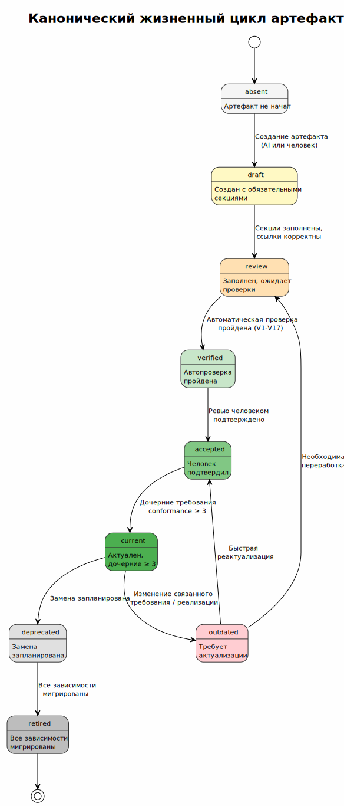

<!-- [AIGD] -->
# CC-Lifecycle — Жизненный цикл артефактов

## Канонический жизненный цикл

> Исходник: [diagrams/CC-artifact-lifecycle.puml](diagrams/CC-artifact-lifecycle.puml)

Диаграмма состояний отражает все переходы жизненного цикла артефактов документации (требования C1–C4, ADR, TD, DD, CC, API-спецификации) и доказательств.

## Реестр статусов артефактов

### Реестры слоёв

| Артефакт | Тип | Статус | Дата | Зависимости |
|---|---|---|---|---|
| [C1-BR.md](../C1-BR.md) | Реестр C1 | verified | 2026-02-23 | C1-BC-001, C1-BC-002, C1-BC-003, C1-BC-004 |
| [C2-PR.md](../C2-PR.md) | Реестр C2 | verified | 2026-02-23 | C2-FR-001..008, C2-NF-001..005, C2-CN-001..002 |
| [C3-CR.md](../C3-CR.md) | Реестр C3 | verified | 2026-02-23 | C3-SA-001, C3-SU-001, C3-NX-001, C3-KA-001, C3-CS-001, C3-MT-001, C3-AD-001 |
| [C4-SR.md](../C4-SR.md) | Реестр C4 | verified | 2026-02-23 | C4-PB-001..002, C4-TM-001..004, C4-RL-001..003 |
| [TD.md](../TD.md) | Реестр TD | verified | 2026-02-23 | TD-FA, TD-VP |
| [ADL.md](../ADL.md) | Реестр ADL | verified | 2026-02-23 | ADR/ |
| [DD.md](../DD.md) | Реестр DD | verified | 2026-02-23 | DD-Catalog, DD-CDM |

### C1 — Бизнес-контекст

| Артефакт | Тип | Статус | Дата | Зависимости |
|---|---|---|---|---|
| [C1-BC-001](../C1/C1-BC-001.md) | Детальный C1 | verified | 2026-02-23 | -- |
| [C1-BC-002](../C1/C1-BC-002.md) | Детальный C1 | verified | 2026-02-23 | -- |
| [C1-BC-003](../C1/C1-BC-003.md) | Детальный C1 | verified | 2026-02-23 | -- |
| [C1-BC-004](../C1/C1-BC-004.md) | Детальный C1 | verified | 2026-02-23 | -- |

### C2 — Требования к продукту

| Артефакт | Тип | Статус | Дата | Зависимости |
|---|---|---|---|---|
| [C2-FR-001](../C2/C2-FR-001.md) | Детальный C2 FR | verified | 2026-02-23 | [C1-BC-001](../C1/C1-BC-001.md), [C1-BC-003](../C1/C1-BC-003.md) |
| [C2-FR-002](../C2/C2-FR-002.md) | Детальный C2 FR | verified | 2026-02-23 | [C1-BC-002](../C1/C1-BC-002.md) |
| C2-FR-003 | Детальный C2 FR | absent | 2026-02-23 | [C1-BC-003](../C1/C1-BC-003.md) |
| C2-FR-004 | Детальный C2 FR | absent | 2026-02-23 | [C1-BC-001](../C1/C1-BC-001.md) |
| C2-FR-005 | Детальный C2 FR | absent | 2026-02-23 | [C1-BC-002](../C1/C1-BC-002.md), [C1-BC-004](../C1/C1-BC-004.md) |
| C2-FR-006 | Детальный C2 FR | absent | 2026-02-23 | [C1-BC-001](../C1/C1-BC-001.md), [C1-BC-003](../C1/C1-BC-003.md) |
| C2-FR-007 | Детальный C2 FR | absent | 2026-02-23 | [C1-BC-002](../C1/C1-BC-002.md) |
| C2-FR-008 | Детальный C2 FR | absent | 2026-02-23 | [C1-BC-004](../C1/C1-BC-004.md) |
| C2-NF-001 | Детальный C2 NF | absent | 2026-02-23 | [C1-BC-004](../C1/C1-BC-004.md) |
| C2-NF-002 | Детальный C2 NF | absent | 2026-02-23 | [C1-BC-004](../C1/C1-BC-004.md) |
| C2-NF-003 | Детальный C2 NF | absent | 2026-02-23 | [C1-BC-004](../C1/C1-BC-004.md) |
| C2-NF-004 | Детальный C2 NF | absent | 2026-02-23 | [C1-BC-004](../C1/C1-BC-004.md) |
| C2-NF-005 | Детальный C2 NF | absent | 2026-02-23 | [C1-BC-004](../C1/C1-BC-004.md) |
| C2-CN-001 | Детальный C2 CN | absent | 2026-02-23 | [C1-BC-001](../C1/C1-BC-001.md) |
| C2-CN-002 | Детальный C2 CN | absent | 2026-02-23 | [C1-BC-001](../C1/C1-BC-001.md) |
| [C2-META](../C2/C2-META.md) | Мета-уровень C2 | verified | 2026-02-23 | -- |

### C3 — Компонентный контекст

| Артефакт | Тип | Статус | Дата | Зависимости |
|---|---|---|---|---|
| C3-SA-001 | Детальный C3 | absent | 2026-02-23 | C2-FR-001, C2-FR-002, C2-FR-003, C2-FR-004, C2-FR-005, C2-NF-001, C2-NF-003, C2-NF-004, C2-NF-005 |
| C3-SU-001 | Детальный C3 | absent | 2026-02-23 | C2-FR-001, C2-NF-001, C2-NF-002, C2-NF-003, C2-NF-004 |
| C3-NX-001 | Детальный C3 | absent | 2026-02-23 | C2-FR-006, C2-CN-002 |
| C3-KA-001 | Детальный C3 | absent | 2026-02-23 | C2-NF-001 |
| C3-CS-001 | Детальный C3 | absent | 2026-02-23 | C2-FR-005, C2-NF-002, C2-CN-002 |
| C3-MT-001 | Детальный C3 | absent | 2026-02-23 | C2-FR-006 |
| C3-AD-001 | Детальный C3 | absent | 2026-02-23 | C2-FR-007, C2-FR-008, C2-NF-004 |

### C4 — Уровень кода

| Артефакт | Тип | Статус | Дата | Зависимости |
|---|---|---|---|---|
| C4-PB-001 | Детальный C4 | absent | 2026-02-23 | [C3-AD-001](../C3/C3-AD-001.md) |
| C4-PB-002 | Детальный C4 | absent | 2026-02-23 | [C3-AD-001](../C3/C3-AD-001.md) |
| C4-TM-001 | Детальный C4 | absent | 2026-02-23 | [C3-SA-001](../C3/C3-SA-001.md) |
| C4-TM-002 | Детальный C4 | absent | 2026-02-23 | [C3-SU-001](../C3/C3-SU-001.md) |
| C4-TM-003 | Детальный C4 | absent | 2026-02-23 | [C3-KA-001](../C3/C3-KA-001.md) |
| C4-TM-004 | Детальный C4 | absent | 2026-02-23 | [C3-SU-001](../C3/C3-SU-001.md) |
| C4-RL-001 | Детальный C4 | absent | 2026-02-23 | [C3-CS-001](../C3/C3-CS-001.md) |
| C4-RL-002 | Детальный C4 | absent | 2026-02-23 | [C3-NX-001](../C3/C3-NX-001.md) |
| C4-RL-003 | Детальный C4 | absent | 2026-02-23 | [C3-MT-001](../C3/C3-MT-001.md) |

### TD — Техническая документация

| Артефакт | Тип | Статус | Дата | Зависимости |
|---|---|---|---|---|
| [TD-FA.md](../TD/TD-FA.md) | TD — Функциональная область | verified | 2026-02-23 | -- |
| [TD-VP.md](../TD/TD-VP.md) | TD — Viewpoints | verified | 2026-02-23 | C1-BC-002 |

### DD — Архитектура данных

| Артефакт | Тип | Статус | Дата | Зависимости |
|---|---|---|---|---|
| [DD-Catalog.md](../DD/DD-Catalog.md) | DD — Каталог сущностей | verified | 2026-02-23 | -- |
| [DD-CDM.md](../DD/DD-CDM.md) | DD — Концептуальная модель | verified | 2026-02-23 | DD-Catalog |

### ADL — Архитектурные решения

| Артефакт | Тип | Статус | Дата | Зависимости |
|---|---|---|---|---|
| [ADL.md](../ADL.md) | Журнал ADR | verified | 2026-02-23 | -- |
| [ADL-archive.md](../ADL-archive.md) | Архив ADR | verified | 2026-02-23 | -- |

### CC — Сквозные объекты

| Артефакт | Тип | Статус | Дата | Зависимости |
|---|---|---|---|---|
| [CC-Risks.md](CC-Risks.md) | CC — Риски | verified | 2026-02-23 | C1--C4, TD |
| [CC-RACI.md](CC-RACI.md) | CC — RACI | verified | 2026-02-23 | C1-BC-002 |
| [CC-Versioning.md](CC-Versioning.md) | CC — Версионирование | verified | 2026-02-23 | -- |
| [CC-Changes.md](CC-Changes.md) | CC — Изменения | verified | 2026-02-23 | -- |
| CC-Lifecycle.md (этот файл) | CC — Жизненный цикл | verified | 2026-02-23 | Все артефакты |

## Статистика

| Статус | Количество |
|---|---|
| verified | 23 |
| absent | 24 |
| draft | 0 |
| review | 0 |
| accepted | 0 |
| implemented | 0 |
| outdated | 0 |
| deprecated | 0 |
| retired | 0 |
| **Итого** | **47** |

> **Примечание:** артефакты со статусом `absent` — детальные файлы требований C2-C4, для которых реестры уже созданы и заполнены, но индивидуальные .md-файлы ещё не сгенерированы.
<!-- [/AIGD] -->
