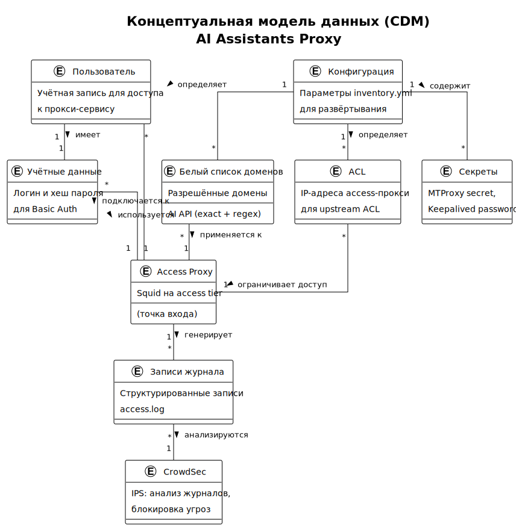

<!-- [AIGD] -->
# DD-CDM — Концептуальная модель данных

## Описание

Концептуальная модель данных (CDM) проекта AI Assistants Proxy описывает бизнес-сущности и их взаимосвязи на уровне, понятном бизнес-стейкхолдерам. Модель не содержит деталей нормализации или физического хранения.

Проект представляет собой IaC-систему (Ansible) без традиционных СУБД. Бизнес-сущности — это конфигурационные данные, учётные записи, правила фильтрации, секреты и журнальные записи.

## Диаграмма CDM

> Исходник: [diagrams/DD-CDM.puml](diagrams/DD-CDM.puml)

## Бизнес-сущности

| Сущность | Описание | DE-ссылка |
|---|---|---|
| Пользователь | Инженер, использующий прокси для доступа к AI API | — (внешний актор, см. [C1-BC-002](../C1/C1-BC-002.md)) |
| Учётные данные | Логин и хеш пароля для Basic Auth аутентификации на access-прокси | [DE-CR-001](DE/DE-CR-001.md) |
| Конфигурация | Параметры inventory.yml, определяющие поведение всех компонентов системы | [DE-CF-001](DE/DE-CF-001.md) |
| Белый список доменов | Разрешённые домены AI API: exact-совпадения и regex-паттерны | [DE-DM-001](DE/DE-DM-001.md) |
| ACL | IP-адреса access-прокси, используемые для ограничения доступа на upstream | [DE-AC-001](DE/DE-AC-001.md) |
| Секреты | MTProxy secret (hex, fake-TLS), пароль Keepalived VRRP | [DE-SC-001](DE/DE-SC-001.md) |
| Access Proxy | Squid-сервер на access tier — точка входа для пользователей | [C3-SA-001](../C3/C3-SA-001.md) |
| Записи журнала | Структурированные записи access.log с информацией о запросах | [DE-LG-001](DE/DE-LG-001.md) |
| CrowdSec | IPS-система, анализирующая журналы для обнаружения и блокировки угроз | [C3-CS-001](../C3/C3-CS-001.md) |

## Связи между сущностями

| Источник | Связь | Назначение | Кардинальность | Описание |
|---|---|---|---|---|
| Пользователь | имеет | Учётные данные | 1:1 | Каждый пользователь имеет одну пару логин/пароль |
| Конфигурация | определяет | Белый список доменов | 1:N | Конфигурация содержит списки allowed_domains и allowed_domain_patterns |
| Конфигурация | определяет | ACL | 1:N | IP-адреса access-прокси из inventory определяют ACL на upstream |
| Конфигурация | содержит | Секреты | 1:N | inventory.yml содержит секреты (MTProxy secret, Keepalived password) |
| Access Proxy | генерирует | Записи журнала | 1:N | Каждый запрос через access-прокси порождает запись в access.log |
| Записи журнала | анализируются | CrowdSec | N:1 | CrowdSec acquisition читает access.log для обнаружения атак |
| Пользователь | подключается к | Access Proxy | N:1 | Множество пользователей подключаются к access-прокси |
| Учётные данные | используются | Access Proxy | N:1 | Access-прокси верифицирует учётные данные через ncsa_auth |
| Белый список доменов | применяется к | Access Proxy | N:1 | Squid ACL на access-прокси фильтрует запросы по доменам |
| ACL | ограничивает доступ | Access Proxy | N:1 | Upstream ACL ограничивает входящие подключения по IP |

## Связанные требования

- [C1-BC-001](../C1/C1-BC-001.md) — Целевая система AI Assistants Proxy
- [C1-BC-002](../C1/C1-BC-002.md) — Стейкхолдеры и акторы
- [C1-BC-003](../C1/C1-BC-003.md) — Внешние системы и интеграции
- [C2-FR-002](../C2/C2-FR-002.md) — Аутентификация и авторизация
- [C2-FR-003](../C2/C2-FR-003.md) — Фильтрация доменов
- [C2-FR-005](../C2/C2-FR-005.md) — Журналирование и аудит
<!-- [/AIGD] -->
