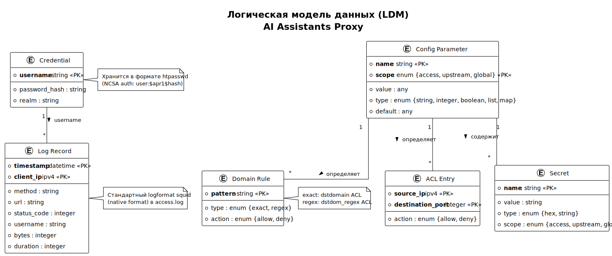

<!-- [AIGD] -->
# DD-LDM — Логическая модель данных

## Описание

Логическая модель данных (LDM) проекта AI Assistants Proxy описывает нормализованные сущности с атрибутами, типами и ключами. Модель не привязана к конкретной платформе хранения.

Так как проект является IaC-системой без традиционных СУБД, логические сущности отражают структуру конфигурационных данных, файлов учётных записей, правил фильтрации, журнальных записей и секретов.

## Диаграмма LDM

> Исходник: [diagrams/DD-LDM.puml](diagrams/DD-LDM.puml)

## Сущности и атрибуты

### Credential (Учётные данные)

Трассировка CDM: Учётные данные → Credential.

| Атрибут | Тип | PK | Обязательность | Описание |
|---|---|---|---|---|
| username | string | PK | Обязательный | Имя пользователя (уникальное) |
| password_hash | string | — | Обязательный | Хеш пароля в формате apr1 (MD5-crypt) |
| realm | string | — | Обязательный | Область аутентификации (Squid proxy realm) |

**Ограничения:**
- username: уникальный, не пустой, ASCII, без пробелов
- password_hash: формат `$apr1$salt$hash`
- realm: значение по умолчанию — "AI Assistants Proxy"

### ACL Entry (Запись списка управления доступом)

Трассировка CDM: ACL → ACL Entry.

| Атрибут | Тип | PK | Обязательность | Описание |
|---|---|---|---|---|
| source_ip | ipv4 | PK | Обязательный | IP-адрес access-прокси |
| destination_port | integer | PK | Обязательный | Порт назначения (443) |
| action | enum {allow, deny} | — | Обязательный | Действие при совпадении |

**Ограничения:**
- source_ip: валидный IPv4-адрес
- destination_port: диапазон 1–65535
- action: по умолчанию — deny (whitelist-подход)

### Domain Rule (Правило фильтрации домена)

Трассировка CDM: Белый список доменов → Domain Rule.

| Атрибут | Тип | PK | Обязательность | Описание |
|---|---|---|---|---|
| pattern | string | PK | Обязательный | Паттерн домена (exact или regex) |
| type | enum {exact, regex} | — | Обязательный | Тип совпадения |
| action | enum {allow, deny} | — | Обязательный | Действие при совпадении |

**Ограничения:**
- pattern: не пустой; для type=regex — валидное регулярное выражение
- Два источника: `allowed_domains` (type=exact) и `allowed_domain_patterns` (type=regex)
- action: всегда allow (whitelist); все остальные домены блокируются по умолчанию

### Config Parameter (Конфигурационный параметр)

Трассировка CDM: Конфигурация → Config Parameter.

| Атрибут | Тип | PK | Обязательность | Описание |
|---|---|---|---|---|
| name | string | PK | Обязательный | Имя параметра (ключ YAML) |
| scope | enum {access, upstream, global} | PK | Обязательный | Область применения |
| value | any | — | Обязательный | Значение параметра |
| type | enum {string, integer, boolean, list, map} | — | Обязательный | Тип данных значения |
| default | any | — | Необязательный | Значение по умолчанию |

**Ограничения:**
- Составной ключ: (name, scope)
- scope=global: параметры из секции `all.vars`
- scope=access: параметры из секции `access_proxies.vars`
- scope=upstream: параметры из секции `upstreams.vars`

### Log Record (Запись журнала)

Трассировка CDM: Записи журнала → Log Record.

| Атрибут | Тип | PK | Обязательность | Описание |
|---|---|---|---|---|
| timestamp | datetime | PK | Обязательный | Метка времени запроса (ISO 8601) |
| client_ip | ipv4 | PK | Обязательный | IP-адрес клиента |
| method | string | — | Обязательный | HTTP-метод (CONNECT, GET, POST) |
| url | string | — | Обязательный | Запрошенный URL или хост:порт |
| status_code | integer | — | Обязательный | HTTP-код статуса ответа |
| username | string | — | Необязательный | Имя аутентифицированного пользователя (или «-») |
| bytes | integer | — | Обязательный | Размер ответа в байтах |
| duration | integer | — | Обязательный | Время обработки запроса (мс) |

**Ограничения:**
- timestamp: формат определяется Squid logformat directive
- method: ограничен CONNECT для HTTPS-прокси
- status_code: стандартные HTTP-коды + специфичные Squid-коды (TCP_TUNNEL/200)
- username: FK → Credential.username (или «-» при отсутствии аутентификации)

### Secret (Секрет)

Трассировка CDM: Секреты → Secret.

| Атрибут | Тип | PK | Обязательность | Описание |
|---|---|---|---|---|
| name | string | PK | Обязательный | Идентификатор секрета |
| value | string | — | Обязательный | Значение секрета |
| type | enum {hex, string} | — | Обязательный | Формат значения |
| scope | enum {access, upstream, global} | — | Обязательный | Область применения |

**Ограничения:**
- name: уникальный
- type=hex: значение содержит только символы [0-9a-f]
- Секреты не должны появляться в логах (no_log в Ansible)

## Связи между сущностями

| Источник | Связь | Назначение | Кардинальность | Описание |
|---|---|---|---|---|
| Credential | → | Log Record | 1:N | username в Log Record ссылается на Credential.username |
| Config Parameter | → | Domain Rule | 1:N | Конфигурация определяет правила фильтрации доменов |
| Config Parameter | → | ACL Entry | 1:N | IP-адреса из inventory порождают ACL-записи |
| Config Parameter | → | Secret | 1:N | Секреты определены в inventory как параметры |

## Связанные требования

- [C2-FR-002](../C2/C2-FR-002.md) — Аутентификация (Credential)
- [C2-FR-003](../C2/C2-FR-003.md) — Фильтрация доменов (Domain Rule)
- [C2-FR-005](../C2/C2-FR-005.md) — Журналирование (Log Record)
- [C2-FR-008](../C2/C2-FR-008.md) — Развёртывание (Config Parameter)
- [C2-NF-002](../C2/C2-NF-002.md) — Безопасность (Secret, Credential)
<!-- [/AIGD] -->
