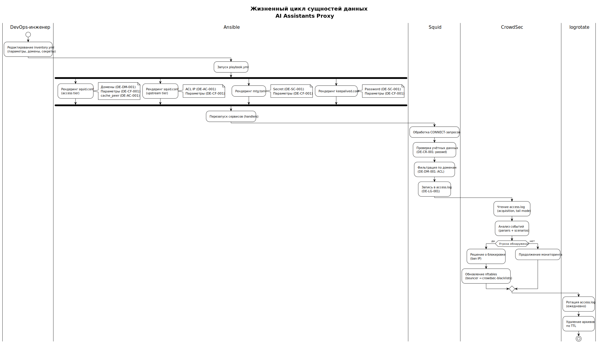

<!-- [AIGD] -->
# DD-Lifecycle — Жизненный цикл данных

## Описание

Документ описывает стадии жизненного цикла для каждого типа сущностей данных проекта AI Assistants Proxy: от создания до удаления/архивирования.

## Общая модель жизненного цикла данных



> Исходник: [diagrams/DD-data-lifecycle.puml](diagrams/DD-data-lifecycle.puml)

Диаграмма отображает сквозной жизненный цикл всех сущностей данных: от редактирования inventory.yml (DevOps-инженер) через рендеринг Ansible (Jinja2-шаблоны) до обработки запросов Squid, анализа CrowdSec и ротации логов.

Стадии жизненного цикла (DAMA DMBOK):

```
Create → Store → Use → Share → Archive → Dispose
```

Не все стадии применимы ко всем сущностям IaC-проекта. Ниже — конкретизация для каждого типа.

## Жизненный цикл по типам сущностей

### DE-CR-001 — Учётные данные (Credentials)

| Стадия | Действие | Актор | Инструмент | Артефакт |
|---|---|---|---|---|
| **Create** | Создание учётной записи | DevOps-инженер | `htpasswd -b /etc/squid/passwd <user> <pass>` | passwd file |
| **Store** | Хранение хеша в passwd | Файловая система | — | `/etc/squid/passwd`, права 640 |
| **Use** | Аутентификация пользователя | Squid (ncsa_auth) | basic_ncsa_auth helper | Proxy-Authorization header → passwd lookup |
| **Share** | Передача логина пользователю | DevOps-инженер | Безопасный канал | Логин + пароль (в открытом виде, однократно) |
| **Archive** | N/A | — | — | Учётные записи не архивируются |
| **Dispose** | Удаление учётной записи | DevOps-инженер | `htpasswd -D /etc/squid/passwd <user>` | Удалена строка из passwd |

**Ротация паролей:** ручная. DevOps-инженер выполняет `htpasswd -b` для обновления хеша.

### DE-AC-001 — Списки управления доступом (ACL)

| Стадия | Действие | Актор | Инструмент | Артефакт |
|---|---|---|---|---|
| **Create** | Генерация ACL из inventory | Ansible | Jinja2 template rendering | squid.conf, nftables.conf |
| **Store** | Хранение в конфигурациях | Файловая система | — | `/etc/squid/squid.conf`, `/etc/nftables.conf` |
| **Use** | Применение правил | Squid, nftables | Squid ACL engine, nftables kernel | Фильтрация трафика |
| **Share** | N/A | — | — | ACL не передаются |
| **Archive** | N/A | — | — | Предыдущие версии в Git (inventory.yml) |
| **Dispose** | Перегенерация при изменении inventory | Ansible | playbook re-run | Замена файла целиком |

**Обновление:** автоматическое при каждом запуске playbook. IP-адреса access-прокси извлекаются из `ansible_host` текущего inventory.

### DE-DM-001 — Белый список доменов (Domain Lists)

| Стадия | Действие | Актор | Инструмент | Артефакт |
|---|---|---|---|---|
| **Create** | Определение доменов в inventory | DevOps-инженер | Текстовый редактор | inventory.yml: `allowed_domains`, `allowed_domain_patterns` |
| **Store** | Рендеринг в squid.conf ACL | Ansible | Jinja2 template | `/etc/squid/squid.conf` ACL-секция |
| **Use** | Фильтрация запросов | Squid | ACL engine (dstdomain, url_regex) | Разрешение/блокировка запросов |
| **Share** | N/A | — | — | — |
| **Archive** | Git history | VCS | Git | Предыдущие версии inventory.yml |
| **Dispose** | Удаление домена из inventory + re-deploy | DevOps-инженер + Ansible | playbook re-run | Обновлённый squid.conf |

**Обновление:** ручное — DevOps-инженер редактирует inventory.yml, запускает playbook.

### DE-CF-001 — Конфигурационные параметры

| Стадия | Действие | Актор | Инструмент | Артефакт |
|---|---|---|---|---|
| **Create** | Определение параметров | DevOps-инженер | Текстовый редактор | inventory.yml |
| **Store** | Хранение в VCS + рендеринг на серверы | Git + Ansible | Jinja2 templates | inventory.yml + generated configs |
| **Use** | Чтение сервисными процессами | Squid, nginx, Keepalived, mtg, CrowdSec | Парсеры конфигураций | Рабочие параметры сервисов |
| **Share** | N/A | — | — | — |
| **Archive** | Git history | VCS | Git | Полная история изменений |
| **Dispose** | Удаление параметра + re-deploy | DevOps-инженер + Ansible | playbook re-run | Обновлённые конфигурации |

**Изменения:** через inventory.yml → playbook. Ansible обеспечивает идемпотентность.

### DE-LG-001 — Записи журнала доступа (Log Records)

| Стадия | Действие | Актор | Инструмент | Артефакт |
|---|---|---|---|---|
| **Create** | Запись при каждом HTTP-запросе | Squid daemon | access_log directive | `/var/log/squid/access.log` |
| **Store** | Хранение на файловой системе | Файловая система | — | access.log, права 640 |
| **Use** | Анализ на угрозы | CrowdSec | acquisition (tail mode) | Решения о блокировке IP |
| **Share** | N/A | — | — | Логи не передаются за пределы хоста |
| **Archive** | Ротация | logrotate | logrotate cron job | access.log.1.gz, access.log.2.gz, ... |
| **Dispose** | Удаление по TTL | logrotate | rotate N + maxage | Удаление архивов старше TTL |

**Ротация:** logrotate — ежедневно или по достижении размера. Сжатие: gzip. Retention: настраивается через logrotate config.

### DE-SC-001 — Секреты (Secrets)

| Стадия | Действие | Актор | Инструмент | Артефакт |
|---|---|---|---|---|
| **Create** | Генерация секрета | DevOps-инженер | `mtg generate-secret --hex <domain>` / ручное задание | Hex-строка / пароль |
| **Store** | Хранение в inventory + рендеринг | Git + Ansible | Jinja2 templates | inventory.yml, mtg.toml, keepalived.conf |
| **Use** | Использование сервисами | mtg, Keepalived | Чтение конфигурации при старте | Шифрование MTProto, аутентификация VRRP |
| **Share** | Передача пользователям MTProxy | DevOps-инженер | Безопасный канал | MTProxy link (содержит secret) |
| **Archive** | Git history | VCS | Git | Предыдущие значения в истории |
| **Dispose** | Ротация: генерация нового + re-deploy | DevOps-инженер + Ansible | playbook re-run | Новое значение секрета |

**Ротация:** ручная. Генерация нового секрета → обновление inventory.yml → playbook re-run → уведомление пользователей MTProxy.

## Сводная матрица жизненного цикла

| Стадия | CR-001 | AC-001 | DM-001 | CF-001 | LG-001 | SC-001 |
|---|---|---|---|---|---|---|
| **Create** | htpasswd CLI | Ansible render | inventory edit | inventory edit | Squid auto | mtg generate / manual |
| **Store** | passwd file | squid.conf / nft | squid.conf | inventory + configs | access.log | inventory + configs |
| **Use** | ncsa_auth | Squid ACL / nft | Squid ACL | Сервисы | CrowdSec | mtg / Keepalived |
| **Share** | Пользователю | — | — | — | — | MTProxy link |
| **Archive** | N/A | Git | Git | Git | logrotate | Git |
| **Dispose** | htpasswd -D | Re-deploy | Re-deploy | Re-deploy | logrotate TTL | Re-deploy |

## Связанные документы

- [DD-Governance.md](DD-Governance.md) — Управление данными
- [DD-Security.md](DD-Security.md) — Безопасность данных
- [DD-Quality.md](DD-Quality.md) — Качество данных
<!-- [/AIGD] -->
