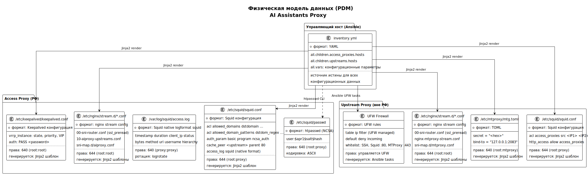

<!-- [AIGD] -->
# DD-PDM — Физическая модель данных

## Описание

Физическая модель данных (PDM) проекта AI Assistants Proxy описывает конкретные файлы, форматы хранения, права доступа и расположение данных на целевых серверах. Проект не использует традиционные СУБД — все данные хранятся в текстовых конфигурационных файлах, управляемых через Ansible (IaC).

## Диаграмма PDM



> Исходник: [diagrams/DD-PDM.puml](diagrams/DD-PDM.puml)

## Физические хранилища

### 1. passwd — файл учётных данных

| Параметр | Значение |
|---|---|
| **LDM-сущность** | Credential |
| **DE** | [DE-CR-001](DE/DE-CR-001.md) |
| **Путь** | `/etc/squid/passwd` |
| **Формат** | htpasswd (NCSA): `user:$apr1$salt$hash` |
| **Кодировка** | ASCII |
| **Права** | 640 (`root:proxy`) |
| **Генерация** | CLI: `htpasswd -b /etc/squid/passwd <user> <password>` |
| **Размер** | ~50 байт на запись |
| **Компонент** | [C3-SA-001](../C3/C3-SA-001.md) — Squid Access Proxy |

**Структура записи:**
```
# AI-GENERATED — NOT REVIEWED: SECTION START
username:$apr1$salt$hash
# AI-GENERATED — NOT REVIEWED: SECTION END
```

Каждая строка — одна учётная запись. Хеш-алгоритм: MD5-crypt (`$apr1$`). Разделитель: двоеточие (`:`).

### 2. squid.conf (access) — конфигурация access-прокси

| Параметр | Значение |
|---|---|
| **LDM-сущности** | Domain Rule, Config Parameter |
| **DE** | [DE-DM-001](DE/DE-DM-001.md), [DE-CF-001](DE/DE-CF-001.md) |
| **Путь** | `/etc/squid/squid.conf` |
| **Формат** | Squid configuration directives |
| **Кодировка** | UTF-8 |
| **Права** | 644 (`root:proxy`) |
| **Генерация** | Ansible: Jinja2 template → rendered config |
| **Компонент** | [C3-SA-001](../C3/C3-SA-001.md) — Squid Access Proxy |

**Ключевые секции:**
```
# AI-GENERATED — NOT REVIEWED: SECTION START
# Белый список доменов (exact match)
acl allowed_domains dstdomain dashscope.aliyuncs.com .alibabacloud.com ...

# Белый список доменов (regex)
acl allowed_domain_patterns url_regex \.ai$ ...

# Аутентификация
auth_param basic program /usr/lib/squid/basic_ncsa_auth /etc/squid/passwd
auth_param basic realm AI Assistants Proxy

# Цепочка к upstream
cache_peer <upstream_ip> parent 80 0 no-query userhash ...

# Формат журнала — стандартный squid (native format)
# AI-GENERATED — NOT REVIEWED: SECTION END
```

### 3. squid.conf (upstream) — конфигурация upstream-прокси

| Параметр | Значение |
|---|---|
| **LDM-сущность** | ACL Entry, Config Parameter |
| **DE** | [DE-AC-001](DE/DE-AC-001.md), [DE-CF-001](DE/DE-CF-001.md) |
| **Путь** | `/etc/squid/squid.conf` |
| **Формат** | Squid configuration directives |
| **Кодировка** | UTF-8 |
| **Права** | 644 (`root:proxy`) |
| **Генерация** | Ansible: Jinja2 template → rendered config |
| **Компонент** | [C3-SU-001](../C3/C3-SU-001.md) — Squid Upstream Proxy |

**Ключевые секции:**
```
# AI-GENERATED — NOT REVIEWED: SECTION START
# ACL: разрешённые IP access-прокси
acl access_proxies src 94.103.88.223 81.85.78.43

# Правила доступа
http_access allow access_proxies
http_access deny all
# AI-GENERATED — NOT REVIEWED: SECTION END
```

### 4. nftables.conf — правила межсетевого экрана

| Параметр | Значение |
|---|---|
| **LDM-сущность** | ACL Entry |
| **DE** | [DE-AC-001](DE/DE-AC-001.md) |
| **Путь** | `/etc/nftables.conf` |
| **Формат** | nftables rule format |
| **Кодировка** | UTF-8 |
| **Права** | 644 (`root:root`) |
| **Генерация** | CrowdSec firewall bouncer (автоматически) |
| **Компонент** | [C3-CS-001](../C3/C3-CS-001.md) — CrowdSec IPS |

**Структура:**
```
# AI-GENERATED — NOT REVIEWED: SECTION START
table inet crowdsec {
    set crowdsec-blacklists {
        type ipv4_addr
        flags timeout
        # элементы добавляются bouncer'ом автоматически
    }
    chain crowdsec-chain {
        ip saddr @crowdsec-blacklists drop
    }
}
# AI-GENERATED — NOT REVIEWED: SECTION END
```

### 5. inventory.yml — инвентарь Ansible

| Параметр | Значение |
|---|---|
| **LDM-сущность** | Config Parameter, Secret |
| **DE** | [DE-CF-001](DE/DE-CF-001.md), [DE-SC-001](DE/DE-SC-001.md) |
| **Путь** | `Servers/deploy/inventory.yml` (в репозитории) |
| **Формат** | YAML |
| **Кодировка** | UTF-8 |
| **Права** | Управляется VCS (Git) |
| **Генерация** | Ручное редактирование DevOps-инженером |

**Структура YAML:**
```yaml
# AI-GENERATED — NOT REVIEWED: SECTION START
all:
  children:
    access_proxies:
      hosts:
        access-01: { ansible_host: <IP>, keepalived_state: MASTER, ... }
        access-02: { ansible_host: <IP>, keepalived_state: BACKUP, ... }
      vars:
        proxy_role: access
        squid_port: 443
        enable_auth: true
        ...
    upstreams:
      hosts:
        upstream01.example.com: { ansible_host: <IP> }
      vars:
        proxy_role: upstream
        squid_port: 80
        ...
  vars:
    ansible_user: root
    allowed_domains: [...]
    allowed_domain_patterns: [...]
    mtproxy_secret: "<hex>"
    keepalived_auth_pass: "<password>"
    ...
# AI-GENERATED — NOT REVIEWED: SECTION END
```

### 6. access.log — журнал доступа

| Параметр | Значение |
|---|---|
| **LDM-сущность** | Log Record |
| **DE** | [DE-LG-001](DE/DE-LG-001.md) |
| **Путь** | `/var/log/squid/access.log` |
| **Формат** | Squid native logformat `squid` |
| **Кодировка** | UTF-8 |
| **Права** | 640 (`proxy:proxy`) |
| **Генерация** | Squid daemon (автоматически при каждом запросе) |
| **Ротация** | logrotate (ежедневно или по размеру) |
| **Компонент** | [C3-SA-001](../C3/C3-SA-001.md) — Squid Access Proxy |

**Формат записи (стандартный Squid native):**
```
# AI-GENERATED — NOT REVIEWED: SECTION START
# access_log daemon:/var/log/squid/access.log squid
1708700400.123     12 192.168.1.1 TCP_TUNNEL/200 1234 CONNECT api.openai.com:443 user1 HIER_DIRECT/1.2.3.4 -
# AI-GENERATED — NOT REVIEWED: SECTION END
```

| Поле | Описание |
|---|---|
| timestamp | Unix timestamp с миллисекундами |
| duration | Время обработки запроса (мс) |
| client_ip | IP-адрес клиента |
| status | Squid result code / HTTP status code |
| bytes | Размер ответа (байты) |
| method | HTTP-метод (CONNECT для HTTPS) |
| url | Запрошенный URL |
| username | Имя пользователя или «-» |
| hierarchy | Иерархия/IP сервера |
| content_type | MIME-тип ответа |

### 7. mtg.toml — конфигурация MTProxy

| Параметр | Значение |
|---|---|
| **LDM-сущность** | Secret, Config Parameter |
| **DE** | [DE-SC-001](DE/DE-SC-001.md), [DE-CF-001](DE/DE-CF-001.md) |
| **Путь** | `/etc/mtproxy/mtg.toml` |
| **Формат** | TOML |
| **Кодировка** | UTF-8 |
| **Права** | 640 (`root:mtproxy`) |
| **Генерация** | Ansible: Jinja2 template → rendered config |
| **Компонент** | [C3-MT-001](../C3/C3-MT-001.md) — MTProxy (mtg) |

**Структура:**
```toml
# AI-GENERATED — NOT REVIEWED: SECTION START
secret = "ee24d2982263cabb7499a6a9a77dc3c91f636c6f7564666c6172652e636f6d"
bind-to = "127.0.0.1:2083"
# AI-GENERATED — NOT REVIEWED: SECTION END
```

### 8. keepalived.conf — конфигурация VRRP

| Параметр | Значение |
|---|---|
| **LDM-сущность** | Secret, Config Parameter |
| **DE** | [DE-SC-001](DE/DE-SC-001.md), [DE-CF-001](DE/DE-CF-001.md) |
| **Путь** | `/etc/keepalived/keepalived.conf` |
| **Формат** | Keepalived structured config |
| **Кодировка** | UTF-8 |
| **Права** | 640 (`root:root`) |
| **Генерация** | Ansible: Jinja2 template → rendered config |
| **Компонент** | [C3-KA-001](../C3/C3-KA-001.md) — Keepalived VRRP |

**Структура:**
```
# AI-GENERATED — NOT REVIEWED: SECTION START
vrrp_instance AI_PROXY {
    state MASTER
    interface eth0
    virtual_router_id 51
    priority 100
    authentication {
        auth_type PASS
        auth_pass GeneratedVRRPPass123
    }
    virtual_ipaddress {
        1.2.3.4
    }
}
# AI-GENERATED — NOT REVIEWED: SECTION END
```

## Связанные требования

- [C2-FR-001](../C2/C2-FR-001.md) — Проксирование (squid.conf access + upstream)
- [C2-FR-002](../C2/C2-FR-002.md) — Аутентификация (passwd)
- [C2-FR-003](../C2/C2-FR-003.md) — Фильтрация доменов (squid.conf ACL)
- [C2-FR-005](../C2/C2-FR-005.md) — Журналирование (access.log)
- [C2-FR-006](../C2/C2-FR-006.md) — MTProxy (mtg.toml)
- [C2-FR-008](../C2/C2-FR-008.md) — Развёртывание (inventory.yml)
- [C2-NF-001](../C2/C2-NF-001.md) — Высокая доступность (keepalived.conf)
- [C2-NF-002](../C2/C2-NF-002.md) — Безопасность (nftables.conf, passwd, mtg.toml)
<!-- [/AIGD] -->
