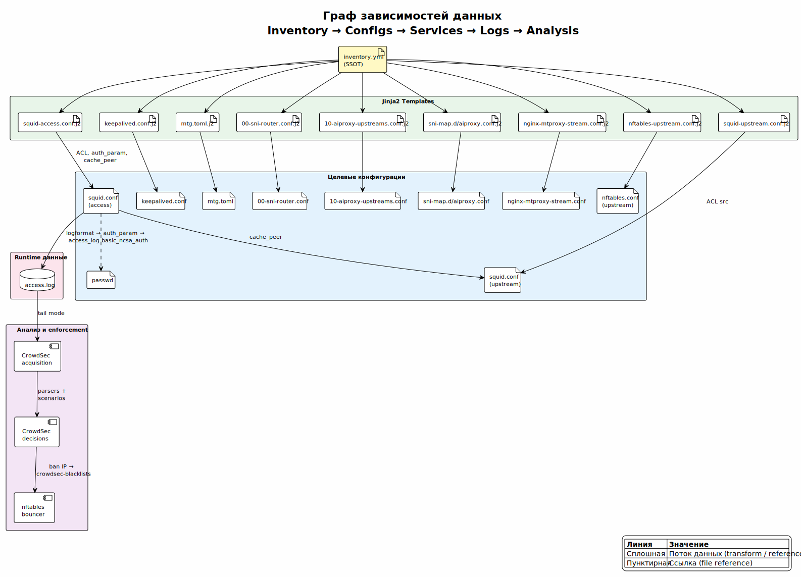

<!-- [AIGD] -->
# DD-SourceMap — Карта источников данных

## Описание

Карта источников данных (Source Map) определяет физическое расположение каждой сущности данных: источник истины (SSOT), место хранения на целевых серверах, формат файлов и паттерны для поиска в кодовой базе.

## Карта источников

| Сущность | ID | Источник (SSOT) | Физическое размещение | Формат | Паттерн поиска в коде |
|---|---|---|---|---|---|
| Учётные данные | [DE-CR-001](DE/DE-CR-001.md) | htpasswd CLI | `/etc/squid/passwd` | htpasswd (NCSA) | `htpasswd`, `basic_ncsa_auth`, `passwd` |
| ACL (IP) | [DE-AC-001](DE/DE-AC-001.md) | inventory.yml (`ansible_host`) | `/etc/squid/squid.conf`, `/etc/nftables.conf` | Squid ACL / nft rules | `acl access_proxies`, `http_access`, `crowdsec-blacklists` |
| Белый список доменов | [DE-DM-001](DE/DE-DM-001.md) | inventory.yml (`allowed_domains`, `allowed_domain_patterns`) | `/etc/squid/squid.conf` (ACL blocks) | Squid ACL directives | `acl allowed_domains`, `acl allowed_domain_patterns`, `dstdomain`, `url_regex` |
| Конфигурационные параметры | [DE-CF-001](DE/DE-CF-001.md) | inventory.yml | Все generated configs | YAML → rendered configs | `inventory.yml`, `.j2` templates, `vars:` |
| Записи журнала | [DE-LG-001](DE/DE-LG-001.md) | Squid daemon | `/var/log/squid/access.log` | Squid native logformat | `access_log daemon:... squid`, `acquis.yaml` |
| Секреты | [DE-SC-001](DE/DE-SC-001.md) | inventory.yml / `mtg generate-secret` | `/etc/mtproxy/mtg.toml`, `/etc/keepalived/keepalived.conf` | TOML / Keepalived conf | `mtproxy_secret`, `keepalived_auth_pass`, `secret`, `auth_pass` |

## Паттерны хранилищ для Code-First Discovery

Паттерны для обнаружения хранилищ данных при реверс-инжиниринге кодовой базы (DD §DD.3.2).

### Ansible Inventory (SSOT)

| Паттерн | Описание | Пример |
|---|---|---|
| `inventory.yml` | Основной файл инвентаря | `Servers/deploy/inventory.yml` |
| `vars:` | Секции переменных | `all.vars`, `access_proxies.vars`, `upstreams.vars` |
| `hosts:` | Определения хостов | `access-01:`, `upstream-de-fn01:` |

### Jinja2 Templates (трансформация)

| Паттерн | Описание | Пример |
|---|---|---|
| `*.j2` | Шаблоны Jinja2 | `squid.conf.j2`, `mtg.toml.j2`, `keepalived.conf.j2` |
| `{{ variable }}` | Подстановка переменных | `{{ squid_port }}`, `{{ mtproxy_secret }}` |
| `` | Итерация по спискам | `` |

### Целевые конфигурации (persistent)

| Путь | Формат | Сервис | Группа хостов |
|---|---|---|---|
| `/etc/squid/squid.conf` | Squid config | Squid | access, upstream |
| `/etc/squid/passwd` | htpasswd | Squid (ncsa_auth) | access |
| `/etc/keepalived/keepalived.conf` | Keepalived config | Keepalived | access |
| `/etc/mtproxy/mtg.toml` | TOML | mtg | upstream |
| `/etc/nginx/conf.d/stream.conf` | nginx config | nginx | access |
| `/etc/nftables.conf` | nftables rules | nftables kernel | все |
| `/etc/crowdsec/acquis.yaml` | YAML | CrowdSec | все |

### Транзиентные данные (runtime)

| Путь | Формат | Генератор | Группа хостов |
|---|---|---|---|
| `/var/log/squid/access.log` | Squid logformat | Squid daemon | access |
| `/var/log/crowdsec/crowdsec.log` | CrowdSec log | CrowdSec | все |
| `/var/run/keepalived.pid` | PID file | Keepalived | access |
| `/var/spool/squid/` | Squid cache | Squid | access |

## Граф зависимостей данных

> Исходник: [diagrams/DD-SourceMap-dependencies.puml](diagrams/DD-SourceMap-dependencies.puml)

Направление потока: **inventory.yml → Jinja2 → configs → services → logs → analysis → enforcement**.

## Связанные документы

- [DD-PDM.md](DD-PDM.md) — Физическая модель (детали форматов)
- [DD-Integration.md](DD-Integration.md) — Паттерны интеграции
- [DD-Catalog.md](DD-Catalog.md) — Каталог сущностей
<!-- [/AIGD] -->
