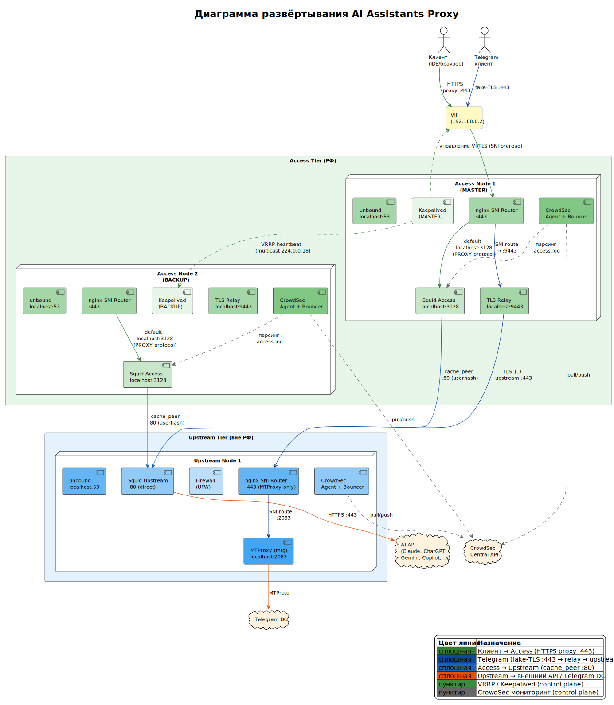
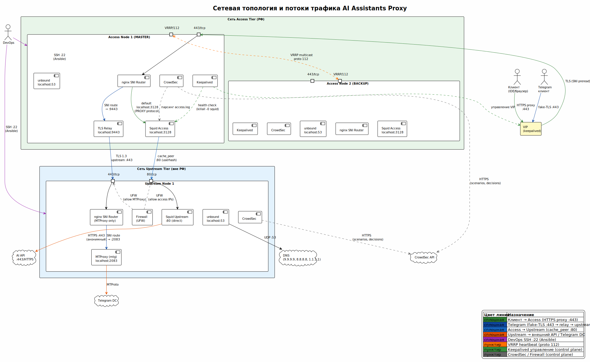

<!-- [AIGD] -->
# TD-FA — Функциональные области системы

## Описание

Функциональные области (ФО) системы AI Assistants Proxy описывают логическую группировку возможностей системы. Каждая ФО объединяет связанные компоненты и требования, обеспечивающие определённый аспект функциональности.

## Функциональные области

| ID | Функциональная область | Описание | Компоненты | Требования |
|---|---|---|---|---|
| ФО-01 | Проксирование | Маршрутизация HTTPS-запросов через двухуровневую цепочку access → upstream → AI API. CONNECT-туннелирование TLS-трафика без расшифровки. | Squid Access (C3-SA-001), Squid Upstream (C3-SU-001) | [C2-FR-001](../C2/C2-FR-001.md), [C2-FR-003](../C2/C2-FR-003.md), [C2-FR-004](../C2/C2-FR-004.md) |
| ФО-02 | Безопасность и контроль доступа | Аутентификация пользователей (Basic Auth), фильтрация доменов (whitelist ACL), обнаружение и предотвращение вторжений (IPS), анонимизация заголовков, межсетевое экранирование. | Squid Access (C3-SA-001), CrowdSec (C3-CS-001), nftables | [C2-FR-002](../C2/C2-FR-002.md), [C2-FR-003](../C2/C2-FR-003.md), [C2-FR-005](../C2/C2-FR-005.md), [C2-NF-002](../C2/C2-NF-002.md) |
| ФО-03 | Отказоустойчивость | VRRP failover на access-уровне через виртуальный IP, upstream load balancing через Squid userhash. Health-check мониторинг компонентов. | Keepalived (C3-KA-001), Squid Access (C3-SA-001) | [C2-NF-001](../C2/C2-NF-001.md), [C2-NF-004](../C2/C2-NF-004.md) |
| ФО-04 | Co-deployment и маршрутизация | SNI-маршрутизация для совместного использования порта 443 между AI Proxy и другими проектами. Бесконфликтное разделение TLS-потоков. | nginx SNI Router (C3-NX-001) | [C2-CN-002](../C2/C2-CN-002.md) |
| ФО-05 | Telegram proxy | MTProxy с fake-TLS маскировкой для обхода DPI-блокировок. Co-deployment на upstream-нодах. Маршрутизация через nginx SNI Router. | MTProxy/mtg (C3-MT-001), nginx SNI Router (C3-NX-001) | [C2-FR-006](../C2/C2-FR-006.md) |
| ФО-06 | Развёртывание и управление | Автоматизированное развёртывание через Ansible IaC. Единый playbook, роли для каждого компонента, идемпотентное выполнение. Управление пользователями и конфигурациями. | Ansible (C3-AD-001) | [C2-FR-007](../C2/C2-FR-007.md), [C2-FR-008](../C2/C2-FR-008.md) |

## Диаграмма функциональных областей

> Исходник: [diagrams/TD-deployment.puml](diagrams/TD-deployment.puml)

Диаграмма развёртывания показывает распределение компонентов по физическим нодам и их принадлежность к функциональным областям.

## Сетевая топология и потоки трафика

> Исходник: [diagrams/TD-network.puml](diagrams/TD-network.puml)

Диаграмма сетевой топологии детализирует порты, протоколы и направление потоков трафика между компонентами функциональных областей. Сплошные линии — data plane (пользовательский трафик), пунктирные — control plane (VRRP, CrowdSec, мониторинг).

## Каталог наблюдаемости

### События (Events)

| ID | Событие | Источник | Формат | ФО | Описание |
|---|---|---|---|---|---|
| EV-01 | Запись access.log | Squid Access | Структурированный текстовый лог (logformat) | ФО-01, ФО-02 | Каждый HTTP/HTTPS-запрос через access-прокси: timestamp, client IP, метод, URL, статус, размер, пользователь |
| EV-02 | CrowdSec alert | CrowdSec Agent | JSON (CrowdSec API) | ФО-02 | Обнаружение аномального поведения: bruteforce, сканирование, нарушение ACL |
| EV-03 | Keepalived state change | Keepalived daemon | syslog | ФО-03 | Переход VRRP-состояния: MASTER → BACKUP, BACKUP → MASTER, FAULT |
| EV-04 | CrowdSec ban/unban | CrowdSec Bouncer (nftables) | nftables rules / CrowdSec decisions API | ФО-02 | Блокировка/разблокировка IP-адреса по решению CrowdSec |
| EV-05 | Systemd unit state | systemd | journald | ФО-06 | Изменение состояния сервисов: start, stop, fail, restart |
| EV-06 | nginx SNI routing | nginx | error.log / access.log (stream) | ФО-04 | Маршрутизация TLS-потока по SNI-заголовку |
| EV-07 | MTProxy connection | mtg daemon | stdout/stderr (systemd journal) | ФО-05 | Подключение/отключение Telegram-клиента |

### Метрики (Metrics)

| ID | Метрика | Тип | Источник | ФО | Описание | Целевое значение |
|---|---|---|---|---|---|---|
| MET-01 | connections/sec | gauge | Squid (access.log, squidclient mgr:info) | ФО-01 | Количество активных соединений в секунду | — (информационная) |
| MET-02 | cache_hit_ratio | gauge | Squid (squidclient mgr:info) | ФО-01 | Процент запросов, обслуженных из кэша | ≥ 10% (для кешируемого контента) |
| MET-03 | response_time_ms | histogram | Squid (access.log %tr) | ФО-01 | Время обработки запроса прокси (мс) | ≤ 50 мс добавленной латентности |
| MET-04 | auth_failures/min | counter | Squid (access.log, статус 407) | ФО-02 | Количество неудачных попыток аутентификации в минуту | < 10 (порог CrowdSec) |
| MET-05 | crowdsec_bans_total | counter | CrowdSec (cscli metrics) | ФО-02 | Общее количество заблокированных IP | — (информационная) |
| MET-06 | vrrp_transitions | counter | Keepalived (syslog) | ФО-03 | Количество переключений VRRP-состояния | 0 в нормальном режиме |
| MET-07 | upstream_availability | gauge | Squid (peer health) | ФО-03 | Доступность upstream-прокси (0/1 для каждого) | 1 (все доступны) |
| MET-08 | service_uptime | gauge | systemd (systemctl is-active) | ФО-06 | Состояние каждого systemd-сервиса | active |

### Связь метрик с бизнес-целями ([C1-BC-004](../C1/C1-BC-004.md))

| Бизнес-цель | KPI | Метрика | Способ измерения |
|---|---|---|---|
| BG-01 Доступность | Uptime ≥ 99.5% | MET-07, MET-08, MET-06 | Мониторинг upstream availability + service uptime + VRRP transitions |
| BG-02 Латентность | ≤ 50 мс | MET-03 | Squid access.log %tr |
| BG-03 Анонимность | 0 утечек IP | — | Тест: проверка заголовков ответа upstream |
| BG-04 Контроль доступа | 100% аутентификация | MET-04 | access.log: отсутствие запросов без аутентификации |
| BG-05 Операционные затраты | ≤ 10 мин | — | Время выполнения ansible-playbook |
| BG-06 Co-deployment | 0 инцидентов | EV-06 | Мониторинг nginx SNI routing errors |
<!-- [/AIGD] -->
