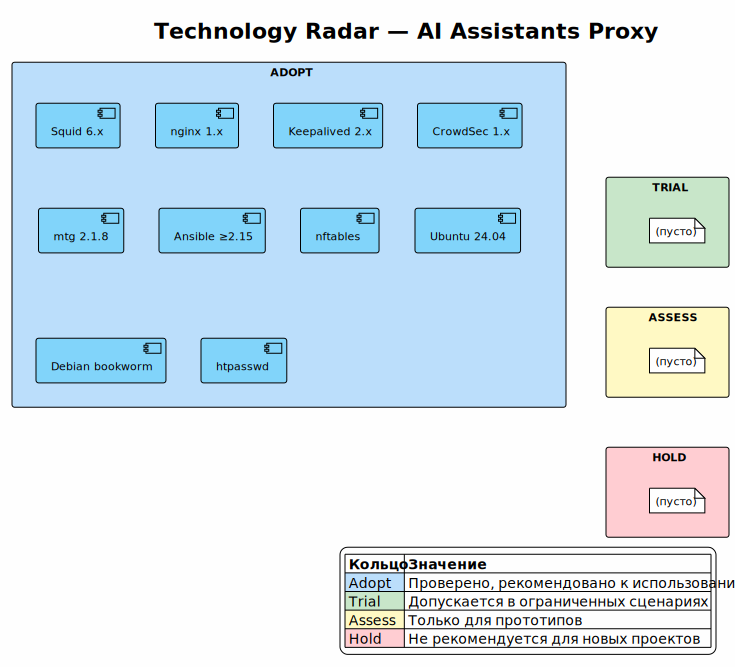

<!-- [AIGD] -->
# TD-TA — Technology Architecture

## Описание

Документ описывает технологический стек системы AI Assistants Proxy: каталог используемых технологий, инфраструктурные паттерны, Technology Radar и связь технологий с компонентами.

## Каталог технологий

| ID | Технология | Версия | Категория | Radar-статус | Компоненты | Описание | Лицензия |
|---|---|---|---|---|---|---|---|
| T-01 | Squid | 6.x | Proxy | Adopt | C3-SA-001, C3-SU-001 | HTTP/HTTPS forward proxy. CONNECT tunneling, Basic Auth (ncsa_auth), ACL, кеширование (ufs), SMP workers, cache_peer cascading. | GPL-2.0 |
| T-02 | nginx | 1.x | Web Server / Router | Adopt | C3-NX-001 | Высокопроизводительный веб-сервер. Используется модуль `stream` для L4 SNI-маршрутизации TLS-трафика на порту 443. | BSD-2-Clause |
| T-03 | Keepalived | 2.x | HA / Clustering | Adopt | C3-KA-001 | Реализация VRRP для Linux. Обеспечивает виртуальный IP (VIP) и автоматический failover на access-уровне. | GPL-2.0 |
| T-04 | CrowdSec | 1.x | Security / IPS | Adopt | C3-CS-001 | Коллаборативная IPS. Парсинг логов, обнаружение сценариев (bruteforce, scan), репутационная база IP, интеграция с nftables bouncer. | MIT |
| T-05 | mtg | 2.1.8 | Proxy (Telegram) | Adopt | C3-MT-001 | MTProxy-реализация на Go. Fake-TLS маскировка, поддержка direct/secure mode. Загрузка бинарника из GitHub Releases. | MIT |
| T-06 | Ansible | ≥2.15 | IaC / Configuration Management | Adopt | C3-AD-001 | Безагентное управление конфигурацией. Декларативные роли, идемпотентное выполнение, Jinja2-шаблоны, inventory-driven. | GPL-3.0 |
| T-07 | nftables | — (ядро Linux) | Firewall | Adopt | C3-SU-001, C3-MT-001 | Замена iptables в ядре Linux ≥3.13. Используется для межсетевого экранирования upstream-нод и как bouncer CrowdSec. | GPL-2.0 |
| T-08 | Ubuntu | 24.04 LTS | OS | Adopt | Все ноды | Основная целевая ОС. Долгосрочная поддержка (LTS). | Various (FOSS) |
| T-09 | Debian | bookworm (12) | OS | Adopt | Все ноды | Вторичная целевая ОС. Используется на части upstream-нод. | DFSG |
| T-10 | htpasswd | — (apache2-utils) | Auth | Adopt | C3-SA-001 | Утилита управления файлом паролей для HTTP Basic Authentication. Часть пакета apache2-utils. | Apache-2.0 |
| T-11 | Unbound | — (пакет ОС) | DNS / Resolver | Adopt | C3-DN-001 | Кеширующий валидирующий DNS-резолвер с DNSSEC. Каскадная архитектура: access unbound → upstream unbound → публичные DNS. Squid использует `dns_nameservers 127.0.0.1`. | BSD-3-Clause |

## Инфраструктурные паттерны

### Двухуровневый прокси (Two-tier Proxy)

**Описание:** трафик проходит через две физически разнесённые прокси-ноды. Access-прокси (РФ) реализует аутентификацию, фильтрацию, журналирование и кеширование. Upstream-прокси (вне РФ) обеспечивает анонимный транзит к целевым AI API.

**Обоснование:** [ADR-000001](../ADR/ADR-000001.md).

**Компоненты:** Squid Access (C3-SA-001) → Squid Upstream (C3-SU-001).

**Механизм:** access-прокси использует `cache_peer` для каскадирования на upstream-прокси. Балансировка — `userhash` (детерминированное распределение по пользователю).

### SNI Multiplexing

**Описание:** порт 443 на upstream-нодах совместно используется несколькими проектами. nginx `stream` модуль читает SNI-заголовок из ClientHello и маршрутизирует TCP-соединение на соответствующий backend без расшифровки TLS.

**Обоснование:** [ADR-000003](../ADR/ADR-000003.md).

**Компоненты:** nginx SNI Router (C3-NX-001).

**Механизм:** `ssl_preread on` → `$ssl_preread_server_name` → `map` → `upstream` backend.

### VRRP Failover

**Описание:** два access-прокси образуют VRRP-пару. Один — MASTER (удерживает VIP), другой — BACKUP. При недоступности MASTER (отказ Squid или сети) BACKUP автоматически поднимает VIP.

**Обоснование:** [ADR-000006](../ADR/ADR-000006.md).

**Компоненты:** Keepalived (C3-KA-001).

**Механизм:** `vrrp_script` проверяет доступность Squid → `vrrp_instance` с приоритетом → автоматическое переключение VIP.

### Infrastructure as Code (Ansible)

**Описание:** вся инфраструктура описывается декларативно в Ansible-ролях и inventory. Единый `playbook.yml` управляет развёртыванием всех компонентов на всех нодах.

**Обоснование:** [ADR-000007](../ADR/ADR-000007.md).

**Компоненты:** Ansible (C3-AD-001).

**Механизм:** `ansible-playbook -i inventory.yml playbook.yml` → роли применяются к группам хостов → идемпотентная конфигурация.

### Cascading DNS (Unbound)

**Описание:** каждая нода (access и upstream) запускает локальный unbound. Upstream-ноды резолвят через публичные DNS (9.9.9.9, 8.8.8.8, 1.1.1.1). Access-ноды пересылают запросы на upstream unbound. Squid использует `dns_nameservers 127.0.0.1`.

**Компоненты:** DNS Resolver (C3-DN-001).

**Механизм:** Ansible-роль `dns_resolver` устанавливает unbound, конфигурирует forwarders в зависимости от `proxy_role`, отключает systemd-resolved если активен, устанавливает `/etc/resolv.conf → nameserver 127.0.0.1`.

## Technology Radar

Technology Radar визуализирует текущий статус каждой технологии в стеке.

### Кольца

| Кольцо | Описание | Значение |
|---|---|---|
| **Adopt** | Использовать | Технология проверена, рекомендована к использованию в продуктивных системах |
| **Trial** | Испытывать | Технология перспективна, допускается использование в ограниченных сценариях |
| **Assess** | Оценивать | Технология изучается, использование только для прототипов |
| **Hold** | Воздержаться | Не рекомендуется для новых проектов; существующее использование — под планом миграции |

### Текущее состояние Radar

> Исходник: [diagrams/TD-TA-radar.puml](diagrams/TD-TA-radar.puml)

Все технологии в стеке находятся в кольце **Adopt** — зрелые, проверенные решения с активным community и стабильными релизами.

### Условия перевода в Hold

| Условие | Действие |
|---|---|
| CVE без патча > 30 дней | Перевести в Hold, создать CC-Risk, запланировать миграцию |
| End of Life (EOL) без замены | Перевести в Hold, создать ADR для миграции |
| Удаление из репозитория ОС | Перевести в Hold, создать CC-Risk |
| Критический баг-блокер без обходного пути | Перевести в Hold, создать CC-Risk |

## Связь с матрицей M10

Полная матрица «Компонент → Технология» — [TD-Matrices.md](TD-Matrices.md) §M10.
<!-- [/AIGD] -->
